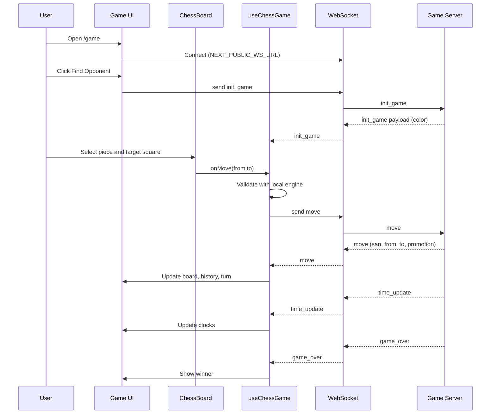
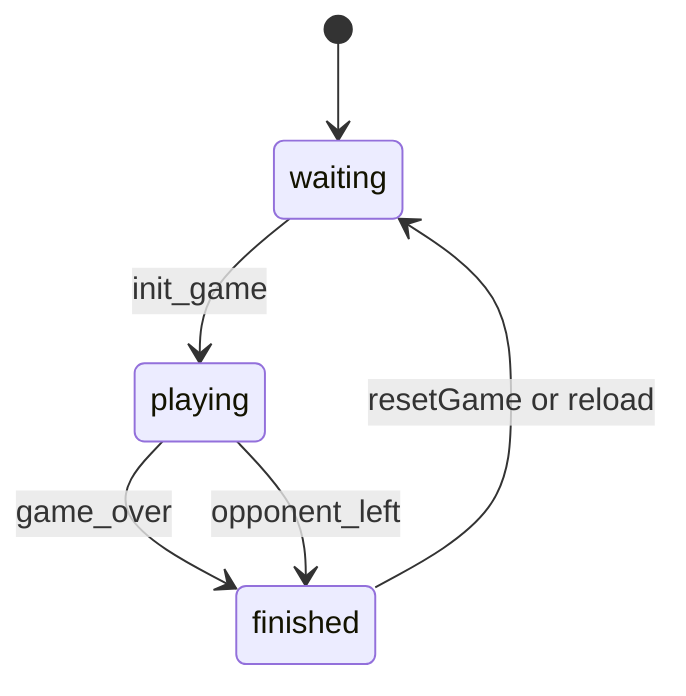
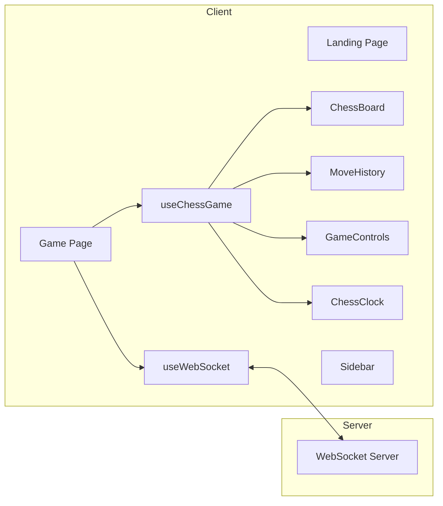

# Mermaid-Only Architecture Diagrams (apps/web)

Diagram set covers the full app flow from landing to gameplay and updates.

```mermaid
graph TD
  A[User] --> B[Landing Page /]
  B --> C[CTA: Play Now]
  C --> D[/game Route]
  D --> E[Game Page Component]
  E --> F[useWebSocket]
  E --> G[useChessGame]
  G --> H[Chess Engine @chess/chess-engine]
  F --> I[(WebSocket Server)]
  E --> J[ChessBoard]
  E --> K[GameControls]
  E --> L[MoveHistory]
  E --> M[ChessClock]
  E --> N[Sidebar]
  J --> O[ChessPiece]
  G --> J
  G --> K
  G --> L
  G --> M
  P[/spectate/:id] --> Q[Spectate Stub]
```







