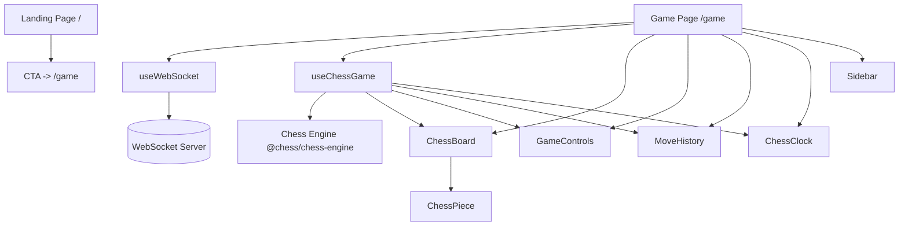
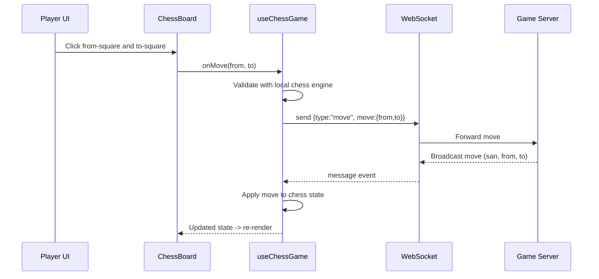
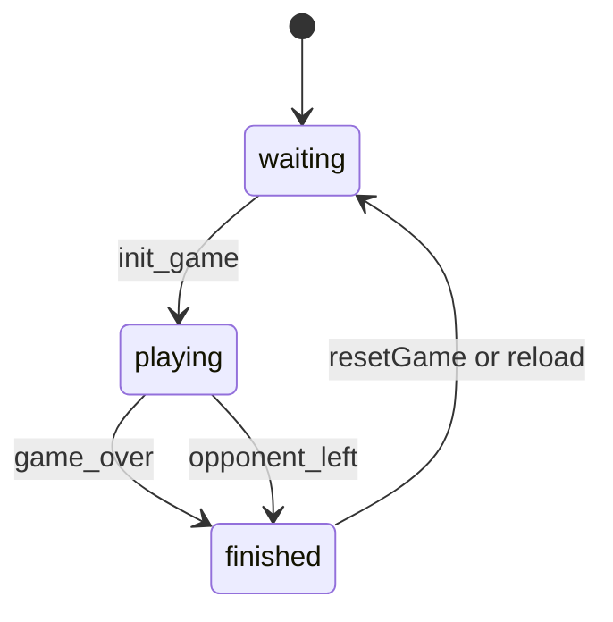

# Architecture Documentation (apps/web)

Generated: 2026-02-06
Scope: /home/abhijitam/Desktop/chess-app/apps/web
Purpose: Explain the architecture, why each file exists, and why each function is written the way it is.

**Overview**
This app is a Next.js (App Router) frontend for a chess experience with a landing page and a live game UI.
It is structured around route-based pages in `app/`, reusable UI pieces in `components/`, and logic hooks in `hooks/`.
Real-time play is modeled as a WebSocket connection plus a local chess engine state that mirrors server moves.
Styling is built on Tailwind CSS v4 tokens plus custom utility classes defined in `app/globals.css`.
The code is in a monorepo and consumes shared workspace packages for UI, types, and chess engine logic.

**High-Level Architecture**
Frontend framework: Next.js 16 App Router with client components for interactive UI and WebSocket state.
Stateful logic: React hooks `useWebSocket` and `useChessGame` manage network and game state respectively.
Rendering: React components in `components/` render board, pieces, controls, sidebar, and history.
Routing: `app/page.tsx` is the marketing landing page; `app/game/page.tsx` is the play screen.
Assets: SVG piece images live in `public/pieces` and are served directly by Next.js.

**Runtime Architecture**
Client-only rendering is used for interactive screens via `"use client"` directives.
The game screen connects to a WebSocket server defined by `NEXT_PUBLIC_WS_URL` or default localhost.
The chess engine lives in the client using `@chess/chess-engine` to validate moves and maintain FEN.
Server messages drive authoritative updates; local UI mirrors them and shows history and timers.

**Data Flow Summary**
User clicks a square on the board.
`ChessBoard` calculates move candidates and calls `onMove` for valid moves.
`useChessGame.makeMove` validates locally and sends a move message over the WebSocket.
Server broadcasts a move message to all players.
`useChessGame` listens to WebSocket messages and applies the server move to local state.
UI components read hook state and render board, turn indicator, move list, and timers.

**Route Map**
/ -> `app/page.tsx` (landing page)
/game -> `app/game/page.tsx` (play screen)
/spectate/[id] -> `app/spectate/[id]/page.tsx` (spectator stub)

**Mermaid Diagrams**
Component and data-flow diagram:

Move sequence diagram:

Game state diagram:

**File-by-File Architecture**
This section explains why each file exists and what role it plays.

File: `package.json`
Purpose: Defines the package metadata, scripts, and dependencies for the web app.
Why it exists: Next.js and tooling need a package manifest to install and run.
Why written this way: Uses workspace:* to link monorepo packages and scripts for dev/build.

File: `next.config.mjs`
Purpose: Next.js configuration.
Why it exists: Customizes build and runtime behavior.
Why written this way: Enables transpiling shared packages and sets standalone output.

File: `tsconfig.json`
Purpose: TypeScript configuration.
Why it exists: Enforces compiler options and path aliases in a monorepo.
Why written this way: Extends a shared config and maps workspace packages for DX.

File: `tailwind.config.ts`
Purpose: Tailwind CSS configuration for class scanning and theme extension.
Why it exists: Tailwind needs explicit content paths to generate styles.
Why written this way: Includes local app files and the shared UI package.

File: `postcss.config.mjs`
Purpose: PostCSS config to enable Tailwind.
Why it exists: Next.js uses PostCSS in its pipeline.
Why written this way: Minimal setup with Tailwind v4 plugin.

File: `eslint.config.mjs`
Purpose: ESLint configuration.
Why it exists: Code quality and linting rules.
Why written this way: Re-uses the monorepo Next.js ESLint preset.

File: `next-env.d.ts`
Purpose: TypeScript ambient declarations for Next.js.
Why it exists: Required by Next.js for type safety and tooling integration.
Why written this way: Auto-generated and should not be edited.

File: `README.md`
Purpose: Project usage notes.
Why it exists: Documents how to run and learn about the project.
Why written this way: Based on Next.js starter template text.

File: `app/layout.tsx`
Purpose: Root layout for the App Router.
Why it exists: Next.js requires a layout to wrap all routes.
Why written this way: Registers local fonts and global CSS once for the whole app.

File: `app/globals.css`
Purpose: Global styles and theme tokens.
Why it exists: Defines base CSS, Tailwind theme tokens, and utility classes.
Why written this way: Centralizes look-and-feel and reusable UI utilities.

File: `app/page.tsx`
Purpose: Landing page with animated marketing sections.
Why it exists: Provides the first interaction point and routes users to /game.
Why written this way: Client-side animations need hooks and framer-motion.

File: `app/game/page.tsx`
Purpose: The primary play screen with board, controls, history, and timers.
Why it exists: This is where the actual chess game runs.
Why written this way: Combines hooks for networking and state with presentational components.

File: `app/spectate/[id]/page.tsx`
Purpose: Spectator route placeholder.
Why it exists: Reserving a route for viewing a game by id.
Why written this way: Minimal placeholder while feature is not implemented.

File: `components/ChessBoard.tsx`
Purpose: Renders the chess board grid and handles square interaction.
Why it exists: Encapsulates board rendering and move selection behavior.
Why written this way: Keeps UI logic (selection and move hints) near the board view.

File: `components/ChessPiece.tsx`
Purpose: Renders a single chess piece image.
Why it exists: Centralizes the mapping from piece type+color to image asset.
Why written this way: Next/Image provides optimized loading for SVG assets.

File: `components/GameControls.tsx`
Purpose: Shows game status, players, and control buttons.
Why it exists: Isolates status UI and action buttons from the game page layout.
Why written this way: Allows the game page to be mostly composition of components.

File: `components/MoveHistory.tsx`
Purpose: Displays a list of moves and keeps the view scrolled to latest.
Why it exists: Provides a consistent, reusable move log panel.
Why written this way: Grouping moves into pairs matches standard chess notation UI.

File: `components/ChessClock.tsx`
Purpose: Displays white and black time remaining.
Why it exists: Encapsulates time formatting and turn highlighting.
Why written this way: A focused component reduces logic in the page.

File: `components/Sidebar.tsx`
Purpose: Settings sidebar and collapsed icon strip.
Why it exists: Provides a place for UI settings without cluttering the board.
Why written this way: Collapsible layout supports mobile and desktop views.

File: `hooks/useWebSocket.ts`
Purpose: WebSocket connection lifecycle and reconnect behavior.
Why it exists: Encapsulates network setup and teardown logic.
Why written this way: Hook interface keeps the page clean and reusable.

File: `hooks/useChessGame.ts`
Purpose: Game state management, move application, and server message handling.
Why it exists: Centralizes chess logic and server protocol handling.
Why written this way: Keeps state transitions predictable and colocated.

File: `public/pieces/*`
Purpose: SVG images for chess pieces.
Why it exists: The UI needs consistent piece art assets.
Why written this way: Stored in public for direct static serving by Next.js.

File: `assets/chess_board_hero_1769865149682.png`
Purpose: Design or marketing asset image.
Why it exists: Used for visual content when needed.
Why written this way: Stored in assets for non-public or build-time use.

File: `next`
Purpose: Empty file (likely a placeholder or artifact).
Why it exists: Not used by app code; safe to ignore unless referenced by tooling.
Why written this way: Appears to be a zero-byte artifact.

File: `web@0.1.0`
Purpose: Empty file (likely a placeholder or artifact).
Why it exists: Not used by app code; safe to ignore unless referenced by tooling.
Why written this way: Appears to be a zero-byte artifact.

**Function-by-Function Rationale**
This section explains why each function exists and the intent behind its implementation.

Function: app/layout.tsx -> RootLayout
What it does: Wraps all routes with a single HTML shell and body.
Why it exists: Next.js App Router requires a root layout.
Why written this way: Applies font variables globally to avoid repetitive setup.
Inputs: React children nodes.
Outputs: HTML with body classes and children rendered.

Function: app/layout.tsx -> metadata
What it does: Declares page title and description for the app shell.
Why it exists: Next.js uses metadata for SEO and document head.
Why written this way: Centralized defaults for all routes.

Function: app/page.tsx -> LoadingScreen
What it does: Shows an animated splash and hides after a timeout.
Why it exists: Creates a branded entry and delays content until animation completes.
Why written this way: Framer Motion handles animations and exit transitions.
Inputs: onFinished callback.
Outputs: A full-screen overlay until timeout.

Function: app/page.tsx -> GlassButton
What it does: Renders a button with glass styling and hover effects.
Why it exists: Centralizes CTA styling and interactive animation.
Why written this way: Uses motion button for hover and tap feedback.
Inputs: children, primary flag, onClick, className.
Outputs: Styled button element.

Function: app/page.tsx -> FeatureCard
What it does: Displays a feature with icon, title, and description.
Why it exists: Reusable card layout for the landing page sections.
Why written this way: Motion props enable reveal and hover effects.
Inputs: icon component, title, description, optional delay.
Outputs: Animated card block.

Function: app/page.tsx -> StatCounter
What it does: Renders a stat label and value.
Why it exists: Emphasizes growth metrics on the landing page.
Why written this way: Motion animates the value into view.
Inputs: label and value.
Outputs: Text block.

Function: app/page.tsx -> HomePage
What it does: Main landing page content and navigation.
Why it exists: First user touchpoint and funnel to /game.
Why written this way: Client component for scroll/animation hooks.
Inputs: none.
Outputs: Landing page layout and sections.

Function: app/game/page.tsx -> Game
What it does: Renders the game UI and wires hooks to components.
Why it exists: Primary interactive route for play.
Why written this way: Keeps WebSocket and game state local to the page.
Inputs: none.
Outputs: Game screen layout.

Function: app/game/page.tsx -> handleStartGame
What it does: Sends INIT_GAME to the server.
Why it exists: Triggers matchmaking or game initialization.
Why written this way: Keeps WebSocket messaging in a small handler for clarity.

Function: app/spectate/[id]/page.tsx -> SpectatePage
What it does: Placeholder spectator page.
Why it exists: Reserves a route for future spectate feature.
Why written this way: Minimal stub to avoid broken route.

Function: components/ChessBoard.tsx -> ChessBoard
What it does: Renders the 8x8 grid, pieces, and handles click selection.
Why it exists: Central visual and interaction surface for chess.
Why written this way: Local state tracks selection and valid moves for responsiveness.
Inputs: chess engine instance, player color, isMyTurn, and onMove callback.
Outputs: Board UI and calls onMove when a move is chosen.

Function: components/ChessBoard.tsx -> handleSquareClick
What it does: Implements selection and move logic on square clicks.
Why it exists: Encapsulates the move-selection state machine for the board.
Why written this way: Provides clear cases for select, deselect, reselect, and move.

Function: components/ChessBoard.tsx -> isLightSquare
What it does: Determines square color based on coordinates.
Why it exists: Chessboard alternates colors; this keeps it deterministic.
Why written this way: Uses parity of indices for a simple rule.

Function: components/ChessClock.tsx -> ChessClock
What it does: Shows white and black clocks with active turn highlight.
Why it exists: Separates timing UI from page layout.
Why written this way: Minimal logic for formatting and highlighting.

Function: components/ChessClock.tsx -> formatTime
What it does: Converts milliseconds into mm:ss text.
Why it exists: Human-readable chess clock display.
Why written this way: Simple integer math and padding is reliable.

Function: components/ChessPiece.tsx -> ChessPiece
What it does: Maps type and color to an SVG asset and renders it.
Why it exists: Keeps piece asset logic in one place.
Why written this way: Next/Image optimizes loading and sizing.

Function: components/GameControls.tsx -> GameControls
What it does: Displays game status, players, and action buttons.
Why it exists: Aggregates game status UI into a single component.
Why written this way: Readable conditional rendering by status.

Function: components/GameControls.tsx -> getStatusBadge
What it does: Computes a styled status badge based on game status.
Why it exists: Avoids repeated badge markup in the render.
Why written this way: Local helper for clarity and maintainability.

Function: components/MoveHistory.tsx -> MoveHistory
What it does: Renders SAN moves in paired rows and auto-scrolls.
Why it exists: Move history is a key chess UI component.
Why written this way: UseEffect keeps newest move visible.

Function: components/Sidebar.tsx -> Sidebar
What it does: Renders a collapsible settings panel.
Why it exists: Provides a consistent area for settings controls.
Why written this way: Supports compact and expanded layouts with a single component.

Function: hooks/useWebSocket.ts -> useWebSocket
What it does: Manages connection state and reconnects on disconnect.
Why it exists: Encapsulates WebSocket lifecycle in a reusable hook.
Why written this way: useEffect creates and cleans up the connection reliably.

Function: hooks/useWebSocket.ts -> connectWebSocket
What it does: Creates a WebSocket, sets handlers, and returns it.
Why it exists: Isolates connection setup and reconnection handling.
Why written this way: Keeps `useEffect` body readable.

Function: hooks/useWebSocket.ts -> sendMessage
What it does: Sends JSON-serialized messages when connected.
Why it exists: Provides a safe, reusable send function.
Why written this way: Prevents sending when disconnected.

Function: hooks/useChessGame.ts -> useChessGame
What it does: Manages chess engine state, turn, status, history, and timers.
Why it exists: Central game state container for the UI.
Why written this way: Clean separation of concerns from UI components.

Function: hooks/useChessGame.ts -> resign
What it does: Sends a resign message to the server.
Why it exists: Allows the user to end a game early.
Why written this way: Simple message is sufficient for protocol.

Function: hooks/useChessGame.ts -> handleMessage
What it does: Responds to server messages and updates state.
Why it exists: All server protocol handling lives in one place.
Why written this way: switch-case on message.type for clarity.

Function: hooks/useChessGame.ts -> makeMove
What it does: Validates a move locally and sends it to the server.
Why it exists: Prevents obvious invalid moves and keeps UI responsive.
Why written this way: Uses a temp chess instance to avoid corrupting state.

Function: hooks/useChessGame.ts -> resetGame
What it does: Resets local state to initial game conditions.
Why it exists: Enables starting fresh without a full reload.
Why written this way: Centralized state reset is easy to reuse.

**Additional Architecture Notes**
Environment variables:
`NEXT_PUBLIC_WS_URL` controls the WebSocket endpoint used by the game page.
If unset, the client defaults to `ws://localhost:8080`.

External workspace packages:
`@chess/chess-engine` supplies the chess engine API used in `useChessGame`.
`@repo/types` supplies shared message types used for the WebSocket protocol.
`@repo/ui` is included in Tailwind content paths for shared UI components, even if unused here.

WebSocket protocol summary:
Client -> Server: `init_game`, `move`, `resign`.
Server -> Client: `init_game`, `move`, `game_over`, `opponent_left`, `invalid_move`, `time_update`.
This protocol is enforced in `useChessGame` via message handling.

Rendering model:
Landing page and game page are client components due to animations and interactive hooks.
The layout and globals are shared across routes via App Router layout.

Known placeholders:
`app/spectate/[id]/page.tsx` is a stub view and does not yet render a live game.

**Appendix A: Line Reference Map**
Each line below is a traceable reference to source lines for navigation and review.

Source: `app/layout.tsx`
app/layout.tsx:1: import type { Metadata } from 'next';
app/layout.tsx:2: import localFont from 'next/font/local';
app/layout.tsx:3: import './globals.css';
app/layout.tsx:4: <empty>
app/layout.tsx:5: const geistSans = localFont({
app/layout.tsx:6:   src: './fonts/GeistVF.woff',
app/layout.tsx:7:   variable: '--font-geist-sans',
app/layout.tsx:8: });
app/layout.tsx:9: const geistMono = localFont({
app/layout.tsx:10:   src: './fonts/GeistMonoVF.woff',
app/layout.tsx:11:   variable: '--font-geist-mono',
app/layout.tsx:12: });
app/layout.tsx:13: <empty>
app/layout.tsx:14: export const metadata: Metadata = {
app/layout.tsx:15:   title: 'Create Next App',
app/layout.tsx:16:   description: 'Generated by create next app',
app/layout.tsx:17: };
app/layout.tsx:18: <empty>
app/layout.tsx:19: export default function RootLayout({
app/layout.tsx:20:   children,
app/layout.tsx:21: }: Readonly<{
app/layout.tsx:22:   children: React.ReactNode;
app/layout.tsx:23: }>) {
app/layout.tsx:24:   return (
app/layout.tsx:25:     <html lang="en">
app/layout.tsx:26:       <body className={`${geistSans.variable} ${geistMono.variable}`}>
app/layout.tsx:27:         {children}
app/layout.tsx:28:       </body>
app/layout.tsx:29:     </html>
app/layout.tsx:30:   );
app/layout.tsx:31: }

Source: `app/page.tsx`
app/page.tsx:1: "use client";
app/page.tsx:2: <empty>
app/page.tsx:3: import React from "react";
app/page.tsx:4: import { useRouter } from "next/navigation";
app/page.tsx:5: import { motion, useScroll, useTransform, AnimatePresence } from "framer-motion";
app/page.tsx:6: import { useEffect, useState } from "react";
app/page.tsx:7: import {
app/page.tsx:8:   Zap,
app/page.tsx:9:   Cpu,
app/page.tsx:10:   Search,
app/page.tsx:11:   ChevronRight,
app/page.tsx:12:   Star,
app/page.tsx:13:   Users,
app/page.tsx:14:   Shield,
app/page.tsx:15:   Globe
app/page.tsx:16: } from "lucide-react";
app/page.tsx:17: <empty>
app/page.tsx:18: // --- Components ---
app/page.tsx:19: <empty>
app/page.tsx:20: const LoadingScreen = ({ onFinished }: { onFinished: () => void }) => {
app/page.tsx:21:   useEffect(() => {
app/page.tsx:22:     const timer = setTimeout(() => onFinished(), 2500);
app/page.tsx:23:     return () => clearTimeout(timer);
app/page.tsx:24:   }, [onFinished]);
app/page.tsx:25: <empty>
app/page.tsx:26:   return (
app/page.tsx:27:     <motion.div
app/page.tsx:28:       initial={{ opacity: 1 }}
app/page.tsx:29:       exit={{ opacity: 0, scale: 1.1 }}
app/page.tsx:30:       transition={{ duration: 1, ease: "easeInOut" }}
app/page.tsx:31:       className="fixed inset-0 z-100 bg-background flex flex-col items-center justify-c...
app/page.tsx:32:     >
app/page.tsx:33:       

app/page.tsx:34: <empty>
app/page.tsx:35:       <motion.div
app/page.tsx:36:         initial={{ opacity: 0, y: 20 }}
app/page.tsx:37:         animate={{ opacity: 1, y: 0 }}
app/page.tsx:38:         transition={{ duration: 0.8, ease: "easeOut" }}
app/page.tsx:39:         className="relative z-10 flex flex-col items-center gap-8"
app/page.tsx:40:       >
app/page.tsx:41:         <motion.div
app/page.tsx:42:           animate={{
app/page.tsx:43:             rotateY: [0, 180, 360],
app/page.tsx:44:             scale: [1, 1.1, 1]
app/page.tsx:45:           }}
app/page.tsx:46:           transition={{ duration: 4, repeat: Infinity, ease: "easeInOut" }}
app/page.tsx:47:           className="w-24 h-24 glass-morphism rounded-[32px] flex items-center justify-...
app/page.tsx:48:         >
app/page.tsx:49:           ♔
app/page.tsx:50:         </motion.div>
app/page.tsx:51: <empty>
app/page.tsx:52:         

app/page.tsx:53:           <motion.h2
app/page.tsx:54:             initial={{ opacity: 0 }}
app/page.tsx:55:             animate={{ opacity: 1 }}
app/page.tsx:56:             transition={{ delay: 0.5, duration: 1 }}
app/page.tsx:57:             className="text-2xl font-black tracking-[0.3em] uppercase text-white"
app/page.tsx:58:           >
app/page.tsx:59:             Welcome to the
app/page.tsx:60:           </motion.h2>
app/page.tsx:61:           <motion.h2
app/page.tsx:62:             initial={{ opacity: 0 }}
app/page.tsx:63:             animate={{ opacity: 1 }}
app/page.tsx:64:             transition={{ delay: 0.8, duration: 1 }}
app/page.tsx:65:             className="text-4xl md:text-5xl font-black tracking-tighter text-gradient-g...
app/page.tsx:66:           >
app/page.tsx:67:             Game of Kings
app/page.tsx:68:           </motion.h2>
app/page.tsx:69:         

app/page.tsx:70: <empty>
app/page.tsx:71:         <motion.div
app/page.tsx:72:           initial={{ width: 0 }}
app/page.tsx:73:           animate={{ width: "200px" }}
app/page.tsx:74:           transition={{ delay: 1, duration: 1.5, ease: "easeInOut" }}
app/page.tsx:75:           className="h-1 bg-linear-to-r from-transparent via-emerald-500 to-transparent...
app/page.tsx:76:         />
app/page.tsx:77:       </motion.div>
app/page.tsx:78: <empty>
app/page.tsx:79:       {/* Decorative glows */}
app/page.tsx:80:       

app/page.tsx:82:   );
app/page.tsx:83: };
app/page.tsx:84: <empty>
app/page.tsx:85: const GlassButton = ({
app/page.tsx:86:   children,
app/page.tsx:87:   primary = false,
app/page.tsx:88:   onClick,
app/page.tsx:89:   className = ""
app/page.tsx:90: }: {
app/page.tsx:91:   children: React.ReactNode;
app/page.tsx:92:   primary?: boolean;
app/page.tsx:93:   onClick?: () => void;
app/page.tsx:94:   className?: string;
app/page.tsx:95: }) => (
app/page.tsx:96:   <motion.button
app/page.tsx:97:     whileHover={{ scale: 1.05, y: -2 }}
app/page.tsx:98:     whileTap={{ scale: 0.98 }}
app/page.tsx:99:     onClick={onClick}
app/page.tsx:100:     className={`
app/page.tsx:101:       px-8 py-4 rounded-xl font-bold transition-all relative overflow-hidden group
app/page.tsx:102:       ${primary
app/page.tsx:103:         ? "bg-linear-to-r from-accent-emerald to-emerald-600 text-white shadow-premium"
app/page.tsx:104:         : "glass-morphism text-white hover:bg-white/10"}
app/page.tsx:105:       ${className}
app/page.tsx:106:     `}
app/page.tsx:107:   >
app/page.tsx:108:     

app/page.tsx:111:     

app/page.tsx:114: );
app/page.tsx:115: <empty>
app/page.tsx:116: const FeatureCard = ({
app/page.tsx:117:   icon: Icon,
app/page.tsx:118:   title,
app/page.tsx:119:   description,
app/page.tsx:120:   delay = 0
app/page.tsx:121: }: {
app/page.tsx:122:   icon: React.ElementType;
app/page.tsx:123:   title: string;
app/page.tsx:124:   description: string;
app/page.tsx:125:   delay?: number;
app/page.tsx:126: }) => (
app/page.tsx:127:   <motion.div
app/page.tsx:128:     initial={{ opacity: 0, y: 30 }}
app/page.tsx:129:     whileInView={{ opacity: 1, y: 0 }}
app/page.tsx:130:     viewport={{ once: true }}
app/page.tsx:131:     transition={{ duration: 0.8, delay, ease: "easeOut" }}
app/page.tsx:132:     whileHover={{ y: -10, scale: 1.02 }}
app/page.tsx:133:     className="glass-morphism p-8 rounded-[32px] hover:border-emerald-500/30 transition...
app/page.tsx:134:   >
app/page.tsx:135:     

app/page.tsx:138:     

app/page.tsx:139:     <h3 className="text-2xl font-black mb-4 text-white tracking-tight">{title}</h3>
app/page.tsx:140:     
{description}

app/page.tsx:141:     

app/page.tsx:143:     

app/page.tsx:144:   </motion.div>
app/page.tsx:145: );
app/page.tsx:146: <empty>
app/page.tsx:147: const StatCounter = ({ label, value }: { label: string; value: string }) => (
app/page.tsx:148:   

app/page.tsx:149:     <motion.div
app/page.tsx:150:       initial={{ opacity: 0, scale: 0.5 }}
app/page.tsx:151:       whileInView={{ opacity: 1, scale: 1 }}
app/page.tsx:152:       viewport={{ once: true }}
app/page.tsx:153:       className="text-5xl font-black text-white mb-2 tracking-tighter"
app/page.tsx:154:     >
app/page.tsx:155:       {value}
app/page.tsx:156:     </motion.div>
app/page.tsx:157:     
...
app/page.tsx:158:   

app/page.tsx:159: );
app/page.tsx:160: <empty>
app/page.tsx:161: // --- Page ---
app/page.tsx:162: <empty>
app/page.tsx:163: export default function HomePage() {
app/page.tsx:164:   const router = useRouter();
app/page.tsx:165:   const [isScrolled, setIsScrolled] = useState(false);
app/page.tsx:166:   const [isLoading, setIsLoading] = useState(true);
app/page.tsx:167:   const { scrollY } = useScroll();
app/page.tsx:168:   const heroOpacity = useTransform(scrollY, [0, 600], [1, 0]);
app/page.tsx:169:   const heroScale = useTransform(scrollY, [0, 600], [1, 0.95]);
app/page.tsx:170:   const heroY = useTransform(scrollY, [0, 600], [0, 100]);
app/page.tsx:171: <empty>
app/page.tsx:172:   useEffect(() => {
app/page.tsx:173:     const handleScroll = () => setIsScrolled(window.scrollY > 50);
app/page.tsx:174:     window.addEventListener("scroll", handleScroll);
app/page.tsx:175:     return () => window.removeEventListener("scroll", handleScroll);
app/page.tsx:176:   }, []);
app/page.tsx:177: <empty>
app/page.tsx:178:   return (
app/page.tsx:179:     

app/page.tsx:181:         {isLoading ? (
app/page.tsx:182:           <LoadingScreen key="loader" onFinished={() => setIsLoading(false)} />
app/page.tsx:183:         ) : (
app/page.tsx:184:           <motion.div
app/page.tsx:185:             key="content"
app/page.tsx:186:             initial={{ opacity: 0 }}
app/page.tsx:187:             animate={{ opacity: 1 }}
app/page.tsx:188:             transition={{ duration: 0.5 }}
app/page.tsx:189:           >
app/page.tsx:190:             {/* Header */}
app/page.tsx:191:             <motion.nav
app/page.tsx:192:               initial={{ y: -100, opacity: 0 }}
app/page.tsx:193:               animate={{ y: 0, opacity: 1 }}
app/page.tsx:194:               transition={{ duration: 0.8, ease: "easeOut", delay: 0.2 }}
app/page.tsx:195:               className={`fixed top-0 left-0 right-0 z-50 transition-all duration-700 ${
app/page.tsx:196:                 isScrolled ? "py-4 bg-black/80 backdrop-blur-2xl border-b border-white/...
app/page.tsx:197:               }`}
app/page.tsx:198:             >
app/page.tsx:199:               

app/page.tsx:200:                 

app/page.tsx:204:                   

app/page.tsx:205:                     
app/page.tsx:210:                 
 (
app/page.tsx:212:                     <a
app/page.tsx:213:                       key={item}
app/page.tsx:214:                       href={`#${item.toLowerCase()}`}
app/page.tsx:215:                       className="hover:text-white transition-all relative group py-2"
app/page.tsx:216:                     >
app/page.tsx:217:                       {item}
app/page.tsx:218:                       
app/page.tsx:220:                   ))}
app/page.tsx:221:                 

app/page.tsx:222: <empty>
app/page.tsx:223:                 

app/page.tsx:224:                   <button className="hidden sm:block text-xs font-black uppercase track...
app/page.tsx:225:                   <GlassButton primary className="py-3 px-8 text-sm" onClick={() => rou...
app/page.tsx:226:                     Play Now
app/page.tsx:227:                   </GlassButton>
app/page.tsx:228:                 

app/page.tsx:229:               

app/page.tsx:230:             </motion.nav>
app/page.tsx:231: <empty>
app/page.tsx:232:             {/* Hero Section */}
app/page.tsx:233:             <section className="relative min-h-[110vh] flex items-center pt-24 px-6 ove...
app/page.tsx:234:               {/* Background Elements */}
app/page.tsx:235:               

app/page.tsx:236:                 <motion.div
app/page.tsx:237:                   animate={{ scale: [1, 1.2, 1], opacity: [0.1, 0.2, 0.1] }}
app/page.tsx:238:                   transition={{ duration: 8, repeat: Infinity }}
app/page.tsx:239:                   className="absolute top-[-20%] left-[-10%] w-[60%] h-[60%] bg-emerald...
app/page.tsx:240:                 />
app/page.tsx:241:                 <motion.div
app/page.tsx:242:                   animate={{ scale: [1.2, 1, 1.2], opacity: [0.05, 0.1, 0.05] }}
app/page.tsx:243:                   transition={{ duration: 10, repeat: Infinity }}
app/page.tsx:244:                   className="absolute bottom-[0%] right-[-10%] w-[50%] h-[70%] bg-accen...
app/page.tsx:245:                 />
app/page.tsx:246:               

app/page.tsx:247: <empty>
app/page.tsx:248:               <motion.div
app/page.tsx:249:                 style={{ opacity: heroOpacity, scale: heroScale, y: heroY }}
app/page.tsx:250:                 className="max-w-7xl mx-auto grid lg:grid-cols-2 gap-20 items-center re...
app/page.tsx:251:               >
app/page.tsx:252:                 

app/page.tsx:253:                   <motion.div
app/page.tsx:254:                     initial={{ opacity: 0, x: -20 }}
app/page.tsx:255:                     animate={{ opacity: 1, x: 0 }}
app/page.tsx:256:                     transition={{ duration: 0.8, delay: 0.2 }}
app/page.tsx:257:                     className="inline-flex items-center gap-3 px-5 py-2.5 rounded-full ...
app/page.tsx:258:                   >
app/page.tsx:259:                     

app/page.tsx:260:                     Revolutionizing Digital Chess
app/page.tsx:261:                   </motion.div>
app/page.tsx:262: <empty>
app/page.tsx:263:                   

app/page.tsx:264:                     <motion.h1
app/page.tsx:265:                       initial={{ opacity: 0, y: 30 }}
app/page.tsx:266:                       animate={{ opacity: 1, y: 0 }}
app/page.tsx:267:                       transition={{ duration: 0.8, delay: 0.4 }}
app/page.tsx:268:                       className="text-7xl md:text-9xl font-black tracking-tighter leadi...
app/page.tsx:269:                     >
app/page.tsx:270:                       Master Chess 
app/page.tsx:271:                       Online.
app/page.tsx:272:                     </motion.h1>
app/page.tsx:273: <empty>
app/page.tsx:274:                     <motion.p
app/page.tsx:275:                       initial={{ opacity: 0, y: 30 }}
app/page.tsx:276:                       animate={{ opacity: 1, y: 0 }}
app/page.tsx:277:                       transition={{ duration: 0.8, delay: 0.6 }}
app/page.tsx:278:                       className="text-xl md:text-2xl text-zinc-400 max-w-xl mx-auto lg:...
app/page.tsx:279:                     >
app/page.tsx:280:                       Focus on what matters: your next bri...
app/page.tsx:281:                       Pure chess, zero clutter. Built for those who take the game serio...
app/page.tsx:282:                     </motion.p>
app/page.tsx:283:                   

app/page.tsx:284: <empty>
app/page.tsx:285:                   <motion.div
app/page.tsx:286:                     initial={{ opacity: 0, y: 30 }}
app/page.tsx:287:                     animate={{ opacity: 1, y: 0 }}
app/page.tsx:288:                     transition={{ duration: 0.8, delay: 0.8 }}
app/page.tsx:289:                     className="flex flex-col sm:flex-row gap-6 justify-center lg:justif...
app/page.tsx:290:                   >
app/page.tsx:291:                     <GlassButton primary className="px-10 py-5" onClick={() => router.p...
app/page.tsx:292:                       Start Playing Free <ChevronRight className="w-5 h-5 ml-2" />
app/page.tsx:293:                     </GlassButton>
app/page.tsx:294:                     <GlassButton className="px-10 py-5">
app/page.tsx:295:                       Challenge AI
app/page.tsx:296:                     </GlassButton>
app/page.tsx:297:                   </motion.div>
app/page.tsx:298: <empty>
app/page.tsx:299:                   <motion.div
app/page.tsx:300:                      initial={{ opacity: 0 }}
app/page.tsx:301:                      animate={{ opacity: 1 }}
app/page.tsx:302:                      transition={{ duration: 1.5, delay: 1.2 }}
app/page.tsx:303:                      className="pt-12 flex flex-wrap items-center justify-center lg:jus...
app/page.tsx:304:                   >
app/page.tsx:305:                     <StatCounter label="Active Players" value="10+" />
app/page.tsx:306:                     <StatCounter label="Growth" value="Fast" />
app/page.tsx:307:                     <StatCounter label="Reach" value="Global" />
app/page.tsx:308:                   </motion.div>
app/page.tsx:309:                 

app/page.tsx:310: <empty>
app/page.tsx:311:                 <motion.div
app/page.tsx:312:                   initial={{ opacity: 0, scale: 0.9, rotateY: 20 }}
app/page.tsx:313:                   animate={{ opacity: 1, scale: 1, rotateY: 0 }}
app/page.tsx:314:                   transition={{ duration: 1.2, delay: 0.6, ease: "easeOut" }}
app/page.tsx:315:                   className="relative h-full perspective-1000"
app/page.tsx:316:                 >
app/page.tsx:317:                   
 (
app/page.tsx:322:                             <motion.div
app/page.tsx:323:                               key={i}
app/page.tsx:324:                               whileHover={{ backgroundColor: "rgba(16, 185, 129, 0.2)" }}
app/page.tsx:325:                               className={`${(Math.floor(i / 8) + i) % 2 === 0 ? 'bg-zin...
app/page.tsx:326:                             />
app/page.tsx:327:                           ))}
app/page.tsx:328:                         

app/page.tsx:329:                         

app/page.tsx:339:                             ♛
app/page.tsx:340:                           </motion.div>
app/page.tsx:341:                         

app/page.tsx:342: <empty>
app/page.tsx:343:                         {/* Floating Pieces Decoration */}
app/page.tsx:344:                         {[
app/page.tsx:345:                           { char: "♞", pos: "top-10 left-10", delay: 0 },
app/page.tsx:346:                           { char: "♝", pos: "bottom-20 right-10", delay: 1 },
app/page.tsx:347:                           { char: "♜", pos: "top-20 right-20", delay: 2 },
app/page.tsx:348:                         ].map((p, i) => (
app/page.tsx:349:                           <motion.div
app/page.tsx:350:                             key={i}
app/page.tsx:351:                             animate={{ y: [0, -20, 0], opacity: [0.3, 0.6, 0.3] }}
app/page.tsx:352:                             transition={{ duration: 4, delay: p.delay, repeat: Infinity }}
app/page.tsx:353:                             className={`absolute ${p.pos} text-5xl text-white/20`}
app/page.tsx:354:                           >
app/page.tsx:355:                             {p.char}
app/page.tsx:356:                           </motion.div>
app/page.tsx:357:                         ))}
app/page.tsx:358:                      

app/page.tsx:359: <empty>
app/page.tsx:360:                      {/* Decorative Ring */}
app/page.tsx:361:                      

app/page.tsx:363:                 </motion.div>
app/page.tsx:364:               </motion.div>
app/page.tsx:365: <empty>
app/page.tsx:366:               

app/page.tsx:373:               

app/page.tsx:374:             </section>
app/page.tsx:375: <empty>
app/page.tsx:376:             {/* Features Grid */}
app/page.tsx:377:             <section id="features" className="py-40 px-6 relative">
app/page.tsx:378:               

app/page.tsx:379:                 

app/page.tsx:380:                   <motion.h2
app/page.tsx:381:                     initial={{ opacity: 0, y: 20 }}
app/page.tsx:382:                     whileInView={{ opacity: 1, y: 0 }}
app/page.tsx:383:                     viewport={{ once: true }}
app/page.tsx:384:                     className="text-5xl md:text-8xl font-black tracking-tighter"
app/page.tsx:385:                   >
app/page.tsx:386:                     Master Your Strategy.
app/page.tsx:387:                   </motion.h2>
app/page.tsx:388:                   <motion.p
app/page.tsx:389:                     initial={{ opacity: 0, y: 20 }}
app/page.tsx:390:                     whileInView={{ opacity: 1, y: 0 }}
app/page.tsx:391:                     viewport={{ once: true }}
app/page.tsx:392:                     transition={{ delay: 0.2 }}
app/page.tsx:393:                     className="text-zinc-500 text-xl max-w-2xl mx-auto font-medium"
app/page.tsx:394:                   >
app/page.tsx:395:                     Experience chess with cutting-edge tools designed for performance a...
app/page.tsx:396:                   </motion.p>
app/page.tsx:397:                 

app/page.tsx:398: <empty>
app/page.tsx:399:                 

app/page.tsx:400:                   

app/page.tsx:401:                     <FeatureCard
app/page.tsx:402:                       icon={Zap}
app/page.tsx:403:                       title="Smart Matchmaking"
app/page.tsx:404:                       description="Our matchmaking engine finds perfectly suited oppone...
app/page.tsx:405:                     />
app/page.tsx:406:                   

app/page.tsx:407:                   

app/page.tsx:408:                     <FeatureCard
app/page.tsx:409:                       icon={Cpu}
app/page.tsx:410:                       title="Adaptive AI"
app/page.tsx:411:                       description="Train against multiple computer personalities that a...
app/page.tsx:412:                       delay={0.1}
app/page.tsx:413:                     />
app/page.tsx:414:                   

app/page.tsx:415:                   

app/page.tsx:416:                     <FeatureCard
app/page.tsx:417:                       icon={Search}
app/page.tsx:418:                       title="Review & Improve"
app/page.tsx:419:                       description="Deep dive into every move with engine-powered analys...
app/page.tsx:420:                       delay={0.2}
app/page.tsx:421:                     />
app/page.tsx:422:                   

app/page.tsx:423:                   

app/page.tsx:424:                     <FeatureCard
app/page.tsx:425:                       icon={Globe}
app/page.tsx:426:                       title="Community Tournaments"
app/page.tsx:427:                       description="Compete in regularly scheduled community events and ...
app/page.tsx:428:                       delay={0.3}
app/page.tsx:429:                     />
app/page.tsx:430:                   

app/page.tsx:431:                 

app/page.tsx:432:               

app/page.tsx:433:             </section>
app/page.tsx:434: <empty>
app/page.tsx:435:             {/* Social Proof */}
app/page.tsx:436:             <section className="py-40 border-y border-white/5 bg-zinc-950 px-6 relative...
app/page.tsx:437:               

app/page.tsx:439:                 

app/page.tsx:440:                    

app/page.tsx:441:                       

app/page.tsx:442:                         <motion.h2
app/page.tsx:443:                           initial={{ opacity: 0, y: 20 }}
app/page.tsx:444:                           whileInView={{ opacity: 1, y: 0 }}
app/page.tsx:445:                           viewport={{ once: true }}
app/page.tsx:446:                           className="text-5xl md:text-7xl font-black tracking-tight lea...
app/page.tsx:447:                         >
app/page.tsx:448:                           Join a community of  
app/page.tsx:449:                           sharp minds.
app/page.tsx:450:                         </motion.h2>
app/page.tsx:451:                         <motion.p
app/page.tsx:452:                           initial={{ opacity: 0, y: 20 }}
app/page.tsx:453:                           whileInView={{ opacity: 1, y: 0 }}
app/page.tsx:454:                           viewport={{ once: true }}
app/page.tsx:455:                           transition={{ delay: 0.2 }}
app/page.tsx:456:                           className="text-xl text-zinc-400 font-medium leading-relaxed"
app/page.tsx:457:                         >
app/page.tsx:458:                           Experience a growing platform dedicated to players ranging fr...
app/page.tsx:459:                         </motion.p>
app/page.tsx:460:                       

app/page.tsx:461: <empty>
app/page.tsx:462:                       

app/page.tsx:463:                         

app/page.tsx:464:                           {[1,2,3,4,5].map(i => (
app/page.tsx:465:                             <motion.div
app/page.tsx:466:                               key={i}
app/page.tsx:467:                               initial={{ x: -20, opacity: 0 }}
app/page.tsx:468:                               whileInView={{ x: 0, opacity: 1 }}
app/page.tsx:469:                               transition={{ delay: i * 0.1 }}
app/page.tsx:470:                               className="w-16 h-16 rounded-full border-4 border-black g...
app/page.tsx:471:                             >
app/page.tsx:472:                               {["P", "P", "P", "P", "P"][i-1]}
app/page.tsx:473:                             </motion.div>
app/page.tsx:474:                           ))}
app/page.tsx:475:                         

app/page.tsx:476:                         

app/page.tsx:477:                           
Growing Commu...
app/page.tsx:478:                           

app/page.tsx:480:                       

app/page.tsx:481:                    

app/page.tsx:482: <empty>
app/page.tsx:483:                    

app/page.tsx:484:                       {[
app/page.tsx:485:                         { name: "Alexander K.", rank: "Passionate Player", text: "The c...
app/page.tsx:486:                         { name: "Sarah Lynch", rank: "Casual Player", text: "The analys...
app/page.tsx:487:                       ].map((testimonial, i) => (
app/page.tsx:488:                         <motion.div
app/page.tsx:489:                           key={i}
app/page.tsx:490:                           initial={{ opacity: 0, x: 30 }}
app/page.tsx:491:                           whileInView={{ opacity: 1, x: 0 }}
app/page.tsx:492:                           transition={{ delay: i * 0.2 }}
app/page.tsx:493:                           whileHover={{ scale: 1.02, rotate: 1 }}
app/page.tsx:494:                           className="p-10 rounded-[40px] glass-morphism border-white/5 ...
app/page.tsx:495:                         >
app/page.tsx:496:                           

app/page.tsx:497:                             {[1,2,3,4,5].map(s => <Star key={s} className="w-5 h-5 text...
app/page.tsx:498:                           

app/page.tsx:499:                           

app/page.tsx:501:                             

app/page.tsx:504:                             

app/page.tsx:505:                               
{testimoni...
app/page.tsx:506:                               

app/page.tsx:508:                           

app/page.tsx:509:                         </motion.div>
app/page.tsx:510:                       ))}
app/page.tsx:511:                    

app/page.tsx:512:                 

app/page.tsx:513:               

app/page.tsx:514:             </section>
app/page.tsx:515: <empty>
app/page.tsx:516:             {/* Final CTA */}
app/page.tsx:517:             <section className="py-60 px-6 relative overflow-hidden">
app/page.tsx:518:               

app/page.tsx:525:                 

app/page.tsx:526:                    <motion.h2
app/page.tsx:527:                      initial={{ opacity: 0, y: 20 }}
app/page.tsx:528:                      whileInView={{ opacity: 1, y: 0 }}
app/page.tsx:529:                      viewport={{ once: true }}
app/page.tsx:530:                      className="text-6xl md:text-9xl font-black tracking-tighter leadin...
app/page.tsx:531:                    >
app/page.tsx:532:                      Ready to take 
app/page.tsx:533:                      the throne?
app/page.tsx:534:                    </motion.h2>
app/page.tsx:535:                    <motion.p
app/page.tsx:536:                      initial={{ opacity: 0, y: 20 }}
app/page.tsx:537:                      whileInView={{ opacity: 1, y: 0 }}
app/page.tsx:538:                      viewport={{ once: true }}
app/page.tsx:539:                      transition={{ delay: 0.2 }}
app/page.tsx:540:                      className="text-zinc-400 text-2xl font-medium tracking-tight max-w...
app/page.tsx:541:                    >
app/page.tsx:542:                      No downloads. No ads. Just pure, unadulterated chess mastery. Join...
app/page.tsx:543:                    </motion.p>
app/page.tsx:544:                 

app/page.tsx:545: <empty>
app/page.tsx:546:                 

app/page.tsx:547:                   <GlassButton primary className="text-2xl px-16 py-8 w-full sm:w-auto"...
app/page.tsx:548:                     Start Playing Now
app/page.tsx:549:                   </GlassButton>
app/page.tsx:550: <empty>
app/page.tsx:551:                   

app/page.tsx:552:                      {[
app/page.tsx:553:                        { icon: Shield, label: "Fair Play" },
app/page.tsx:554:                        { icon: Users, label: "Active Daily" },
app/page.tsx:555:                        { icon: Zap, label: "Zero Lag" }
app/page.tsx:556:                      ].map((badge, i) => (
app/page.tsx:557:                        
 {badge.label}
app/page.tsx:559:                        

app/page.tsx:560:                      ))}
app/page.tsx:561:                   

app/page.tsx:562:                 

app/page.tsx:563:               </motion.div>
app/page.tsx:564:             </section>
app/page.tsx:565: <empty>
app/page.tsx:566:             {/* Footer */}
app/page.tsx:567:             <footer className="py-32 border-t border-white/5 bg-background relative ove...
app/page.tsx:568:               

app/page.tsx:569:                 

app/page.tsx:570:                   

app/page.tsx:571:                     

app/page.tsx:572:                       

app/page.tsx:574:                          (
app/page.tsx:583:                         <motion.a
app/page.tsx:584:                           key={i}
app/page.tsx:585:                           href="#"
app/page.tsx:586:                           whileHover={{ scale: 1.1, y: -5 }}
app/page.tsx:587:                           className="w-12 h-12 glass-morphism rounded-xl flex items-cen...
app/page.tsx:588:                         >
app/page.tsx:589:                           <Globe className="w-6 h-6" />
app/page.tsx:590:                         </motion.a>
app/page.tsx:591:                       ))}
app/page.tsx:592:                     

app/page.tsx:593:                   

app/page.tsx:594: <empty>
app/page.tsx:595:                   

app/page.tsx:596:                     

app/page.tsx:597:                       

app/page.tsx:599:                         <li><a href="#" className="hover:text-emerald-500 transition-co...
app/page.tsx:600:                         <li><a href="#" className="hover:text-emerald-500 transition-co...
app/page.tsx:601:                         <li><a href="#" className="hover:text-emerald-500 transition-co...
app/page.tsx:602:                         <li><a href="#" className="hover:text-emerald-500 transition-co...
app/page.tsx:603:                       </ul>
app/page.tsx:604:                     

app/page.tsx:605:                     

app/page.tsx:606:                       

app/page.tsx:608:                         <li><a href="#" className="hover:text-emerald-500 transition-co...
app/page.tsx:609:                         <li><a href="#" className="hover:text-emerald-500 transition-co...
app/page.tsx:610:                         <li><a href="#" className="hover:text-emerald-500 transition-co...
app/page.tsx:611:                         <li><a href="#" className="hover:text-emerald-500 transition-co...
app/page.tsx:612:                       </ul>
app/page.tsx:613:                     

app/page.tsx:614:                     

app/page.tsx:615:                       

app/page.tsx:617:                         <li><a href="#" className="hover:text-emerald-500 transition-co...
app/page.tsx:618:                         <li><a href="#" className="hover:text-emerald-500 transition-co...
app/page.tsx:619:                         <li><a href="#" className="hover:text-emerald-500 transition-co...
app/page.tsx:620:                         <li><a href="#" className="hover:text-emerald-500 transition-co...
app/page.tsx:621:                       </ul>
app/page.tsx:622:                     

app/page.tsx:623:                   

app/page.tsx:624:                 

app/page.tsx:625: <empty>
app/page.tsx:626:                 

app/page.tsx:630:                   
S...
app/page.tsx:632:                      <a href="#" className="hover:text-emerald-500 transition-colors">C...
app/page.tsx:633:                      <a href="#" className="hover:text-emerald-500 transition-colors">P...
app/page.tsx:634:                   

app/page.tsx:635:                 

app/page.tsx:636:               

app/page.tsx:637: <empty>
app/page.tsx:638:               {/* Decorative corner blur */}
app/page.tsx:639:               

app/page.tsx:641:           </motion.div>
app/page.tsx:642:         )}
app/page.tsx:643:       </AnimatePresence>
app/page.tsx:644:     

app/page.tsx:645:   );
app/page.tsx:646: }

Source: `app/game/page.tsx`
app/game/page.tsx:1: "use client";
app/game/page.tsx:2: <empty>
app/game/page.tsx:3: import { useState } from "react";
app/game/page.tsx:4: import { useWebSocket } from "../../hooks/useWebSocket";
app/game/page.tsx:5: import { useChessGame } from "../../hooks/useChessGame";
app/game/page.tsx:6: import { ChessBoard } from "../../components/ChessBoard";
app/game/page.tsx:7: import { GameControls } from "../../components/GameControls";
app/game/page.tsx:8: import { MoveHistory } from "../../components/MoveHistory";
app/game/page.tsx:9: import { Sidebar } from "../../components/Sidebar";
app/game/page.tsx:10: import { useRouter } from "next/navigation";
app/game/page.tsx:11: import { INIT_GAME } from '@repo/types';
app/game/page.tsx:12: import { ChessClock } from "../../components/ChessClock";
app/game/page.tsx:13: <empty>
app/game/page.tsx:14: const WS_URL = process.env.NEXT_PUBLIC_WS_URL || "ws://localhost:8080";
app/game/page.tsx:15: <empty>
app/game/page.tsx:16: export default function Game() {
app/game/page.tsx:17:   const { socket, isConnected, sendMessage } = useWebSocket(WS_URL);
app/game/page.tsx:18:   const {
app/game/page.tsx:19:     chess,
app/game/page.tsx:20:     playerColor,
app/game/page.tsx:21:     status,
app/game/page.tsx:22:     turn,
app/game/page.tsx:23:     winner,
app/game/page.tsx:24:     moveHistory,
app/game/page.tsx:25:     makeMove,
app/game/page.tsx:26:     isMyTurn,
app/game/page.tsx:27:     resign,
app/game/page.tsx:28:     whiteTime,
app/game/page.tsx:29:     blackTime,
app/game/page.tsx:30:   } = useChessGame(socket, isConnected);
app/game/page.tsx:31:   const router = useRouter();
app/game/page.tsx:32:   const [sidebarCollapsed, setSidebarCollapsed] = useState(true);
app/game/page.tsx:33:   const [moveHistoryExpanded, setMoveHistoryExpanded] = useState(false);
app/game/page.tsx:34: <empty>
app/game/page.tsx:35:   const handleStartGame = () => {
app/game/page.tsx:36:     sendMessage({ type: INIT_GAME });
app/game/page.tsx:37:   };
app/game/page.tsx:38: <empty>
app/game/page.tsx:39:   return (
app/game/page.tsx:40:     

app/game/page.tsx:41:       {/* Navigation - Fixed Height */}
app/game/page.tsx:42:       <nav className="h-16 relative z-20 border-b border-white/[0.06] bg-background-ele...
app/game/page.tsx:43:         

app/game/page.tsx:44:           

app/game/page.tsx:45:             {/* Left: Menu + Logo */}
app/game/page.tsx:46:             

app/game/page.tsx:47:               {/* Mobile menu toggle */}
app/game/page.tsx:48:               <button
app/game/page.tsx:49:                 onClick={() => setSidebarCollapsed(!sidebarCollapsed)}
app/game/page.tsx:50:                 className="lg:hidden p-2 rounded-lg hover:bg-white/[0.05] transition-co...
app/game/page.tsx:51:                 aria-label="Toggle menu"
app/game/page.tsx:52:               >
app/game/page.tsx:53:                 <svg className="w-5 h-5" fill="none" viewBox="0 0 24 24" stroke="curren...
app/game/page.tsx:54:                   <path strokeLinecap="round" strokeLinejoin="round" strokeWidth={2} d=...
app/game/page.tsx:55:                 </svg>
app/game/page.tsx:56:               </button>
app/game/page.tsx:57: <empty>
app/game/page.tsx:58:               {/* Logo */}
app/game/page.tsx:59:               <button
app/game/page.tsx:60:                 onClick={() => router.push("/")}
app/game/page.tsx:61:                 className="flex items-center gap-2 group transition-opacity hover:opaci...
app/game/page.tsx:62:               >
app/game/page.tsx:63:                 ♔
app/game/page.tsx:64:                 
app/game/page.tsx:67:               </button>
app/game/page.tsx:68:             

app/game/page.tsx:69: <empty>
app/game/page.tsx:70:             {/* Right: Connection Status */}
app/game/page.tsx:71:             

app/game/page.tsx:72:               

app/game/page.tsx:79:                 
{isConnected ? 'Connected' : 'Connec...
app/game/page.tsx:81:               

app/game/page.tsx:82:             

app/game/page.tsx:83:           

app/game/page.tsx:84:         

app/game/page.tsx:85:       </nav>
app/game/page.tsx:86: <empty>
app/game/page.tsx:87:       {/* Main Content - Tight 3-Column Layout */}
app/game/page.tsx:88:       <main className="flex-1 flex overflow-hidden">
app/game/page.tsx:89:         {/* Left: Sidebar (Collapsed by default on mobile) */}
app/game/page.tsx:90:         

app/game/page.tsx:95:           <Sidebar
app/game/page.tsx:96:             isCollapsed={sidebarCollapsed}
app/game/page.tsx:97:             onToggle={() => setSidebarCollapsed(!sidebarCollapsed)}
app/game/page.tsx:98:           />
app/game/page.tsx:99:         

app/game/page.tsx:100: <empty>
app/game/page.tsx:101:         {/* Center: Board Area - MAXIMIZED */}
app/game/page.tsx:102:         

app/game/page.tsx:104:             {/* Board Container - Responsive but huge */}
app/game/page.tsx:105:             

app/game/page.tsx:106:               

app/game/page.tsx:107:                 <ChessBoard
app/game/page.tsx:108:                   chess={chess}
app/game/page.tsx:109:                   playerColor={playerColor}
app/game/page.tsx:110:                   isMyTurn={isMyTurn}
app/game/page.tsx:111:                   onMove={makeMove}
app/game/page.tsx:112:                 />
app/game/page.tsx:113:               

app/game/page.tsx:114:             

app/game/page.tsx:115: <empty>
app/game/page.tsx:116:             {/* Turn indicator - tighter spacing */}
app/game/page.tsx:117:             {status === 'playing' && (
app/game/page.tsx:118:               
{turn === 'w' ? '♔' : '♚'}
app/game/page.tsx:120:                 
app/game/page.tsx:123:               

app/game/page.tsx:124:             )}
app/game/page.tsx:125:           

app/game/page.tsx:126:         

app/game/page.tsx:127: <empty>
app/game/page.tsx:128:         {/* Right: Game Info Panel - Closer to board */}
app/game/page.tsx:129:         

app/game/page.tsx:136: <empty>
app/game/page.tsx:137:           <GameControls
app/game/page.tsx:138:             isConnected={isConnected}
app/game/page.tsx:139:             playerColor={playerColor}
app/game/page.tsx:140:             status={status}
app/game/page.tsx:141:             turn={turn}
app/game/page.tsx:142:             isMyTurn={isMyTurn}
app/game/page.tsx:143:             winner={winner}
app/game/page.tsx:144:             onStartGame={handleStartGame}
app/game/page.tsx:145:             onResign={resign}
app/game/page.tsx:146:           />
app/game/page.tsx:147: <empty>
app/game/page.tsx:148:           
Move History
app/game/page.tsx:151:               {moveHistory && moveHistory.length > 0 && (
app/game/page.tsx:152:                 
app/game/page.tsx:153:                   {Math.ceil(moveHistory.length / 2)}
app/game/page.tsx:154:                 
app/game/page.tsx:155:               )}
app/game/page.tsx:156:             

app/game/page.tsx:157:             

app/game/page.tsx:158:               <MoveHistory moves={moveHistory} />
app/game/page.tsx:159:             

app/game/page.tsx:160:           

app/game/page.tsx:161:         

app/game/page.tsx:162:       </main>
app/game/page.tsx:163:     

app/game/page.tsx:164:   );
app/game/page.tsx:165: }

Source: `app/spectate/[id]/page.tsx`
app/spectate/[id]/page.tsx:1: export default function SpectatePage() {
app/spectate/[id]/page.tsx:2:   return <main>Spectate game</main>;
app/spectate/[id]/page.tsx:3: }

Source: `app/globals.css`
app/globals.css:1: @import url('https://fonts.googleapis.com/css2?family=Inter:wght@400;500;600;700;800;90...
app/globals.css:2: @import "tailwindcss";
app/globals.css:3: <empty>
app/globals.css:4: /* ============================================
app/globals.css:5:    Custom Theme Tokens (Tailwind v4)
app/globals.css:6:    Premium "Black & Gold & Emerald" Theme
app/globals.css:7:    ============================================ */
app/globals.css:8: <empty>
app/globals.css:9: @theme {
app/globals.css:10:   /* Chessboard colors */
app/globals.css:11:   --color-board-light: #eeeed2;
app/globals.css:12:   --color-board-dark: #769656;
app/globals.css:13:   --color-board-light-hover: #f5f5e6;
app/globals.css:14:   --color-board-dark-hover: #86a666;
app/globals.css:15:   --color-move-highlight-light: rgba(247, 236, 94, 0.8);
app/globals.css:16:   --color-move-highlight-dark: rgba(247, 236, 94, 0.6);
app/globals.css:17: <empty>
app/globals.css:18:   /* Font families */
app/globals.css:19:   --font-sans: 'Inter', system-ui, -apple-system, BlinkMacSystemFont, 'Segoe UI', Robot...
app/globals.css:20:   --font-mono: 'JetBrains Mono', ui-monospace, SFMono-Regular, monospace;
app/globals.css:21: }
app/globals.css:22: <empty>
app/globals.css:23: .debug-border {
app/globals.css:24:   border: 2px solid #ff00ea !important;
app/globals.css:25: }
app/globals.css:26: <empty>
app/globals.css:27: /* ============================================
app/globals.css:28:    Base Resets
app/globals.css:29:    ============================================ */
app/globals.css:30: <empty>
app/globals.css:31: html,
app/globals.css:32: body {
app/globals.css:33:   max-width: 100vw;
app/globals.css:34:   overflow-x: hidden;
app/globals.css:35:   -webkit-font-smoothing: antialiased;
app/globals.css:36:   background-color: var(--color-background);
app/globals.css:37:   color: var(--color-text-primary);
app/globals.css:38:   font-family: var(--font-sans);
app/globals.css:39: }
app/globals.css:40: <empty>
app/globals.css:41: /* ============================================
app/globals.css:42:    Premium Utilities
app/globals.css:43:    ============================================ */
app/globals.css:44: <empty>
app/globals.css:45: .text-gradient-gold {
app/globals.css:46:   background: linear-gradient(135deg, #fef3c7 0%, #c6a052 50%, #78350f 100%);
app/globals.css:47:   -webkit-background-clip: text;
app/globals.css:48:   background-clip: text;
app/globals.css:49:   color: transparent;
app/globals.css:50:   filter: drop-shadow(0 4px 10px rgba(198, 160, 82, 0.2));
app/globals.css:51: }
app/globals.css:52: <empty>
app/globals.css:53: .text-gradient-emerald {
app/globals.css:54:   background: linear-gradient(135deg, #dcfce7 0%, #10b981 50%, #064e3b 100%);
app/globals.css:55:   -webkit-background-clip: text;
app/globals.css:56:   background-clip: text;
app/globals.css:57:   color: transparent;
app/globals.css:58: }
app/globals.css:59: <empty>
app/globals.css:60: .glass-morphism {
app/globals.css:61:   background: rgba(255, 255, 255, 0.03);
app/globals.css:62:   backdrop-filter: blur(16px);
app/globals.css:63:   -webkit-backdrop-filter: blur(16px);
app/globals.css:64:   border: 1px solid rgba(255, 255, 255, 0.08);
app/globals.css:65: }
app/globals.css:66: <empty>
app/globals.css:67: .glass-morphism-gold {
app/globals.css:68:   background: rgba(198, 160, 82, 0.05);
app/globals.css:69:   backdrop-filter: blur(12px);
app/globals.css:70:   border: 1px solid rgba(198, 160, 82, 0.15);
app/globals.css:71: }
app/globals.css:72: <empty>
app/globals.css:73: .bg-mesh-gradient {
app/globals.css:74:   background-color: #050505;
app/globals.css:75:   background-image:
app/globals.css:76:     radial-gradient(at 0% 0%, rgba(16, 185, 129, 0.08) 0px, transparent 50%),
app/globals.css:77:     radial-gradient(at 100% 100%, rgba(198, 160, 82, 0.05) 0px, transparent 50%),
app/globals.css:78:     radial-gradient(at 50% 50%, rgba(16, 185, 129, 0.02) 0px, transparent 50%);
app/globals.css:79: }
app/globals.css:80: <empty>
app/globals.css:81: /* ============================================
app/globals.css:82:    Animations
app/globals.css:83:    ============================================ */
app/globals.css:84: <empty>
app/globals.css:85: @keyframes float {
app/globals.css:86:   0%, 100% { transform: translateY(0); }
app/globals.css:87:   50% { transform: translateY(-15px); }
app/globals.css:88: }
app/globals.css:89: <empty>
app/globals.css:90: .animate-float {
app/globals.css:91:   animation: float 5s ease-in-out infinite;
app/globals.css:92: }
app/globals.css:93: <empty>
app/globals.css:94: @keyframes shimmer {
app/globals.css:95:   0% { transform: translateX(-100%) skewX(-30deg); }
app/globals.css:96:   100% { transform: translateX(200%) skewX(-30deg); }
app/globals.css:97: }
app/globals.css:98: <empty>
app/globals.css:99: .shimmer-effect {
app/globals.css:100:   position: relative;
app/globals.css:101:   overflow: hidden;
app/globals.css:102: }
app/globals.css:103: <empty>
app/globals.css:104: .shimmer-effect::after {
app/globals.css:105:   content: "";
app/globals.css:106:   position: absolute;
app/globals.css:107:   top: 0;
app/globals.css:108:   left: 0;
app/globals.css:109:   width: 50%;
app/globals.css:110:   height: 100%;
app/globals.css:111:   background: linear-gradient(
app/globals.css:112:     to right,
app/globals.css:113:     transparent,
app/globals.css:114:     rgba(255, 255, 255, 0.1),
app/globals.css:115:     transparent
app/globals.css:116:   );
app/globals.css:117:   animation: shimmer 3s infinite;
app/globals.css:118: }
app/globals.css:119: <empty>
app/globals.css:120: /* ============================================
app/globals.css:121:    Custom Scrollbar
app/globals.css:122:    ============================================ */
app/globals.css:123: <empty>
app/globals.css:124: ::-webkit-scrollbar {
app/globals.css:125:   width: 10px;
app/globals.css:126: }
app/globals.css:127: <empty>
app/globals.css:128: ::-webkit-scrollbar-track {
app/globals.css:129:   background: #050505;
app/globals.css:130: }
app/globals.css:131: <empty>
app/globals.css:132: ::-webkit-scrollbar-thumb {
app/globals.css:133:   background: #27272a;
app/globals.css:134:   border: 2px solid #050505;
app/globals.css:135:   border-radius: 10px;
app/globals.css:136: }
app/globals.css:137: <empty>
app/globals.css:138: ::-webkit-scrollbar-thumb:hover {
app/globals.css:139:   background: #3f3f46;
app/globals.css:140: }

Source: `components/ChessBoard.tsx`
components/ChessBoard.tsx:1: "use client";
components/ChessBoard.tsx:2: import { useState, useEffect } from 'react';
components/ChessBoard.tsx:3: import type { Chess, Square } from '@chess/chess-engine';
components/ChessBoard.tsx:4: import { ChessPiece } from './ChessPiece';
components/ChessBoard.tsx:5: <empty>
components/ChessBoard.tsx:6: // Move type from chess.js - only the fields we use
components/ChessBoard.tsx:7: interface Move {
components/ChessBoard.tsx:8:     from: string;
components/ChessBoard.tsx:9:     to: string;
components/ChessBoard.tsx:10: }
components/ChessBoard.tsx:11: interface ChessBoardProps {
components/ChessBoard.tsx:12:     chess: Chess;
components/ChessBoard.tsx:13:     playerColor: 'white' | 'black' | null;
components/ChessBoard.tsx:14:     isMyTurn: boolean;
components/ChessBoard.tsx:15:     onMove: (from: string, to: string) => boolean;
components/ChessBoard.tsx:16: }
components/ChessBoard.tsx:17: <empty>
components/ChessBoard.tsx:18: export function ChessBoard({ chess, playerColor, isMyTurn, onMove }: ChessBoardProps) {
components/ChessBoard.tsx:19:     const [selectedSquare, setSelectedSquare] = useState<string | null>(null);
components/ChessBoard.tsx:20:     const [validMoves, setValidMoves] = useState<string[]>([]);
components/ChessBoard.tsx:21:     const [lastMove, setLastMove] = useState<{ from: string; to: string } | null>(null);
components/ChessBoard.tsx:22: <empty>
components/ChessBoard.tsx:23:     const files = ['a', 'b', 'c', 'd', 'e', 'f', 'g', 'h'];
components/ChessBoard.tsx:24:     const ranks = ['8', '7', '6', '5', '4', '3', '2', '1'];
components/ChessBoard.tsx:25: <empty>
components/ChessBoard.tsx:26:     const displayFiles = playerColor === 'black' ? [...files].reverse() : files;
components/ChessBoard.tsx:27:     const displayRanks = playerColor === 'black' ? [...ranks].reverse() : ranks;
components/ChessBoard.tsx:28: <empty>
components/ChessBoard.tsx:29:     // Track last move from game history
components/ChessBoard.tsx:30:     useEffect(() => {
components/ChessBoard.tsx:31:         const history = chess.history({ verbose: true }) as Move[];
components/ChessBoard.tsx:32:         if (history.length > 0) {
components/ChessBoard.tsx:33:             const last = history[history.length - 1]!;
components/ChessBoard.tsx:34:             setLastMove({ from: last.from, to: last.to });
components/ChessBoard.tsx:35:         }
components/ChessBoard.tsx:36:     }, [chess]);
components/ChessBoard.tsx:37: <empty>
components/ChessBoard.tsx:38:     const handleSquareClick = (square: string) => {
components/ChessBoard.tsx:39:         if (!isMyTurn) return;
components/ChessBoard.tsx:40: <empty>
components/ChessBoard.tsx:41:         const piece = chess.get(square as Square);
components/ChessBoard.tsx:42:         const yourColor = playerColor === 'white' ? 'w' : 'b';
components/ChessBoard.tsx:43: <empty>
components/ChessBoard.tsx:44:         // Case 1: No piece selected - select if it's your piece
components/ChessBoard.tsx:45:         if (!selectedSquare && piece && piece.color === yourColor) {
components/ChessBoard.tsx:46:             setSelectedSquare(square);
components/ChessBoard.tsx:47:             const moves = chess.moves({ square: square as Square, verbose: true });
components/ChessBoard.tsx:48:             setValidMoves(moves.map(m => m.to));
components/ChessBoard.tsx:49:             return;
components/ChessBoard.tsx:50:         }
components/ChessBoard.tsx:51: <empty>
components/ChessBoard.tsx:52:         // Case 2: Click same square - deselect
components/ChessBoard.tsx:53:         if (selectedSquare === square) {
components/ChessBoard.tsx:54:             setSelectedSquare(null);
components/ChessBoard.tsx:55:             setValidMoves([]);
components/ChessBoard.tsx:56:             return;
components/ChessBoard.tsx:57:         }
components/ChessBoard.tsx:58: <empty>
components/ChessBoard.tsx:59:         // Case 3: Click another piece of yours - reselect
components/ChessBoard.tsx:60:         if (piece && piece.color === yourColor) {
components/ChessBoard.tsx:61:             setSelectedSquare(square);
components/ChessBoard.tsx:62:             const moves = chess.moves({ square: square as Square, verbose: true });
components/ChessBoard.tsx:63:             setValidMoves(moves.map(m => m.to));
components/ChessBoard.tsx:64:             return;
components/ChessBoard.tsx:65:         }
components/ChessBoard.tsx:66: <empty>
components/ChessBoard.tsx:67:         // Case 4: Click valid move - make the move
components/ChessBoard.tsx:68:         if (validMoves.includes(square)) {
components/ChessBoard.tsx:69:             const success = onMove(selectedSquare as string, square);
components/ChessBoard.tsx:70:             if (success) {
components/ChessBoard.tsx:71:                 setLastMove({ from: selectedSquare as string, to: square });
components/ChessBoard.tsx:72:                 setSelectedSquare(null);
components/ChessBoard.tsx:73:                 setValidMoves([]);
components/ChessBoard.tsx:74:             }
components/ChessBoard.tsx:75:             return;
components/ChessBoard.tsx:76:         }
components/ChessBoard.tsx:77: <empty>
components/ChessBoard.tsx:78:         // Case 5: Click invalid square - cancel selection
components/ChessBoard.tsx:79:         setSelectedSquare(null);
components/ChessBoard.tsx:80:         setValidMoves([]);
components/ChessBoard.tsx:81:     };
components/ChessBoard.tsx:82: <empty>
components/ChessBoard.tsx:83:     const isLightSquare = (fileIndex: number, rankIndex: number): boolean => {
components/ChessBoard.tsx:84:         return (fileIndex + rankIndex) % 2 === 0;
components/ChessBoard.tsx:85:     };
components/ChessBoard.tsx:86: <empty>
components/ChessBoard.tsx:87: <empty>
components/ChessBoard.tsx:88:     // Safe hex colors for board - fallback if variables fail
components/ChessBoard.tsx:89:     const colors = {
components/ChessBoard.tsx:90:         light: '#eeeed2',
components/ChessBoard.tsx:91:         dark: '#769656',
components/ChessBoard.tsx:92:         lightHover: '#f5f5e6',
components/ChessBoard.tsx:93:         darkHover: '#86a666',
components/ChessBoard.tsx:94:         selected: '#f7ec5e',
components/ChessBoard.tsx:95:         moveLight: 'rgba(247, 236, 94, 0.8)',
components/ChessBoard.tsx:96:         moveDark: 'rgba(247, 236, 94, 0.6)'
components/ChessBoard.tsx:97:     };
components/ChessBoard.tsx:98: <empty>
components/ChessBoard.tsx:99:     return (
components/ChessBoard.tsx:100:         

components/ChessBoard.tsx:101:             {/* Board container with explicit centering and sizing */}
components/ChessBoard.tsx:102:             

components/ChessBoard.tsx:112:                 

components/ChessBoard.tsx:113:                     {displayRanks.map((rank, rankIndex) => (
components/ChessBoard.tsx:114:                         displayFiles.map((file, fileIndex) => {
components/ChessBoard.tsx:115:                             const square = `${file}${rank}`;
components/ChessBoard.tsx:116:                             const isLight = isLightSquare(fileIndex, rankIndex);
components/ChessBoard.tsx:117:                             const piece = chess.get(square as Square);
components/ChessBoard.tsx:118:                             const isValidMove = validMoves.includes(square);
components/ChessBoard.tsx:119:                             const isSelected = selectedSquare === square;
components/ChessBoard.tsx:120:                             const isLastMoveSquare = lastMove && (lastMove.from === squ...
components/ChessBoard.tsx:121: <empty>
components/ChessBoard.tsx:122:                             // Inline styles for absolute color safety
components/ChessBoard.tsx:123:                             const bgStyle = isSelected
components/ChessBoard.tsx:124:                                 ? colors.selected
components/ChessBoard.tsx:125:                                 : isLastMoveSquare
components/ChessBoard.tsx:126:                                     ? (isLight ? colors.moveLight : colors.moveDark)
components/ChessBoard.tsx:127:                                     : (isLight ? colors.light : colors.dark);
components/ChessBoard.tsx:128: <empty>
components/ChessBoard.tsx:129:                             return (
components/ChessBoard.tsx:130:                                 
 handleSquareClick(square)}
components/ChessBoard.tsx:133:                                     className={`
components/ChessBoard.tsx:134:                                         relative w-full h-full flex items-center justif...
components/ChessBoard.tsx:135:                                         ${isValidMove && piece ? 'shadow-[inset_0_0_0_4...
components/ChessBoard.tsx:136:                                     `}
components/ChessBoard.tsx:137:                                     style={{ backgroundColor: bgStyle }}
components/ChessBoard.tsx:138:                                 >
components/ChessBoard.tsx:139:                                     {/* Rank label (left side) */}
components/ChessBoard.tsx:140:                                     {fileIndex === 0 && (
components/ChessBoard.tsx:141:                                         
components/ChessBoard.tsx:145:                                             {rank}
components/ChessBoard.tsx:146:                                         
components/ChessBoard.tsx:147:                                     )}
components/ChessBoard.tsx:148: <empty>
components/ChessBoard.tsx:149:                                     {/* File label (bottom) */}
components/ChessBoard.tsx:150:                                     {rankIndex === 7 && (
components/ChessBoard.tsx:151:                                         
components/ChessBoard.tsx:155:                                             {file}
components/ChessBoard.tsx:156:                                         
components/ChessBoard.tsx:157:                                     )}
components/ChessBoard.tsx:158: <empty>
components/ChessBoard.tsx:159:                                     {/* Valid move indicator */}
components/ChessBoard.tsx:160:                                     {isValidMove && !piece && (
components/ChessBoard.tsx:161:                                         

components/ChessBoard.tsx:164:                                     {/* Chess piece */}
components/ChessBoard.tsx:165:                                     {piece && (
components/ChessBoard.tsx:166:                                         

components/ChessBoard.tsx:172:                                         

components/ChessBoard.tsx:173:                                     )}
components/ChessBoard.tsx:174:                                 

components/ChessBoard.tsx:175:                             );
components/ChessBoard.tsx:176:                         })
components/ChessBoard.tsx:177:                     ))}
components/ChessBoard.tsx:178:                 

components/ChessBoard.tsx:179:             

components/ChessBoard.tsx:180:         

components/ChessBoard.tsx:181:     );
components/ChessBoard.tsx:182: }

Source: `components/ChessClock.tsx`
components/ChessClock.tsx:1: interface ChessClockProps {
components/ChessClock.tsx:2:     whiteTime: number;
components/ChessClock.tsx:3:     blackTime: number;
components/ChessClock.tsx:4:     turn: 'w' | 'b';
components/ChessClock.tsx:5:   }
components/ChessClock.tsx:6: <empty>
components/ChessClock.tsx:7:   export function ChessClock({ whiteTime, blackTime, turn }: ChessClockProps) {
components/ChessClock.tsx:8:     const formatTime = (ms: number) => {
components/ChessClock.tsx:9:       const seconds = Math.floor(ms / 1000);
components/ChessClock.tsx:10:       const mins = Math.floor(seconds / 60);
components/ChessClock.tsx:11:       const secs = seconds % 60;
components/ChessClock.tsx:12:       return `${mins}:${secs.toString().padStart(2, '0')}`;
components/ChessClock.tsx:13:     };
components/ChessClock.tsx:14: <empty>
components/ChessClock.tsx:15:     return (
components/ChessClock.tsx:16:       

components/ChessClock.tsx:17:         

components/ChessClock.tsx:18:           
White

components/ChessClock.tsx:19:           
{formatTime(whiteTime)}

components/ChessClock.tsx:20:         

components/ChessClock.tsx:21:         

components/ChessClock.tsx:22:           
Black

components/ChessClock.tsx:23:           
{formatTime(blackTime)}

components/ChessClock.tsx:24:         

components/ChessClock.tsx:25:       

components/ChessClock.tsx:26:     );
components/ChessClock.tsx:27:   }

Source: `components/ChessPiece.tsx`
components/ChessPiece.tsx:1: "use client";
components/ChessPiece.tsx:2: <empty>
components/ChessPiece.tsx:3: import Image from 'next/image';
components/ChessPiece.tsx:4: <empty>
components/ChessPiece.tsx:5: interface ChessPieceProps {
components/ChessPiece.tsx:6:   type: 'k' | 'q' | 'r' | 'b' | 'n' | 'p';
components/ChessPiece.tsx:7:   color: 'w' | 'b';
components/ChessPiece.tsx:8:   className?: string;
components/ChessPiece.tsx:9:   isSelected?: boolean;
components/ChessPiece.tsx:10: }
components/ChessPiece.tsx:11: <empty>
components/ChessPiece.tsx:12: const PIECE_NAMES: { [key: string]: string } = {
components/ChessPiece.tsx:13:   'k': 'king',
components/ChessPiece.tsx:14:   'q': 'queen',
components/ChessPiece.tsx:15:   'r': 'rook',
components/ChessPiece.tsx:16:   'b': 'bishop',
components/ChessPiece.tsx:17:   'n': 'knight',
components/ChessPiece.tsx:18:   'p': 'pawn',
components/ChessPiece.tsx:19: };
components/ChessPiece.tsx:20: <empty>
components/ChessPiece.tsx:21: export function ChessPiece({ type, color, className = '', isSelected = false }: ChessPi...
components/ChessPiece.tsx:22:   const colorName = color === 'w' ? 'white' : 'black';
components/ChessPiece.tsx:23:   const pieceName = PIECE_NAMES[type];
components/ChessPiece.tsx:24:   const src = `/pieces/${colorName}-${pieceName}.svg`;
components/ChessPiece.tsx:25: <empty>
components/ChessPiece.tsx:26:   return (
components/ChessPiece.tsx:27:     

components/ChessPiece.tsx:35:       <Image
components/ChessPiece.tsx:36:         src={src}
components/ChessPiece.tsx:37:         alt={`${colorName} ${pieceName}`}
components/ChessPiece.tsx:38:         width={45}
components/ChessPiece.tsx:39:         height={45}
components/ChessPiece.tsx:40:         className="w-[85%] h-[85%] object-contain drop-shadow-md"
components/ChessPiece.tsx:41:         priority
components/ChessPiece.tsx:42:         draggable={false}
components/ChessPiece.tsx:43:       />
components/ChessPiece.tsx:44:     

components/ChessPiece.tsx:45:   );
components/ChessPiece.tsx:46: }

Source: `components/GameControls.tsx`
components/GameControls.tsx:1: "use client";
components/GameControls.tsx:2: <empty>
components/GameControls.tsx:3: interface GameControlsProps {
components/GameControls.tsx:4:     isConnected: boolean;
components/GameControls.tsx:5:     playerColor: 'white' | 'black' | null;
components/GameControls.tsx:6:     status: 'waiting' | 'playing' | 'finished';
components/GameControls.tsx:7:     turn: 'w' | 'b';
components/GameControls.tsx:8:     isMyTurn: boolean;
components/GameControls.tsx:9:     winner: string | null;
components/GameControls.tsx:10:     onStartGame: () => void;
components/GameControls.tsx:11:     onResign: () => void;
components/GameControls.tsx:12: }
components/GameControls.tsx:13: <empty>
components/GameControls.tsx:14: export function GameControls({
components/GameControls.tsx:15:     isConnected,
components/GameControls.tsx:16:     playerColor,
components/GameControls.tsx:17:     status,
components/GameControls.tsx:18:     turn,
components/GameControls.tsx:19:     isMyTurn,
components/GameControls.tsx:20:     winner,
components/GameControls.tsx:21:     onStartGame,
components/GameControls.tsx:22:     onResign
components/GameControls.tsx:23: }: GameControlsProps) {
components/GameControls.tsx:24: <empty>
components/GameControls.tsx:25:     const getStatusBadge = () => {
components/GameControls.tsx:26:         const baseClasses = "px-3 py-1.5 rounded-md text-xs font-bold uppercase trackin...
components/GameControls.tsx:27: <empty>
components/GameControls.tsx:28:         if (status === 'waiting') {
components/GameControls.tsx:29:             return (
components/GameControls.tsx:30:                 
components/GameControls.tsx:33:             );
components/GameControls.tsx:34:         } else if (status === 'playing') {
components/GameControls.tsx:35:             return (
components/GameControls.tsx:36:                 
components/GameControls.tsx:39:             );
components/GameControls.tsx:40:         }
components/GameControls.tsx:41:         return (
components/GameControls.tsx:42:             
components/GameControls.tsx:43:                 Ended
components/GameControls.tsx:44:             
components/GameControls.tsx:45:         );
components/GameControls.tsx:46:     };
components/GameControls.tsx:47: <empty>
components/GameControls.tsx:48:     return (
components/GameControls.tsx:49:         

components/GameControls.tsx:50:             {/* Header */}
components/GameControls.tsx:51:             

components/GameControls.tsx:52:                 <h2 className="text-base font-bold text-text-primary">
components/GameControls.tsx:53:                     Game Status
components/GameControls.tsx:54:                 </h2>
components/GameControls.tsx:55:                 {getStatusBadge()}
components/GameControls.tsx:56:             

components/GameControls.tsx:57: <empty>
components/GameControls.tsx:58:             

components/GameControls.tsx:59:                 {/* Status Message */}
components/GameControls.tsx:60:                 

components/GameControls.tsx:62:                         {status === 'waiting' && "Finding an opponent..."}
components/GameControls.tsx:63:                         {status === 'playing' && (isMyTurn ? "Your turn to move" : "Wai...
components/GameControls.tsx:64:                         {status === 'finished' && "Game complete"}
components/GameControls.tsx:65:                     

components/GameControls.tsx:66:                 

components/GameControls.tsx:67: <empty>
components/GameControls.tsx:68:                 {/* Player Cards */}
components/GameControls.tsx:69:                 

components/GameControls.tsx:70:                     {/* Black Player */}
components/GameControls.tsx:71:                     

components/GameControls.tsx:78:                         

components/GameControls.tsx:81:                         

components/GameControls.tsx:82:                             

components/GameControls.tsx:88:                                 )}
components/GameControls.tsx:89:                             

components/GameControls.tsx:90:                             
Player

components/GameControls.tsx:91:                         

components/GameControls.tsx:92:                         {turn === 'b' && status === 'playing' && (
components/GameControls.tsx:93:                             

components/GameControls.tsx:96: <empty>
components/GameControls.tsx:97:                     {/* White Player */}
components/GameControls.tsx:98:                     

components/GameControls.tsx:105:                         

components/GameControls.tsx:108:                         

components/GameControls.tsx:109:                             

components/GameControls.tsx:115:                                 )}
components/GameControls.tsx:116:                             

components/GameControls.tsx:117:                             
Player

components/GameControls.tsx:118:                         

components/GameControls.tsx:119:                         {turn === 'w' && status === 'playing' && (
components/GameControls.tsx:120:                             

components/GameControls.tsx:123:                 

components/GameControls.tsx:124: <empty>
components/GameControls.tsx:125:                 {/* Action Buttons */}
components/GameControls.tsx:126:                 

components/GameControls.tsx:127:                     {status === 'waiting' && (
components/GameControls.tsx:128:                         <button
components/GameControls.tsx:129:                             className="btn-primary w-full text-sm"
components/GameControls.tsx:130:                             onClick={onStartGame}
components/GameControls.tsx:131:                             disabled={!isConnected}
components/GameControls.tsx:132:                         >
components/GameControls.tsx:133:                             {isConnected ? 'Find Opponent' : 'Connecting...'}
components/GameControls.tsx:134:                         </button>
components/GameControls.tsx:135:                     )}
components/GameControls.tsx:136: <empty>
components/GameControls.tsx:137:                     {status === 'playing' && (
components/GameControls.tsx:138:                         <button
components/GameControls.tsx:139:                             className="btn-danger w-full text-sm"
components/GameControls.tsx:140:                             onClick={onResign}
components/GameControls.tsx:141:                         >
components/GameControls.tsx:142:                             Resign Game
components/GameControls.tsx:143:                         </button>
components/GameControls.tsx:144:                     )}
components/GameControls.tsx:145: <empty>
components/GameControls.tsx:146:                     {status === 'finished' && (
components/GameControls.tsx:147:                         

components/GameControls.tsx:148:                             

components/GameControls.tsx:150:                                     {winner === 'white' ? '♔' : '♚'}
components/GameControls.tsx:151:                                 

components/GameControls.tsx:152:                                 <h3 className="text-lg font-bold text-accent-gold capit...
components/GameControls.tsx:153:                                     {winner} wins!
components/GameControls.tsx:154:                                 </h3>
components/GameControls.tsx:155:                             

components/GameControls.tsx:156:                             <button
components/GameControls.tsx:157:                                 className="btn-primary w-full text-sm"
components/GameControls.tsx:158:                                 onClick={() => window.location.reload()}
components/GameControls.tsx:159:                             >
components/GameControls.tsx:160:                                 Play Again
components/GameControls.tsx:161:                             </button>
components/GameControls.tsx:162:                         

components/GameControls.tsx:163:                     )}
components/GameControls.tsx:164:                 

components/GameControls.tsx:165:             

components/GameControls.tsx:166:         

components/GameControls.tsx:167:     );
components/GameControls.tsx:168: }

Source: `components/MoveHistory.tsx`
components/MoveHistory.tsx:1: import { useEffect, useRef } from 'react';
components/MoveHistory.tsx:2: <empty>
components/MoveHistory.tsx:3: interface MoveHistoryProps {
components/MoveHistory.tsx:4:   moves: string[];
components/MoveHistory.tsx:5: }
components/MoveHistory.tsx:6: <empty>
components/MoveHistory.tsx:7: export function MoveHistory({ moves }: MoveHistoryProps) {
components/MoveHistory.tsx:8:   const scrollRef = useRef<HTMLDivElement>(null);
components/MoveHistory.tsx:9: <empty>
components/MoveHistory.tsx:10:   // Auto-scroll to latest move
components/MoveHistory.tsx:11:   useEffect(() => {
components/MoveHistory.tsx:12:     if (scrollRef.current) {
components/MoveHistory.tsx:13:       scrollRef.current.scrollTop = scrollRef.current.scrollHeight;
components/MoveHistory.tsx:14:     }
components/MoveHistory.tsx:15:   }, [moves]);
components/MoveHistory.tsx:16: <empty>
components/MoveHistory.tsx:17:   // Group moves into pairs (white, black)
components/MoveHistory.tsx:18:   const movePairs = [];
components/MoveHistory.tsx:19:   for (let i = 0; i < moves.length; i += 2) {
components/MoveHistory.tsx:20:     movePairs.push({
components/MoveHistory.tsx:21:       number: Math.floor(i / 2) + 1,
components/MoveHistory.tsx:22:       white: moves[i],
components/MoveHistory.tsx:23:       black: moves[i + 1] || null,
components/MoveHistory.tsx:24:     });
components/MoveHistory.tsx:25:   }
components/MoveHistory.tsx:26: <empty>
components/MoveHistory.tsx:27:   return (
components/MoveHistory.tsx:28:     

components/MoveHistory.tsx:29:       

components/MoveHistory.tsx:33:         {moves.length === 0 ? (
components/MoveHistory.tsx:34:           

components/MoveHistory.tsx:35:             ♟
components/MoveHistory.tsx:36:             No moves yet
components/MoveHistory.tsx:37:           

components/MoveHistory.tsx:38:         ) : (
components/MoveHistory.tsx:39:           

components/MoveHistory.tsx:40:             {movePairs.map((pair, index) => (
components/MoveHistory.tsx:41:               

components/MoveHistory.tsx:49:                 {/* Move number */}
components/MoveHistory.tsx:50:                 
components/MoveHistory.tsx:53: <empty>
components/MoveHistory.tsx:54:                 {/* White's move */}
components/MoveHistory.tsx:55:                 <button className={`
components/MoveHistory.tsx:56:                   font-mono text-[13px] px-2 py-1 rounded text-left
components/MoveHistory.tsx:57:                   transition-all duration-100
components/MoveHistory.tsx:58:                   ${index === movePairs.length - 1 && !pair.black
components/MoveHistory.tsx:59:                     ? 'bg-accent-primary/20 text-accent-primary font-semibold'
components/MoveHistory.tsx:60:                     : 'text-text-primary hover:bg-white/[0.06]'
components/MoveHistory.tsx:61:                   }
components/MoveHistory.tsx:62:                 `}>
components/MoveHistory.tsx:63:                   {pair.white}
components/MoveHistory.tsx:64:                 </button>
components/MoveHistory.tsx:65: <empty>
components/MoveHistory.tsx:66:                 {/* Black's move */}
components/MoveHistory.tsx:67:                 {pair.black ? (
components/MoveHistory.tsx:68:                   <button className={`
components/MoveHistory.tsx:69:                     font-mono text-[13px] px-2 py-1 rounded text-left
components/MoveHistory.tsx:70:                     transition-all duration-100
components/MoveHistory.tsx:71:                     ${index === movePairs.length - 1
components/MoveHistory.tsx:72:                       ? 'bg-accent-primary/20 text-accent-primary font-semibold'
components/MoveHistory.tsx:73:                       : 'text-text-primary hover:bg-white/[0.06]'
components/MoveHistory.tsx:74:                     }
components/MoveHistory.tsx:75:                   `}>
components/MoveHistory.tsx:76:                     {pair.black}
components/MoveHistory.tsx:77:                   </button>
components/MoveHistory.tsx:78:                 ) : (
components/MoveHistory.tsx:79:                   
components/MoveHistory.tsx:80:                 )}
components/MoveHistory.tsx:81:               

components/MoveHistory.tsx:82:             ))}
components/MoveHistory.tsx:83:           

components/MoveHistory.tsx:84:         )}
components/MoveHistory.tsx:85:       

components/MoveHistory.tsx:86:     

components/MoveHistory.tsx:87:   );
components/MoveHistory.tsx:88: }

Source: `components/Sidebar.tsx`
components/Sidebar.tsx:1: "use client";
components/Sidebar.tsx:2: <empty>
components/Sidebar.tsx:3: import { useState } from 'react';
components/Sidebar.tsx:4: <empty>
components/Sidebar.tsx:5: interface SidebarProps {
components/Sidebar.tsx:6:     isCollapsed: boolean;
components/Sidebar.tsx:7:     onToggle: () => void;
components/Sidebar.tsx:8: }
components/Sidebar.tsx:9: <empty>
components/Sidebar.tsx:10: export function Sidebar({ isCollapsed, onToggle }: SidebarProps) {
components/Sidebar.tsx:11:     const [activeSection, setActiveSection] = useState<string>('settings');
components/Sidebar.tsx:12: <empty>
components/Sidebar.tsx:13:     return (
components/Sidebar.tsx:14:         <>
components/Sidebar.tsx:15:             {/* Sidebar */}
components/Sidebar.tsx:16:             <aside
components/Sidebar.tsx:17:                 className={`
components/Sidebar.tsx:18:                     fixed lg:relative z-40 h-full
components/Sidebar.tsx:19:                     transition-all duration-300 ease-in-out
components/Sidebar.tsx:20:                     ${isCollapsed ? 'w-0 lg:w-16' : 'w-[280px]'}
components/Sidebar.tsx:21:                     bg-background-sidebar border-r border-white/[0.06]
components/Sidebar.tsx:22:                     flex flex-col overflow-hidden
components/Sidebar.tsx:23:                 `}
components/Sidebar.tsx:24:             >
components/Sidebar.tsx:25:                 {/* Sidebar Header */}
components/Sidebar.tsx:26:                 

components/Sidebar.tsx:30:                     {!isCollapsed && (
components/Sidebar.tsx:31:                         
components/Sidebar.tsx:34:                     )}
components/Sidebar.tsx:35:                     <button
components/Sidebar.tsx:36:                         onClick={onToggle}
components/Sidebar.tsx:37:                         className="p-2 rounded-lg hover:bg-white/[0.05] transition-colo...
components/Sidebar.tsx:38:                         aria-label={isCollapsed ? 'Expand sidebar' : 'Collapse sidebar'}
components/Sidebar.tsx:39:                     >
components/Sidebar.tsx:40:                         <svg
components/Sidebar.tsx:41:                             className={`w-5 h-5 transition-transform duration-300 ${isC...
components/Sidebar.tsx:42:                             fill="none"
components/Sidebar.tsx:43:                             viewBox="0 0 24 24"
components/Sidebar.tsx:44:                             stroke="currentColor"
components/Sidebar.tsx:45:                         >
components/Sidebar.tsx:46:                             <path strokeLinecap="round" strokeLinejoin="round" strokeWi...
components/Sidebar.tsx:47:                         </svg>
components/Sidebar.tsx:48:                     </button>
components/Sidebar.tsx:49:                 

components/Sidebar.tsx:50: <empty>
components/Sidebar.tsx:51:                 {/* Sidebar Content */}
components/Sidebar.tsx:52:                 {!isCollapsed && (
components/Sidebar.tsx:53:                     

components/Sidebar.tsx:54:                         {/* Board Theme Section */}
components/Sidebar.tsx:55:                         

components/Sidebar.tsx:56:                             <button
components/Sidebar.tsx:57:                                 className={`sidebar-item w-full text-left flex items-ce...
components/Sidebar.tsx:58:                                 onClick={() => setActiveSection('theme')}
components/Sidebar.tsx:59:                             >
components/Sidebar.tsx:60:                                 🎨
components/Sidebar.tsx:61:                                 

components/Sidebar.tsx:62:                                     
Wood Class...
components/Sidebar.tsx:64:                                 

components/Sidebar.tsx:65:                             </button>
components/Sidebar.tsx:66:                         

components/Sidebar.tsx:67: <empty>
components/Sidebar.tsx:68:                         {/* Piece Style Section */}
components/Sidebar.tsx:69:                         

components/Sidebar.tsx:70:                             <button
components/Sidebar.tsx:71:                                 className={`sidebar-item w-full text-left flex items-ce...
components/Sidebar.tsx:72:                                 onClick={() => setActiveSection('pieces')}
components/Sidebar.tsx:73:                             >
components/Sidebar.tsx:74:                                 ♞
components/Sidebar.tsx:75:                                 

components/Sidebar.tsx:76:                                     
Standard S...
components/Sidebar.tsx:78:                                 

components/Sidebar.tsx:79:                             </button>
components/Sidebar.tsx:80:                         

components/Sidebar.tsx:81: <empty>
components/Sidebar.tsx:82:                         {/* Sound Section */}
components/Sidebar.tsx:83:                         

components/Sidebar.tsx:84:                             <button
components/Sidebar.tsx:85:                                 className={`sidebar-item w-full text-left flex items-ce...
components/Sidebar.tsx:86:                                 onClick={() => setActiveSection('sound')}
components/Sidebar.tsx:87:                             >
components/Sidebar.tsx:88:                                 🔊
components/Sidebar.tsx:89:                                 

components/Sidebar.tsx:90:                                     
Enabled

components/Sidebar.tsx:92:                                 

components/Sidebar.tsx:93:                             </button>
components/Sidebar.tsx:94:                         

components/Sidebar.tsx:95: <empty>
components/Sidebar.tsx:96:                         {/* Coordinates Section */}
components/Sidebar.tsx:97:                         

components/Sidebar.tsx:98:                             <button
components/Sidebar.tsx:99:                                 className={`sidebar-item w-full text-left flex items-ce...
components/Sidebar.tsx:100:                                 onClick={() => setActiveSection('coords')}
components/Sidebar.tsx:101:                             >
components/Sidebar.tsx:102:                                 a1
components/Sidebar.tsx:103:                                 

components/Sidebar.tsx:104:                                     
Shown

components/Sidebar.tsx:106:                                 

components/Sidebar.tsx:107:                             </button>
components/Sidebar.tsx:108:                         

components/Sidebar.tsx:109: <empty>
components/Sidebar.tsx:110:                         {/* Animation Section */}
components/Sidebar.tsx:111:                         

components/Sidebar.tsx:112:                             <button
components/Sidebar.tsx:113:                                 className={`sidebar-item w-full text-left flex items-ce...
components/Sidebar.tsx:114:                                 onClick={() => setActiveSection('animation')}
components/Sidebar.tsx:115:                             >
components/Sidebar.tsx:116:                                 ✨
components/Sidebar.tsx:117:                                 

components/Sidebar.tsx:118:                                     
Enabled

components/Sidebar.tsx:120:                                 

components/Sidebar.tsx:121:                             </button>
components/Sidebar.tsx:122:                         

components/Sidebar.tsx:123:                     

components/Sidebar.tsx:124:                 )}
components/Sidebar.tsx:125: <empty>
components/Sidebar.tsx:126:                 {/* Collapsed Icons */}
components/Sidebar.tsx:127:                 {isCollapsed && (
components/Sidebar.tsx:128:                     
🎨
components/Sidebar.tsx:131:                         </button>
components/Sidebar.tsx:132:                         <button className="p-3 rounded-lg hover:bg-white/[0.05] transit...
components/Sidebar.tsx:133:                             ♞
components/Sidebar.tsx:134:                         </button>
components/Sidebar.tsx:135:                         <button className="p-3 rounded-lg hover:bg-white/[0.05] transit...
components/Sidebar.tsx:136:                             🔊
components/Sidebar.tsx:137:                         </button>
components/Sidebar.tsx:138:                         <button className="p-3 rounded-lg hover:bg-white/[0.05] transit...
components/Sidebar.tsx:139:                             a1
components/Sidebar.tsx:140:                         </button>
components/Sidebar.tsx:141:                         <button className="p-3 rounded-lg hover:bg-white/[0.05] transit...
components/Sidebar.tsx:142:                             ✨
components/Sidebar.tsx:143:                         </button>
components/Sidebar.tsx:144:                     

components/Sidebar.tsx:145:                 )}
components/Sidebar.tsx:146:             </aside>
components/Sidebar.tsx:147: <empty>
components/Sidebar.tsx:148:             {/* Mobile Overlay */}
components/Sidebar.tsx:149:             {!isCollapsed && (
components/Sidebar.tsx:150:                 

components/Sidebar.tsx:154:             )}
components/Sidebar.tsx:155:         </>
components/Sidebar.tsx:156:     );
components/Sidebar.tsx:157: }

Source: `hooks/useWebSocket.ts`
hooks/useWebSocket.ts:1: "use client";
hooks/useWebSocket.ts:2: <empty>
hooks/useWebSocket.ts:3: import { useEffect, useRef, useState } from "react";
hooks/useWebSocket.ts:4: <empty>
hooks/useWebSocket.ts:5: export function useWebSocket(url: string) {
hooks/useWebSocket.ts:6:   const [socket, setSocket] = useState<WebSocket | null>(null);
hooks/useWebSocket.ts:7:   const [isConnected, setIsConnected] = useState(false);
hooks/useWebSocket.ts:8:   const reconnectTimeoutRef = useRef<number | null>(null);
hooks/useWebSocket.ts:9: <empty>
hooks/useWebSocket.ts:10:   useEffect(() => {
hooks/useWebSocket.ts:11:     const connectWebSocket = () => {
hooks/useWebSocket.ts:12:       const ws = new WebSocket(url);
hooks/useWebSocket.ts:13: <empty>
hooks/useWebSocket.ts:14:       ws.onopen = () => {
hooks/useWebSocket.ts:15:         console.log("WebSocket connected");
hooks/useWebSocket.ts:16:         setIsConnected(true);
hooks/useWebSocket.ts:17:         setSocket(ws);
hooks/useWebSocket.ts:18:       };
hooks/useWebSocket.ts:19: <empty>
hooks/useWebSocket.ts:20:       ws.onclose = () => {
hooks/useWebSocket.ts:21:         console.log("WebSocket disconnected");
hooks/useWebSocket.ts:22:         setIsConnected(false);
hooks/useWebSocket.ts:23:         setSocket(null);
hooks/useWebSocket.ts:24: <empty>
hooks/useWebSocket.ts:25:         reconnectTimeoutRef.current = window.setTimeout(() => {
hooks/useWebSocket.ts:26:           console.log("Attempting to reconnect...");
hooks/useWebSocket.ts:27:           connectWebSocket();
hooks/useWebSocket.ts:28:         }, 3000);
hooks/useWebSocket.ts:29:       };
hooks/useWebSocket.ts:30: <empty>
hooks/useWebSocket.ts:31:       ws.onerror = (error) => {
hooks/useWebSocket.ts:32:         console.error("WebSocket error:", error);
hooks/useWebSocket.ts:33:       };
hooks/useWebSocket.ts:34: <empty>
hooks/useWebSocket.ts:35:       return ws;
hooks/useWebSocket.ts:36:     };
hooks/useWebSocket.ts:37: <empty>
hooks/useWebSocket.ts:38:     const ws = connectWebSocket();
hooks/useWebSocket.ts:39: <empty>
hooks/useWebSocket.ts:40:     return () => {
hooks/useWebSocket.ts:41:       if (reconnectTimeoutRef.current) {
hooks/useWebSocket.ts:42:         clearTimeout(reconnectTimeoutRef.current);
hooks/useWebSocket.ts:43:       }
hooks/useWebSocket.ts:44:       ws.close();
hooks/useWebSocket.ts:45:     };
hooks/useWebSocket.ts:46:   }, [url]);
hooks/useWebSocket.ts:47: <empty>
hooks/useWebSocket.ts:48:   const sendMessage = (message: unknown) => {
hooks/useWebSocket.ts:49:     if (socket && isConnected) {
hooks/useWebSocket.ts:50:       socket.send(JSON.stringify(message));
hooks/useWebSocket.ts:51:     } else {
hooks/useWebSocket.ts:52:       console.error("WebSocket is not connected");
hooks/useWebSocket.ts:53:     }
hooks/useWebSocket.ts:54:   };
hooks/useWebSocket.ts:55: <empty>
hooks/useWebSocket.ts:56:   return { socket, isConnected, sendMessage };
hooks/useWebSocket.ts:57: }

Source: `hooks/useChessGame.ts`
hooks/useChessGame.ts:1: "use client";
hooks/useChessGame.ts:2: <empty>
hooks/useChessGame.ts:3: import { useEffect, useState } from "react";
hooks/useChessGame.ts:4: import { createChess } from "@chess/chess-engine";
hooks/useChessGame.ts:5: import {
hooks/useChessGame.ts:6:   ServerMessage,
hooks/useChessGame.ts:7:   ClientMessage,
hooks/useChessGame.ts:8: } from "@repo/types";
hooks/useChessGame.ts:9: <empty>
hooks/useChessGame.ts:10: type GameStatus = "waiting" | "playing" | "finished";
hooks/useChessGame.ts:11: type PlayerColor = "white" | "black" | null;
hooks/useChessGame.ts:12: <empty>
hooks/useChessGame.ts:13: interface GameState {
hooks/useChessGame.ts:14:   chess: ReturnType<typeof createChess>;
hooks/useChessGame.ts:15:   playerColor: PlayerColor;
hooks/useChessGame.ts:16:   status: GameStatus;
hooks/useChessGame.ts:17:   turn: "w" | "b";
hooks/useChessGame.ts:18:   winner: string | null;
hooks/useChessGame.ts:19: }
hooks/useChessGame.ts:20: <empty>
hooks/useChessGame.ts:21: export function useChessGame(socket: WebSocket | null, isConnected: boolean) {
hooks/useChessGame.ts:22:   const [gameState, setGameState] = useState<GameState>({
hooks/useChessGame.ts:23:     chess: createChess(),
hooks/useChessGame.ts:24:     playerColor: null,
hooks/useChessGame.ts:25:     status: "waiting",
hooks/useChessGame.ts:26:     turn: "w",
hooks/useChessGame.ts:27:     winner: null,
hooks/useChessGame.ts:28:   });
hooks/useChessGame.ts:29:   const [moveHistory, setMoveHistory] = useState<string[]>([]);
hooks/useChessGame.ts:30:   const [timeState, setTimeState] = useState({
hooks/useChessGame.ts:31:     whiteTime: 300000,
hooks/useChessGame.ts:32:     blackTime: 300000
hooks/useChessGame.ts:33:   });
hooks/useChessGame.ts:34: <empty>
hooks/useChessGame.ts:35:   const resign = () => {
hooks/useChessGame.ts:36:     if (socket && isConnected) {
hooks/useChessGame.ts:37:       socket.send(JSON.stringify({
hooks/useChessGame.ts:38:         type: "resign"
hooks/useChessGame.ts:39:       }));
hooks/useChessGame.ts:40:     }
hooks/useChessGame.ts:41:   }
hooks/useChessGame.ts:42: <empty>
hooks/useChessGame.ts:43:   useEffect(() => {
hooks/useChessGame.ts:44:     if (!socket) return;
hooks/useChessGame.ts:45: <empty>
hooks/useChessGame.ts:46:     const handleMessage = (event: MessageEvent) => {
hooks/useChessGame.ts:47:       const message = JSON.parse(event.data as string) as ServerMessage;
hooks/useChessGame.ts:48:       console.log("Game message received:", message);
hooks/useChessGame.ts:49: <empty>
hooks/useChessGame.ts:50:       switch (message.type) {
hooks/useChessGame.ts:51:         case "init_game":
hooks/useChessGame.ts:52:           setMoveHistory([]);
hooks/useChessGame.ts:53:           setGameState((prev) => ({
hooks/useChessGame.ts:54:             ...prev,
hooks/useChessGame.ts:55:             playerColor: message.payload.color,
hooks/useChessGame.ts:56:             status: "playing",
hooks/useChessGame.ts:57:           }));
hooks/useChessGame.ts:58:           break;
hooks/useChessGame.ts:59: <empty>
hooks/useChessGame.ts:60:         case "move": {
hooks/useChessGame.ts:61:           const { from, to, san, promotion } = message.payload as { from: string; to: s...
hooks/useChessGame.ts:62: <empty>
hooks/useChessGame.ts:63:           setGameState((prev) => {
hooks/useChessGame.ts:64:             const newChess = createChess();
hooks/useChessGame.ts:65:             newChess.load(prev.chess.fen());
hooks/useChessGame.ts:66: <empty>
hooks/useChessGame.ts:67:             try {
hooks/useChessGame.ts:68:               const moveResult = newChess.move({
hooks/useChessGame.ts:69:                 from,
hooks/useChessGame.ts:70:                 to,
hooks/useChessGame.ts:71:                 promotion: promotion || 'q'
hooks/useChessGame.ts:72:               });
hooks/useChessGame.ts:73: <empty>
hooks/useChessGame.ts:74:               if (!moveResult) {
hooks/useChessGame.ts:75:                 console.error("Invalid move received from server:", message.payload);
hooks/useChessGame.ts:76:                 return prev;
hooks/useChessGame.ts:77:               }
hooks/useChessGame.ts:78: <empty>
hooks/useChessGame.ts:79:               return {
hooks/useChessGame.ts:80:                 ...prev,
hooks/useChessGame.ts:81:                 chess: newChess,
hooks/useChessGame.ts:82:                 turn: newChess.turn(),
hooks/useChessGame.ts:83:               };
hooks/useChessGame.ts:84:             } catch (error) {
hooks/useChessGame.ts:85:               console.error("Error applying move from server:", error);
hooks/useChessGame.ts:86:               return prev;
hooks/useChessGame.ts:87:             }
hooks/useChessGame.ts:88:           });
hooks/useChessGame.ts:89: <empty>
hooks/useChessGame.ts:90:           setMoveHistory(prevHistory => {
hooks/useChessGame.ts:91:             const newHistory = [...prevHistory, san];
hooks/useChessGame.ts:92:             return newHistory;
hooks/useChessGame.ts:93:           });
hooks/useChessGame.ts:94:           break;
hooks/useChessGame.ts:95:         }
hooks/useChessGame.ts:96: <empty>
hooks/useChessGame.ts:97:         case "game_over":
hooks/useChessGame.ts:98:           setGameState((prev) => ({
hooks/useChessGame.ts:99:             ...prev,
hooks/useChessGame.ts:100:             status: "finished",
hooks/useChessGame.ts:101:             winner: message.payload.winner,
hooks/useChessGame.ts:102:           }));
hooks/useChessGame.ts:103:           break;
hooks/useChessGame.ts:104: <empty>
hooks/useChessGame.ts:105:         case "opponent_left":
hooks/useChessGame.ts:106:           setGameState((prev) => ({
hooks/useChessGame.ts:107:             ...prev,
hooks/useChessGame.ts:108:             status: "finished",
hooks/useChessGame.ts:109:             winner: prev.playerColor,
hooks/useChessGame.ts:110:           }));
hooks/useChessGame.ts:111:           alert(message.payload.message);
hooks/useChessGame.ts:112:           break;
hooks/useChessGame.ts:113: <empty>
hooks/useChessGame.ts:114:         case "invalid_move":
hooks/useChessGame.ts:115:           alert(`Invalid Move : ${message.payload.error}`);
hooks/useChessGame.ts:116:           break;
hooks/useChessGame.ts:117: <empty>
hooks/useChessGame.ts:118:         case "time_update":
hooks/useChessGame.ts:119:           setTimeState({
hooks/useChessGame.ts:120:             whiteTime: message.payload.whiteTime,
hooks/useChessGame.ts:121:             blackTime: message.payload.blackTime,
hooks/useChessGame.ts:122:           });
hooks/useChessGame.ts:123:           break;
hooks/useChessGame.ts:124:       }
hooks/useChessGame.ts:125:     };
hooks/useChessGame.ts:126: <empty>
hooks/useChessGame.ts:127:     socket.addEventListener("message", handleMessage);
hooks/useChessGame.ts:128:     return () => {
hooks/useChessGame.ts:129:       socket.removeEventListener("message", handleMessage);
hooks/useChessGame.ts:130:     };
hooks/useChessGame.ts:131:   }, [socket]);
hooks/useChessGame.ts:132: <empty>
hooks/useChessGame.ts:133:   const makeMove = (from: string, to: string) => {
hooks/useChessGame.ts:134:     const tempChess = createChess();
hooks/useChessGame.ts:135:     tempChess.load(gameState.chess.fen());
hooks/useChessGame.ts:136: <empty>
hooks/useChessGame.ts:137:     const move = tempChess.move({ from, to, promotion: "q" });
hooks/useChessGame.ts:138:     if (move) {
hooks/useChessGame.ts:139:       if (socket && isConnected) {
hooks/useChessGame.ts:140:         const message: ClientMessage = {
hooks/useChessGame.ts:141:           type: "move",
hooks/useChessGame.ts:142:           move: { from, to },
hooks/useChessGame.ts:143:         };
hooks/useChessGame.ts:144:         socket.send(JSON.stringify(message));
hooks/useChessGame.ts:145:       }
hooks/useChessGame.ts:146:       return true;
hooks/useChessGame.ts:147:     }
hooks/useChessGame.ts:148:     return false;
hooks/useChessGame.ts:149:   };
hooks/useChessGame.ts:150: <empty>
hooks/useChessGame.ts:151:   const resetGame = () => {
hooks/useChessGame.ts:152:     setGameState({
hooks/useChessGame.ts:153:       chess: createChess(),
hooks/useChessGame.ts:154:       playerColor: null,
hooks/useChessGame.ts:155:       status: "waiting",
hooks/useChessGame.ts:156:       turn: "w",
hooks/useChessGame.ts:157:       winner: null,
hooks/useChessGame.ts:158:     });
hooks/useChessGame.ts:159:     setMoveHistory([]);
hooks/useChessGame.ts:160:   };
hooks/useChessGame.ts:161: <empty>
hooks/useChessGame.ts:162:   return {
hooks/useChessGame.ts:163:     ...gameState,
hooks/useChessGame.ts:164:     makeMove,
hooks/useChessGame.ts:165:     resetGame,
hooks/useChessGame.ts:166:     moveHistory,
hooks/useChessGame.ts:167:     resign,
hooks/useChessGame.ts:168:     whiteTime: timeState.whiteTime,
hooks/useChessGame.ts:169:     blackTime: timeState.blackTime,
hooks/useChessGame.ts:170:     isMyTurn:
hooks/useChessGame.ts:171:       gameState.playerColor !== null &&
hooks/useChessGame.ts:172:       ((gameState.playerColor === "white" && gameState.turn === "w") ||
hooks/useChessGame.ts:173:         (gameState.playerColor === "black" && gameState.turn === "b")),
hooks/useChessGame.ts:174:   };
hooks/useChessGame.ts:175: }

Source: `next.config.mjs`
next.config.mjs:1: const nextConfig = {
next.config.mjs:2:   transpilePackages: ["@repo/utils"],
next.config.mjs:3:   output: 'standalone',
next.config.mjs:4: };
next.config.mjs:5: <empty>
next.config.mjs:6: export default nextConfig;

Source: `tailwind.config.ts`
tailwind.config.ts:1: import type { Config } from "tailwindcss";
tailwind.config.ts:2: <empty>
tailwind.config.ts:3: const config: Config = {
tailwind.config.ts:4:   content: [
tailwind.config.ts:5:     "./app/**/*.{js,ts,jsx,tsx,mdx}",
tailwind.config.ts:6:     "./components/**/*.{js,ts,jsx,tsx,mdx}",
tailwind.config.ts:7:     "./hooks/**/*.{js,ts,jsx,tsx,mdx}",
tailwind.config.ts:8:     // CRITICAL: Include UI package for shared components
tailwind.config.ts:9:     "../../packages/ui/src/**/*.{js,ts,jsx,tsx}",
tailwind.config.ts:10:   ],
tailwind.config.ts:11:   theme: {
tailwind.config.ts:12:     extend: {},
tailwind.config.ts:13:   },
tailwind.config.ts:14:   plugins: [],
tailwind.config.ts:15: };
tailwind.config.ts:16: <empty>
tailwind.config.ts:17: export default config;

Source: `postcss.config.mjs`
postcss.config.mjs:1: const config = {
postcss.config.mjs:2:   plugins: {
postcss.config.mjs:3:     "@tailwindcss/postcss": {},
postcss.config.mjs:4:   },
postcss.config.mjs:5: };
postcss.config.mjs:6: <empty>
postcss.config.mjs:7: export default config;

Source: `eslint.config.mjs`
eslint.config.mjs:1: import { nextJsConfig } from "@repo/eslint-config/next-js";
eslint.config.mjs:2: <empty>
eslint.config.mjs:3: /** @type {import("eslint").Linter.Config} */
eslint.config.mjs:4: export default nextJsConfig;

Source: `package.json`
package.json:1: {
package.json:2:   "name": "web",
package.json:3:   "version": "0.1.0",
package.json:4:   "type": "module",
package.json:5:   "private": true,
package.json:6:   "scripts": {
package.json:7:     "dev": "next dev --turbopack --port 3000",
package.json:8:     "build": "next build",
package.json:9:     "start": "next start",
package.json:10:     "lint": "eslint .",
package.json:11:     "check-types": "tsc --noEmit"
package.json:12:   },
package.json:13:   "dependencies": {
package.json:14:     "@chess/chess-engine": "workspace:*",
package.json:15:     "@repo/types": "workspace:*",
package.json:16:     "@repo/ui": "workspace:*",
package.json:17:     "chess.js": "^1.0.0",
package.json:18:     "clsx": "^2.1.1",
package.json:19:     "framer-motion": "^12.31.1",
package.json:20:     "lucide-react": "^0.563.0",
package.json:21:     "next": "16.0.10",
package.json:22:     "react": "^19.1.0",
package.json:23:     "react-dom": "^19.1.0"
package.json:24:   },
package.json:25:   "devDependencies": {
package.json:26:     "@repo/eslint-config": "workspace:*",
package.json:27:     "@repo/typescript-config": "workspace:*",
package.json:28:     "@tailwindcss/postcss": "^4.1.18",
package.json:29:     "@types/node": "^22.15.3",
package.json:30:     "@types/react": "19.1.0",
package.json:31:     "@types/react-dom": "19.1.1",
package.json:32:     "autoprefixer": "^10.4.24",
package.json:33:     "eslint": "^9.31.0",
package.json:34:     "postcss": "^8.5.6",
package.json:35:     "tailwindcss": "^4.1.18",
package.json:36:     "typescript": "5.8.2"
package.json:37:   }
package.json:38: }

Source: `tsconfig.json`
tsconfig.json:1: {
tsconfig.json:2:   "extends": "@repo/typescript-config/nextjs.json",
tsconfig.json:3:   "compilerOptions": {
tsconfig.json:4:     "baseUrl": "../..",
tsconfig.json:5:     "paths": {
tsconfig.json:6:       "@repo/ui": ["packages/ui/src"],
tsconfig.json:7:       "@repo/ui/*": ["packages/ui/src/*"],
tsconfig.json:8:       "@repo/types": ["packages/types/src"],
tsconfig.json:9:       "@chess/chess-engine": ["packages/chess-engine/src"]
tsconfig.json:10:     },
tsconfig.json:11:     "plugins": [
tsconfig.json:12:       {
tsconfig.json:13:         "name": "next"
tsconfig.json:14:       }
tsconfig.json:15:     ]
tsconfig.json:16:   },
tsconfig.json:17:   "include": [
tsconfig.json:18:     "**/*.ts",
tsconfig.json:19:     "**/*.tsx",
tsconfig.json:20:     "next-env.d.ts",
tsconfig.json:21:     "next.config.js",
tsconfig.json:22:     ".next/types/**/*.ts"
tsconfig.json:23:   ],
tsconfig.json:24:   "exclude": [
tsconfig.json:25:     "node_modules"
tsconfig.json:26:   ]
tsconfig.json:27: }

Source: `README.md`
README.md:1: pnpm dev
README.md:2: # Also works with NPM, YARN, BUN, ...
README.md:3: <empty>
README.md:4: This project uses [`next/font`](https://nextjs.org/docs/app/building-your-application/o...
README.md:5: <empty>
README.md:6: ## Learn More
README.md:7: <empty>
README.md:8: Learn more about `Next.js` with the following resources:
README.md:9: <empty>
README.md:10: - [Next.js Documentation](https://nextjs.org/docs) - learn about Next.js features and API.
README.md:11: - [Learn Next.js](https://nextjs.org/learn) - an interactive Next.js tutorial.
README.md:12: <empty>
README.md:13: You can check out [the Next.js GitHub repository](https://github.com/vercel/next.js) - ...
README.md:14: <empty>
README.md:15: ## Deploy on Vercel
README.md:16: <empty>
README.md:17: The easiest way to deploy your Next.js app is to use the [Vercel Platform](https://verc...
README.md:18: <empty>
README.md:19: Check out our [Next.js deployment documentation](https://nextjs.org/docs/app/building-y...

Source: `next-env.d.ts`
next-env.d.ts:1: /// <reference types="next" />
next-env.d.ts:2: /// <reference types="next/image-types/global" />
next-env.d.ts:3: import "./.next/dev/types/routes.d.ts";
next-env.d.ts:4: <empty>
next-env.d.ts:5: // NOTE: This file should not be edited
next-env.d.ts:6: // see https://nextjs.org/docs/app/api-reference/config/typescript for more information.

**Appendix B: Class Token Index**
Each entry lists a class token and where it appears. This is a styling reference.

Token: `${geistSans.variable}` | File: `app/layout.tsx` | Notes: Used for styling in this component.
Token: `${geistMono.variable}` | File: `app/layout.tsx` | Notes: Used for styling in this component.
Token: `fixed` | File: `app/page.tsx` | Notes: Used for styling in this component.
Token: `inset-0` | File: `app/page.tsx` | Notes: Used for styling in this component.
Token: `z-100` | File: `app/page.tsx` | Notes: Used for styling in this component.
Token: `bg-background` | File: `app/page.tsx` | Notes: Used for styling in this component.
Token: `flex` | File: `app/page.tsx` | Notes: Used for styling in this component.
Token: `flex-col` | File: `app/page.tsx` | Notes: Used for styling in this component.
Token: `items-center` | File: `app/page.tsx` | Notes: Used for styling in this component.
Token: `justify-center` | File: `app/page.tsx` | Notes: Used for styling in this component.
Token: `overflow-hidden` | File: `app/page.tsx` | Notes: Used for styling in this component.
Token: `absolute` | File: `app/page.tsx` | Notes: Used for styling in this component.
Token: `bg-mesh-gradient` | File: `app/page.tsx` | Notes: Used for styling in this component.
Token: `opacity-30` | File: `app/page.tsx` | Notes: Used for styling in this component.
Token: `relative` | File: `app/page.tsx` | Notes: Used for styling in this component.
Token: `z-10` | File: `app/page.tsx` | Notes: Used for styling in this component.
Token: `gap-8` | File: `app/page.tsx` | Notes: Used for styling in this component.
Token: `w-24` | File: `app/page.tsx` | Notes: Used for styling in this component.
Token: `h-24` | File: `app/page.tsx` | Notes: Used for styling in this component.
Token: `glass-morphism` | File: `app/page.tsx` | Notes: Used for styling in this component.
Token: `rounded-[32px]` | File: `app/page.tsx` | Notes: Used for styling in this component.
Token: `text-5xl` | File: `app/page.tsx` | Notes: Used for styling in this component.
Token: `text-emerald-500` | File: `app/page.tsx` | Notes: Used for styling in this component.
Token: `shadow-premium` | File: `app/page.tsx` | Notes: Used for styling in this component.
Token: `gap-2` | File: `app/page.tsx` | Notes: Used for styling in this component.
Token: `text-2xl` | File: `app/page.tsx` | Notes: Used for styling in this component.
Token: `font-black` | File: `app/page.tsx` | Notes: Used for styling in this component.
Token: `tracking-[0.3em]` | File: `app/page.tsx` | Notes: Used for styling in this component.
Token: `uppercase` | File: `app/page.tsx` | Notes: Used for styling in this component.
Token: `text-white` | File: `app/page.tsx` | Notes: Used for styling in this component.
Token: `text-4xl` | File: `app/page.tsx` | Notes: Used for styling in this component.
Token: `md:text-5xl` | File: `app/page.tsx` | Notes: Used for styling in this component.
Token: `tracking-tighter` | File: `app/page.tsx` | Notes: Used for styling in this component.
Token: `text-gradient-gold` | File: `app/page.tsx` | Notes: Used for styling in this component.
Token: `h-1` | File: `app/page.tsx` | Notes: Used for styling in this component.
Token: `bg-linear-to-r` | File: `app/page.tsx` | Notes: Used for styling in this component.
Token: `from-transparent` | File: `app/page.tsx` | Notes: Used for styling in this component.
Token: `via-emerald-500` | File: `app/page.tsx` | Notes: Used for styling in this component.
Token: `to-transparent` | File: `app/page.tsx` | Notes: Used for styling in this component.
Token: `rounded-full` | File: `app/page.tsx` | Notes: Used for styling in this component.
Token: `opacity-50` | File: `app/page.tsx` | Notes: Used for styling in this component.
Token: `top-1/2` | File: `app/page.tsx` | Notes: Used for styling in this component.
Token: `left-1/2` | File: `app/page.tsx` | Notes: Used for styling in this component.
Token: `-translate-x-1/2` | File: `app/page.tsx` | Notes: Used for styling in this component.
Token: `-translate-y-1/2` | File: `app/page.tsx` | Notes: Used for styling in this component.
Token: `w-full` | File: `app/page.tsx` | Notes: Used for styling in this component.
Token: `h-full` | File: `app/page.tsx` | Notes: Used for styling in this component.
Token: `bg-emerald-500/5` | File: `app/page.tsx` | Notes: Used for styling in this component.
Token: `blur-[150px]` | File: `app/page.tsx` | Notes: Used for styling in this component.
Token: `pointer-events-none` | File: `app/page.tsx` | Notes: Used for styling in this component.
Token: `px-8` | File: `app/page.tsx` | Notes: Used for styling in this component.
Token: `py-4` | File: `app/page.tsx` | Notes: Used for styling in this component.
Token: `rounded-xl` | File: `app/page.tsx` | Notes: Used for styling in this component.
Token: `font-bold` | File: `app/page.tsx` | Notes: Used for styling in this component.
Token: `transition-all` | File: `app/page.tsx` | Notes: Used for styling in this component.
Token: `group` | File: `app/page.tsx` | Notes: Used for styling in this component.
Token: `${primary` | File: `app/page.tsx` | Notes: Used for styling in this component.
Token: `?` | File: `app/page.tsx` | Notes: Used for styling in this component.
Token: `transition-transform` | File: `app/page.tsx` | Notes: Used for styling in this component.
Token: `group-hover:scale-105` | File: `app/page.tsx` | Notes: Used for styling in this component.
Token: `transition-opacity` | File: `app/page.tsx` | Notes: Used for styling in this component.
Token: `duration-500` | File: `app/page.tsx` | Notes: Used for styling in this component.
Token: `shimmer-effect` | File: `app/page.tsx` | Notes: Used for styling in this component.
Token: `opacity-0` | File: `app/page.tsx` | Notes: Used for styling in this component.
Token: `group-hover:opacity-100` | File: `app/page.tsx` | Notes: Used for styling in this component.
Token: `p-8` | File: `app/page.tsx` | Notes: Used for styling in this component.
Token: `hover:border-emerald-500/30` | File: `app/page.tsx` | Notes: Used for styling in this component.
Token: `top-0` | File: `app/page.tsx` | Notes: Used for styling in this component.
Token: `right-0` | File: `app/page.tsx` | Notes: Used for styling in this component.
Token: `w-32` | File: `app/page.tsx` | Notes: Used for styling in this component.
Token: `h-32` | File: `app/page.tsx` | Notes: Used for styling in this component.
Token: `blur-3xl` | File: `app/page.tsx` | Notes: Used for styling in this component.
Token: `-mr-16` | File: `app/page.tsx` | Notes: Used for styling in this component.
Token: `-mt-16` | File: `app/page.tsx` | Notes: Used for styling in this component.
Token: `group-hover:bg-emerald-500/10` | File: `app/page.tsx` | Notes: Used for styling in this component.
Token: `transition-colors` | File: `app/page.tsx` | Notes: Used for styling in this component.
Token: `w-16` | File: `app/page.tsx` | Notes: Used for styling in this component.
Token: `h-16` | File: `app/page.tsx` | Notes: Used for styling in this component.
Token: `rounded-2xl` | File: `app/page.tsx` | Notes: Used for styling in this component.
Token: `mb-8` | File: `app/page.tsx` | Notes: Used for styling in this component.
Token: `group-hover:scale-110` | File: `app/page.tsx` | Notes: Used for styling in this component.
Token: `w-8` | File: `app/page.tsx` | Notes: Used for styling in this component.
Token: `h-8` | File: `app/page.tsx` | Notes: Used for styling in this component.
Token: `mb-4` | File: `app/page.tsx` | Notes: Used for styling in this component.
Token: `tracking-tight` | File: `app/page.tsx` | Notes: Used for styling in this component.
Token: `text-zinc-400` | File: `app/page.tsx` | Notes: Used for styling in this component.
Token: `leading-relaxed` | File: `app/page.tsx` | Notes: Used for styling in this component.
Token: `font-medium` | File: `app/page.tsx` | Notes: Used for styling in this component.
Token: `mt-6` | File: `app/page.tsx` | Notes: Used for styling in this component.
Token: `text-sm` | File: `app/page.tsx` | Notes: Used for styling in this component.
Token: `w-4` | File: `app/page.tsx` | Notes: Used for styling in this component.
Token: `h-4` | File: `app/page.tsx` | Notes: Used for styling in this component.
Token: `text-center` | File: `app/page.tsx` | Notes: Used for styling in this component.
Token: `md:text-left` | File: `app/page.tsx` | Notes: Used for styling in this component.
Token: `mb-2` | File: `app/page.tsx` | Notes: Used for styling in this component.
Token: `text-emerald-500/80` | File: `app/page.tsx` | Notes: Used for styling in this component.
Token: `text-xs` | File: `app/page.tsx` | Notes: Used for styling in this component.
Token: `tracking-[0.2em]` | File: `app/page.tsx` | Notes: Used for styling in this component.
Token: `min-h-screen` | File: `app/page.tsx` | Notes: Used for styling in this component.
Token: `text-zinc-100` | File: `app/page.tsx` | Notes: Used for styling in this component.
Token: `overflow-x-hidden` | File: `app/page.tsx` | Notes: Used for styling in this component.
Token: `selection:bg-emerald-500/30` | File: `app/page.tsx` | Notes: Used for styling in this component.
Token: `left-0` | File: `app/page.tsx` | Notes: Used for styling in this component.
Token: `z-50` | File: `app/page.tsx` | Notes: Used for styling in this component.
Token: `duration-700` | File: `app/page.tsx` | Notes: Used for styling in this component.
Token: `${` | File: `app/page.tsx` | Notes: Used for styling in this component.
Token: `isScrolled` | File: `app/page.tsx` | Notes: Used for styling in this component.
Token: `max-w-7xl` | File: `app/page.tsx` | Notes: Used for styling in this component.
Token: `mx-auto` | File: `app/page.tsx` | Notes: Used for styling in this component.
Token: `px-6` | File: `app/page.tsx` | Notes: Used for styling in this component.
Token: `justify-between` | File: `app/page.tsx` | Notes: Used for styling in this component.
Token: `gap-3` | File: `app/page.tsx` | Notes: Used for styling in this component.
Token: `cursor-pointer` | File: `app/page.tsx` | Notes: Used for styling in this component.
Token: `w-12` | File: `app/page.tsx` | Notes: Used for styling in this component.
Token: `h-12` | File: `app/page.tsx` | Notes: Used for styling in this component.
Token: `group-hover:rotate-12` | File: `app/page.tsx` | Notes: Used for styling in this component.
Token: `leading-none` | File: `app/page.tsx` | Notes: Used for styling in this component.
Token: `text-[10px]` | File: `app/page.tsx` | Notes: Used for styling in this component.
Token: `opacity-60` | File: `app/page.tsx` | Notes: Used for styling in this component.
Token: `hidden` | File: `app/page.tsx` | Notes: Used for styling in this component.
Token: `lg:flex` | File: `app/page.tsx` | Notes: Used for styling in this component.
Token: `gap-12` | File: `app/page.tsx` | Notes: Used for styling in this component.
Token: `hover:text-white` | File: `app/page.tsx` | Notes: Used for styling in this component.
Token: `py-2` | File: `app/page.tsx` | Notes: Used for styling in this component.
Token: `bottom-0` | File: `app/page.tsx` | Notes: Used for styling in this component.
Token: `w-0` | File: `app/page.tsx` | Notes: Used for styling in this component.
Token: `h-0.5` | File: `app/page.tsx` | Notes: Used for styling in this component.
Token: `bg-emerald-500` | File: `app/page.tsx` | Notes: Used for styling in this component.
Token: `group-hover:w-full` | File: `app/page.tsx` | Notes: Used for styling in this component.
Token: `gap-6` | File: `app/page.tsx` | Notes: Used for styling in this component.
Token: `sm:block` | File: `app/page.tsx` | Notes: Used for styling in this component.
Token: `py-3` | File: `app/page.tsx` | Notes: Used for styling in this component.
Token: `min-h-[110vh]` | File: `app/page.tsx` | Notes: Used for styling in this component.
Token: `pt-24` | File: `app/page.tsx` | Notes: Used for styling in this component.
Token: `top-[-20%]` | File: `app/page.tsx` | Notes: Used for styling in this component.
Token: `left-[-10%]` | File: `app/page.tsx` | Notes: Used for styling in this component.
Token: `w-[60%]` | File: `app/page.tsx` | Notes: Used for styling in this component.
Token: `h-[60%]` | File: `app/page.tsx` | Notes: Used for styling in this component.
Token: `bg-emerald-500/10` | File: `app/page.tsx` | Notes: Used for styling in this component.
Token: `bottom-[0%]` | File: `app/page.tsx` | Notes: Used for styling in this component.
Token: `right-[-10%]` | File: `app/page.tsx` | Notes: Used for styling in this component.
Token: `w-[50%]` | File: `app/page.tsx` | Notes: Used for styling in this component.
Token: `h-[70%]` | File: `app/page.tsx` | Notes: Used for styling in this component.
Token: `bg-accent-gold/5` | File: `app/page.tsx` | Notes: Used for styling in this component.
Token: `blur-[120px]` | File: `app/page.tsx` | Notes: Used for styling in this component.
Token: `grid` | File: `app/page.tsx` | Notes: Used for styling in this component.
Token: `lg:grid-cols-2` | File: `app/page.tsx` | Notes: Used for styling in this component.
Token: `gap-20` | File: `app/page.tsx` | Notes: Used for styling in this component.
Token: `space-y-12` | File: `app/page.tsx` | Notes: Used for styling in this component.
Token: `lg:text-left` | File: `app/page.tsx` | Notes: Used for styling in this component.
Token: `inline-flex` | File: `app/page.tsx` | Notes: Used for styling in this component.
Token: `px-5` | File: `app/page.tsx` | Notes: Used for styling in this component.
Token: `py-2.5` | File: `app/page.tsx` | Notes: Used for styling in this component.
Token: `glass-morphism-gold` | File: `app/page.tsx` | Notes: Used for styling in this component.
Token: `border-accent-gold/20` | File: `app/page.tsx` | Notes: Used for styling in this component.
Token: `text-accent-gold` | File: `app/page.tsx` | Notes: Used for styling in this component.
Token: `w-2` | File: `app/page.tsx` | Notes: Used for styling in this component.
Token: `h-2` | File: `app/page.tsx` | Notes: Used for styling in this component.
Token: `bg-accent-gold` | File: `app/page.tsx` | Notes: Used for styling in this component.
Token: `animate-pulse` | File: `app/page.tsx` | Notes: Used for styling in this component.
Token: `space-y-6` | File: `app/page.tsx` | Notes: Used for styling in this component.
Token: `text-7xl` | File: `app/page.tsx` | Notes: Used for styling in this component.
Token: `md:text-9xl` | File: `app/page.tsx` | Notes: Used for styling in this component.
Token: `leading-[0.85]` | File: `app/page.tsx` | Notes: Used for styling in this component.
Token: `text-xl` | File: `app/page.tsx` | Notes: Used for styling in this component.
Token: `md:text-2xl` | File: `app/page.tsx` | Notes: Used for styling in this component.
Token: `max-w-xl` | File: `app/page.tsx` | Notes: Used for styling in this component.
Token: `lg:mx-0` | File: `app/page.tsx` | Notes: Used for styling in this component.
Token: `md:block` | File: `app/page.tsx` | Notes: Used for styling in this component.
Token: `sm:flex-row` | File: `app/page.tsx` | Notes: Used for styling in this component.
Token: `lg:justify-start` | File: `app/page.tsx` | Notes: Used for styling in this component.
Token: `px-10` | File: `app/page.tsx` | Notes: Used for styling in this component.
Token: `py-5` | File: `app/page.tsx` | Notes: Used for styling in this component.
Token: `w-5` | File: `app/page.tsx` | Notes: Used for styling in this component.
Token: `h-5` | File: `app/page.tsx` | Notes: Used for styling in this component.
Token: `ml-2` | File: `app/page.tsx` | Notes: Used for styling in this component.
Token: `pt-12` | File: `app/page.tsx` | Notes: Used for styling in this component.
Token: `flex-wrap` | File: `app/page.tsx` | Notes: Used for styling in this component.
Token: `border-t` | File: `app/page.tsx` | Notes: Used for styling in this component.
Token: `border-white/5` | File: `app/page.tsx` | Notes: Used for styling in this component.
Token: `perspective-1000` | File: `app/page.tsx` | Notes: Used for styling in this component.
Token: `rounded-[60px]` | File: `app/page.tsx` | Notes: Used for styling in this component.
Token: `p-6` | File: `app/page.tsx` | Notes: Used for styling in this component.
Token: `aspect-square` | File: `app/page.tsx` | Notes: Used for styling in this component.
Token: `bg-zinc-950` | File: `app/page.tsx` | Notes: Used for styling in this component.
Token: `rounded-[40px]` | File: `app/page.tsx` | Notes: Used for styling in this component.
Token: `border-2` | File: `app/page.tsx` | Notes: Used for styling in this component.
Token: `grid-cols-8` | File: `app/page.tsx` | Notes: Used for styling in this component.
Token: `grid-rows-8` | File: `app/page.tsx` | Notes: Used for styling in this component.
Token: `opacity-40` | File: `app/page.tsx` | Notes: Used for styling in this component.
Token: `${(Math.floor(i` | File: `app/page.tsx` | Notes: Used for styling in this component.
Token: `/` | File: `app/page.tsx` | Notes: Used for styling in this component.
Token: `8)` | File: `app/page.tsx` | Notes: Used for styling in this component.
Token: `+` | File: `app/page.tsx` | Notes: Used for styling in this component.
Token: `i)` | File: `app/page.tsx` | Notes: Used for styling in this component.
Token: `%` | File: `app/page.tsx` | Notes: Used for styling in this component.
Token: `2` | File: `app/page.tsx` | Notes: Used for styling in this component.
Token: `===` | File: `app/page.tsx` | Notes: Used for styling in this component.
Token: `0` | File: `app/page.tsx` | Notes: Used for styling in this component.
Token: `text-[280px]` | File: `app/page.tsx` | Notes: Used for styling in this component.
Token: `select-none` | File: `app/page.tsx` | Notes: Used for styling in this component.
Token: `opacity-90` | File: `app/page.tsx` | Notes: Used for styling in this component.
Token: `cursor-default` | File: `app/page.tsx` | Notes: Used for styling in this component.
Token: `${p.pos}` | File: `app/page.tsx` | Notes: Used for styling in this component.
Token: `text-white/20` | File: `app/page.tsx` | Notes: Used for styling in this component.
Token: `-inset-4` | File: `app/page.tsx` | Notes: Used for styling in this component.
Token: `border` | File: `app/page.tsx` | Notes: Used for styling in this component.
Token: `border-emerald-500/10` | File: `app/page.tsx` | Notes: Used for styling in this component.
Token: `rounded-[70px]` | File: `app/page.tsx` | Notes: Used for styling in this component.
Token: `-z-10` | File: `app/page.tsx` | Notes: Used for styling in this component.
Token: `bottom-12` | File: `app/page.tsx` | Notes: Used for styling in this component.
Token: `gap-4` | File: `app/page.tsx` | Notes: Used for styling in this component.
Token: `tracking-[0.5em]` | File: `app/page.tsx` | Notes: Used for styling in this component.
Token: `w-1.5` | File: `app/page.tsx` | Notes: Used for styling in this component.
Token: `h-3` | File: `app/page.tsx` | Notes: Used for styling in this component.
Token: `py-40` | File: `app/page.tsx` | Notes: Used for styling in this component.
Token: `mb-32` | File: `app/page.tsx` | Notes: Used for styling in this component.
Token: `md:text-8xl` | File: `app/page.tsx` | Notes: Used for styling in this component.
Token: `text-gradient-emerald` | File: `app/page.tsx` | Notes: Used for styling in this component.
Token: `text-zinc-500` | File: `app/page.tsx` | Notes: Used for styling in this component.
Token: `max-w-2xl` | File: `app/page.tsx` | Notes: Used for styling in this component.
Token: `md:grid-cols-6` | File: `app/page.tsx` | Notes: Used for styling in this component.
Token: `md:col-span-4` | File: `app/page.tsx` | Notes: Used for styling in this component.
Token: `md:col-span-2` | File: `app/page.tsx` | Notes: Used for styling in this component.
Token: `border-y` | File: `app/page.tsx` | Notes: Used for styling in this component.
Token: `gap-24` | File: `app/page.tsx` | Notes: Used for styling in this component.
Token: `md:text-7xl` | File: `app/page.tsx` | Notes: Used for styling in this component.
Token: `gap-10` | File: `app/page.tsx` | Notes: Used for styling in this component.
Token: `-space-x-4` | File: `app/page.tsx` | Notes: Used for styling in this component.
Token: `border-4` | File: `app/page.tsx` | Notes: Used for styling in this component.
Token: `border-black` | File: `app/page.tsx` | Notes: Used for styling in this component.
Token: `sm:text-left` | File: `app/page.tsx` | Notes: Used for styling in this component.
Token: `tracking-widest` | File: `app/page.tsx` | Notes: Used for styling in this component.
Token: `p-10` | File: `app/page.tsx` | Notes: Used for styling in this component.
Token: `fill-accent-gold` | File: `app/page.tsx` | Notes: Used for styling in this component.
Token: `text-zinc-200` | File: `app/page.tsx` | Notes: Used for styling in this component.
Token: `bg-accent-gold/20` | File: `app/page.tsx` | Notes: Used for styling in this component.
Token: `text-lg` | File: `app/page.tsx` | Notes: Used for styling in this component.
Token: `py-60` | File: `app/page.tsx` | Notes: Used for styling in this component.
Token: `blur-[200px]` | File: `app/page.tsx` | Notes: Used for styling in this component.
Token: `max-w-5xl` | File: `app/page.tsx` | Notes: Used for styling in this component.
Token: `p-20` | File: `app/page.tsx` | Notes: Used for styling in this component.
Token: `space-y-16` | File: `app/page.tsx` | Notes: Used for styling in this component.
Token: `space-y-8` | File: `app/page.tsx` | Notes: Used for styling in this component.
Token: `text-6xl` | File: `app/page.tsx` | Notes: Used for styling in this component.
Token: `px-16` | File: `app/page.tsx` | Notes: Used for styling in this component.
Token: `py-8` | File: `app/page.tsx` | Notes: Used for styling in this component.
Token: `sm:w-auto` | File: `app/page.tsx` | Notes: Used for styling in this component.
Token: `py-32` | File: `app/page.tsx` | Notes: Used for styling in this component.
Token: `md:grid-cols-12` | File: `app/page.tsx` | Notes: Used for styling in this component.
Token: `md:col-span-5` | File: `app/page.tsx` | Notes: Used for styling in this component.
Token: `space-y-10` | File: `app/page.tsx` | Notes: Used for styling in this component.
Token: `w-14` | File: `app/page.tsx` | Notes: Used for styling in this component.
Token: `h-14` | File: `app/page.tsx` | Notes: Used for styling in this component.
Token: `text-3xl` | File: `app/page.tsx` | Notes: Used for styling in this component.
Token: `tracking-[0.4em]` | File: `app/page.tsx` | Notes: Used for styling in this component.
Token: `max-w-sm` | File: `app/page.tsx` | Notes: Used for styling in this component.
Token: `w-6` | File: `app/page.tsx` | Notes: Used for styling in this component.
Token: `h-6` | File: `app/page.tsx` | Notes: Used for styling in this component.
Token: `md:col-span-7` | File: `app/page.tsx` | Notes: Used for styling in this component.
Token: `grid-cols-2` | File: `app/page.tsx` | Notes: Used for styling in this component.
Token: `sm:grid-cols-3` | File: `app/page.tsx` | Notes: Used for styling in this component.
Token: `space-y-4` | File: `app/page.tsx` | Notes: Used for styling in this component.
Token: `hover:text-emerald-500` | File: `app/page.tsx` | Notes: Used for styling in this component.
Token: `md:flex-row` | File: `app/page.tsx` | Notes: Used for styling in this component.
Token: `text-zinc-600` | File: `app/page.tsx` | Notes: Used for styling in this component.
Token: `w-96` | File: `app/page.tsx` | Notes: Used for styling in this component.
Token: `h-96` | File: `app/page.tsx` | Notes: Used for styling in this component.
Token: `translate-x-1/2` | File: `app/page.tsx` | Notes: Used for styling in this component.
Token: `h-screen` | File: `app/game/page.tsx` | Notes: Used for styling in this component.
Token: `flex` | File: `app/game/page.tsx` | Notes: Used for styling in this component.
Token: `flex-col` | File: `app/game/page.tsx` | Notes: Used for styling in this component.
Token: `bg-background` | File: `app/game/page.tsx` | Notes: Used for styling in this component.
Token: `overflow-hidden` | File: `app/game/page.tsx` | Notes: Used for styling in this component.
Token: `h-16` | File: `app/game/page.tsx` | Notes: Used for styling in this component.
Token: `relative` | File: `app/game/page.tsx` | Notes: Used for styling in this component.
Token: `z-20` | File: `app/game/page.tsx` | Notes: Used for styling in this component.
Token: `border-b` | File: `app/game/page.tsx` | Notes: Used for styling in this component.
Token: `border-white/[0.06]` | File: `app/game/page.tsx` | Notes: Used for styling in this component.
Token: `bg-background-elevated/80` | File: `app/game/page.tsx` | Notes: Used for styling in this component.
Token: `backdrop-blur-md` | File: `app/game/page.tsx` | Notes: Used for styling in this component.
Token: `flex-shrink-0` | File: `app/game/page.tsx` | Notes: Used for styling in this component.
Token: `max-w-[1920px]` | File: `app/game/page.tsx` | Notes: Used for styling in this component.
Token: `mx-auto` | File: `app/game/page.tsx` | Notes: Used for styling in this component.
Token: `px-4` | File: `app/game/page.tsx` | Notes: Used for styling in this component.
Token: `lg:px-6` | File: `app/game/page.tsx` | Notes: Used for styling in this component.
Token: `h-full` | File: `app/game/page.tsx` | Notes: Used for styling in this component.
Token: `items-center` | File: `app/game/page.tsx` | Notes: Used for styling in this component.
Token: `justify-between` | File: `app/game/page.tsx` | Notes: Used for styling in this component.
Token: `w-full` | File: `app/game/page.tsx` | Notes: Used for styling in this component.
Token: `gap-4` | File: `app/game/page.tsx` | Notes: Used for styling in this component.
Token: `lg:hidden` | File: `app/game/page.tsx` | Notes: Used for styling in this component.
Token: `p-2` | File: `app/game/page.tsx` | Notes: Used for styling in this component.
Token: `rounded-lg` | File: `app/game/page.tsx` | Notes: Used for styling in this component.
Token: `hover:bg-white/[0.05]` | File: `app/game/page.tsx` | Notes: Used for styling in this component.
Token: `transition-colors` | File: `app/game/page.tsx` | Notes: Used for styling in this component.
Token: `text-text-muted` | File: `app/game/page.tsx` | Notes: Used for styling in this component.
Token: `hover:text-text-primary` | File: `app/game/page.tsx` | Notes: Used for styling in this component.
Token: `min-w-[44px]` | File: `app/game/page.tsx` | Notes: Used for styling in this component.
Token: `min-h-[44px]` | File: `app/game/page.tsx` | Notes: Used for styling in this component.
Token: `w-5` | File: `app/game/page.tsx` | Notes: Used for styling in this component.
Token: `h-5` | File: `app/game/page.tsx` | Notes: Used for styling in this component.
Token: `gap-2` | File: `app/game/page.tsx` | Notes: Used for styling in this component.
Token: `group` | File: `app/game/page.tsx` | Notes: Used for styling in this component.
Token: `transition-opacity` | File: `app/game/page.tsx` | Notes: Used for styling in this component.
Token: `hover:opacity-80` | File: `app/game/page.tsx` | Notes: Used for styling in this component.
Token: `text-2xl` | File: `app/game/page.tsx` | Notes: Used for styling in this component.
Token: `lg:text-3xl` | File: `app/game/page.tsx` | Notes: Used for styling in this component.
Token: `text-accent-emerald` | File: `app/game/page.tsx` | Notes: Used for styling in this component.
Token: `text-lg` | File: `app/game/page.tsx` | Notes: Used for styling in this component.
Token: `lg:text-xl` | File: `app/game/page.tsx` | Notes: Used for styling in this component.
Token: `font-bold` | File: `app/game/page.tsx` | Notes: Used for styling in this component.
Token: `text-text-primary` | File: `app/game/page.tsx` | Notes: Used for styling in this component.
Token: `tracking-tight` | File: `app/game/page.tsx` | Notes: Used for styling in this component.
Token: `gap-3` | File: `app/game/page.tsx` | Notes: Used for styling in this component.
Token: `px-3` | File: `app/game/page.tsx` | Notes: Used for styling in this component.
Token: `py-1.5` | File: `app/game/page.tsx` | Notes: Used for styling in this component.
Token: `rounded-full` | File: `app/game/page.tsx` | Notes: Used for styling in this component.
Token: `text-xs` | File: `app/game/page.tsx` | Notes: Used for styling in this component.
Token: `font-medium` | File: `app/game/page.tsx` | Notes: Used for styling in this component.
Token: `${isConnected` | File: `app/game/page.tsx` | Notes: Used for styling in this component.
Token: `?` | File: `app/game/page.tsx` | Notes: Used for styling in this component.
Token: `w-2` | File: `app/game/page.tsx` | Notes: Used for styling in this component.
Token: `h-2` | File: `app/game/page.tsx` | Notes: Used for styling in this component.
Token: `hidden` | File: `app/game/page.tsx` | Notes: Used for styling in this component.
Token: `sm:inline` | File: `app/game/page.tsx` | Notes: Used for styling in this component.
Token: `flex-1` | File: `app/game/page.tsx` | Notes: Used for styling in this component.
Token: `${sidebarCollapsed` | File: `app/game/page.tsx` | Notes: Used for styling in this component.
Token: `justify-center` | File: `app/game/page.tsx` | Notes: Used for styling in this component.
Token: `lg:p-4` | File: `app/game/page.tsx` | Notes: Used for styling in this component.
Token: `min-h-0` | File: `app/game/page.tsx` | Notes: Used for styling in this component.
Token: `aspect-square` | File: `app/game/page.tsx` | Notes: Used for styling in this component.
Token: `max-h-[85vh]` | File: `app/game/page.tsx` | Notes: Used for styling in this component.
Token: `w-auto` | File: `app/game/page.tsx` | Notes: Used for styling in this component.
Token: `mt-4` | File: `app/game/page.tsx` | Notes: Used for styling in this component.
Token: `px-6` | File: `app/game/page.tsx` | Notes: Used for styling in this component.
Token: `py-2` | File: `app/game/page.tsx` | Notes: Used for styling in this component.
Token: `rounded-xl` | File: `app/game/page.tsx` | Notes: Used for styling in this component.
Token: `bg-white/5` | File: `app/game/page.tsx` | Notes: Used for styling in this component.
Token: `border` | File: `app/game/page.tsx` | Notes: Used for styling in this component.
Token: `border-white/10` | File: `app/game/page.tsx` | Notes: Used for styling in this component.
Token: `shrink-0` | File: `app/game/page.tsx` | Notes: Used for styling in this component.
Token: `font-semibold` | File: `app/game/page.tsx` | Notes: Used for styling in this component.
Token: `${isMyTurn` | File: `app/game/page.tsx` | Notes: Used for styling in this component.
Token: `xl:flex` | File: `app/game/page.tsx` | Notes: Used for styling in this component.
Token: `w-[320px]` | File: `app/game/page.tsx` | Notes: Used for styling in this component.
Token: `border-l` | File: `app/game/page.tsx` | Notes: Used for styling in this component.
Token: `border-white/5` | File: `app/game/page.tsx` | Notes: Used for styling in this component.
Token: `bg-background-elevated` | File: `app/game/page.tsx` | Notes: Used for styling in this component.
Token: `p-4` | File: `app/game/page.tsx` | Notes: Used for styling in this component.
Token: `overflow-y-auto` | File: `app/game/page.tsx` | Notes: Used for styling in this component.
Token: `shadow-2xl` | File: `app/game/page.tsx` | Notes: Used for styling in this component.
Token: `z-10` | File: `app/game/page.tsx` | Notes: Used for styling in this component.
Token: `bg-white/[0.02]` | File: `app/game/page.tsx` | Notes: Used for styling in this component.
Token: `p-3` | File: `app/game/page.tsx` | Notes: Used for styling in this component.
Token: `uppercase` | File: `app/game/page.tsx` | Notes: Used for styling in this component.
Token: `tracking-wider` | File: `app/game/page.tsx` | Notes: Used for styling in this component.
Token: `px-2` | File: `app/game/page.tsx` | Notes: Used for styling in this component.
Token: `py-0.5` | File: `app/game/page.tsx` | Notes: Used for styling in this component.
Token: `rounded` | File: `app/game/page.tsx` | Notes: Used for styling in this component.
Token: `flex` | File: `components/ChessBoard.tsx` | Notes: Used for styling in this component.
Token: `justify-center` | File: `components/ChessBoard.tsx` | Notes: Used for styling in this component.
Token: `items-center` | File: `components/ChessBoard.tsx` | Notes: Used for styling in this component.
Token: `w-full` | File: `components/ChessBoard.tsx` | Notes: Used for styling in this component.
Token: `h-full` | File: `components/ChessBoard.tsx` | Notes: Used for styling in this component.
Token: `aspect-square` | File: `components/ChessBoard.tsx` | Notes: Used for styling in this component.
Token: `bg-[#2c2c2c]` | File: `components/ChessBoard.tsx` | Notes: Used for styling in this component.
Token: `border-4` | File: `components/ChessBoard.tsx` | Notes: Used for styling in this component.
Token: `border-[#3c3c3c]` | File: `components/ChessBoard.tsx` | Notes: Used for styling in this component.
Token: `rounded-sm` | File: `components/ChessBoard.tsx` | Notes: Used for styling in this component.
Token: `shadow-2xl` | File: `components/ChessBoard.tsx` | Notes: Used for styling in this component.
Token: `relative` | File: `components/ChessBoard.tsx` | Notes: Used for styling in this component.
Token: `grid` | File: `components/ChessBoard.tsx` | Notes: Used for styling in this component.
Token: `grid-cols-8` | File: `components/ChessBoard.tsx` | Notes: Used for styling in this component.
Token: `grid-rows-8` | File: `components/ChessBoard.tsx` | Notes: Used for styling in this component.
Token: `cursor-pointer` | File: `components/ChessBoard.tsx` | Notes: Used for styling in this component.
Token: `${isValidMove` | File: `components/ChessBoard.tsx` | Notes: Used for styling in this component.
Token: `&&` | File: `components/ChessBoard.tsx` | Notes: Used for styling in this component.
Token: `piece` | File: `components/ChessBoard.tsx` | Notes: Used for styling in this component.
Token: `?` | File: `components/ChessBoard.tsx` | Notes: Used for styling in this component.
Token: `absolute` | File: `components/ChessBoard.tsx` | Notes: Used for styling in this component.
Token: `top-0.5` | File: `components/ChessBoard.tsx` | Notes: Used for styling in this component.
Token: `left-1` | File: `components/ChessBoard.tsx` | Notes: Used for styling in this component.
Token: `text-[10px]` | File: `components/ChessBoard.tsx` | Notes: Used for styling in this component.
Token: `font-bold` | File: `components/ChessBoard.tsx` | Notes: Used for styling in this component.
Token: `pointer-events-none` | File: `components/ChessBoard.tsx` | Notes: Used for styling in this component.
Token: `select-none` | File: `components/ChessBoard.tsx` | Notes: Used for styling in this component.
Token: `z-10` | File: `components/ChessBoard.tsx` | Notes: Used for styling in this component.
Token: `${isLight` | File: `components/ChessBoard.tsx` | Notes: Used for styling in this component.
Token: `bottom-0.5` | File: `components/ChessBoard.tsx` | Notes: Used for styling in this component.
Token: `right-1` | File: `components/ChessBoard.tsx` | Notes: Used for styling in this component.
Token: `w-3` | File: `components/ChessBoard.tsx` | Notes: Used for styling in this component.
Token: `h-3` | File: `components/ChessBoard.tsx` | Notes: Used for styling in this component.
Token: `bg-black/20` | File: `components/ChessBoard.tsx` | Notes: Used for styling in this component.
Token: `rounded-full` | File: `components/ChessBoard.tsx` | Notes: Used for styling in this component.
Token: `z-20` | File: `components/ChessBoard.tsx` | Notes: Used for styling in this component.
Token: `w-[90%]` | File: `components/ChessBoard.tsx` | Notes: Used for styling in this component.
Token: `h-[90%]` | File: `components/ChessBoard.tsx` | Notes: Used for styling in this component.
Token: `bg-gray-800` | File: `components/ChessClock.tsx` | Notes: Used for styling in this component.
Token: `p-4` | File: `components/ChessClock.tsx` | Notes: Used for styling in this component.
Token: `rounded-lg` | File: `components/ChessClock.tsx` | Notes: Used for styling in this component.
Token: `space-y-2` | File: `components/ChessClock.tsx` | Notes: Used for styling in this component.
Token: `p-2` | File: `components/ChessClock.tsx` | Notes: Used for styling in this component.
Token: `rounded` | File: `components/ChessClock.tsx` | Notes: Used for styling in this component.
Token: `${turn` | File: `components/ChessClock.tsx` | Notes: Used for styling in this component.
Token: `===` | File: `components/ChessClock.tsx` | Notes: Used for styling in this component.
Token: `text-white` | File: `components/ChessClock.tsx` | Notes: Used for styling in this component.
Token: `text-2xl` | File: `components/ChessClock.tsx` | Notes: Used for styling in this component.
Token: `font-mono` | File: `components/ChessClock.tsx` | Notes: Used for styling in this component.
Token: `relative` | File: `components/ChessPiece.tsx` | Notes: Used for styling in this component.
Token: `w-full` | File: `components/ChessPiece.tsx` | Notes: Used for styling in this component.
Token: `h-full` | File: `components/ChessPiece.tsx` | Notes: Used for styling in this component.
Token: `flex` | File: `components/ChessPiece.tsx` | Notes: Used for styling in this component.
Token: `items-center` | File: `components/ChessPiece.tsx` | Notes: Used for styling in this component.
Token: `justify-center` | File: `components/ChessPiece.tsx` | Notes: Used for styling in this component.
Token: `piece-transition` | File: `components/ChessPiece.tsx` | Notes: Used for styling in this component.
Token: `select-none` | File: `components/ChessPiece.tsx` | Notes: Used for styling in this component.
Token: `pointer-events-none` | File: `components/ChessPiece.tsx` | Notes: Used for styling in this component.
Token: `${isSelected` | File: `components/ChessPiece.tsx` | Notes: Used for styling in this component.
Token: `?` | File: `components/ChessPiece.tsx` | Notes: Used for styling in this component.
Token: `w-[85%]` | File: `components/ChessPiece.tsx` | Notes: Used for styling in this component.
Token: `h-[85%]` | File: `components/ChessPiece.tsx` | Notes: Used for styling in this component.
Token: `object-contain` | File: `components/ChessPiece.tsx` | Notes: Used for styling in this component.
Token: `drop-shadow-md` | File: `components/ChessPiece.tsx` | Notes: Used for styling in this component.
Token: `${baseClasses}` | File: `components/GameControls.tsx` | Notes: Used for styling in this component.
Token: `bg-status-warning/20` | File: `components/GameControls.tsx` | Notes: Used for styling in this component.
Token: `text-status-warning` | File: `components/GameControls.tsx` | Notes: Used for styling in this component.
Token: `bg-accent-primary/20` | File: `components/GameControls.tsx` | Notes: Used for styling in this component.
Token: `text-accent-primary` | File: `components/GameControls.tsx` | Notes: Used for styling in this component.
Token: `animate-pulse-glow` | File: `components/GameControls.tsx` | Notes: Used for styling in this component.
Token: `bg-text-muted/20` | File: `components/GameControls.tsx` | Notes: Used for styling in this component.
Token: `text-text-muted` | File: `components/GameControls.tsx` | Notes: Used for styling in this component.
Token: `card` | File: `components/GameControls.tsx` | Notes: Used for styling in this component.
Token: `flex` | File: `components/GameControls.tsx` | Notes: Used for styling in this component.
Token: `flex-col` | File: `components/GameControls.tsx` | Notes: Used for styling in this component.
Token: `gap-4` | File: `components/GameControls.tsx` | Notes: Used for styling in this component.
Token: `w-full` | File: `components/GameControls.tsx` | Notes: Used for styling in this component.
Token: `card-header` | File: `components/GameControls.tsx` | Notes: Used for styling in this component.
Token: `items-center` | File: `components/GameControls.tsx` | Notes: Used for styling in this component.
Token: `justify-between` | File: `components/GameControls.tsx` | Notes: Used for styling in this component.
Token: `text-base` | File: `components/GameControls.tsx` | Notes: Used for styling in this component.
Token: `font-bold` | File: `components/GameControls.tsx` | Notes: Used for styling in this component.
Token: `text-text-primary` | File: `components/GameControls.tsx` | Notes: Used for styling in this component.
Token: `card-body` | File: `components/GameControls.tsx` | Notes: Used for styling in this component.
Token: `bg-background/60` | File: `components/GameControls.tsx` | Notes: Used for styling in this component.
Token: `p-4` | File: `components/GameControls.tsx` | Notes: Used for styling in this component.
Token: `rounded-lg` | File: `components/GameControls.tsx` | Notes: Used for styling in this component.
Token: `text-center` | File: `components/GameControls.tsx` | Notes: Used for styling in this component.
Token: `border` | File: `components/GameControls.tsx` | Notes: Used for styling in this component.
Token: `border-white/[0.04]` | File: `components/GameControls.tsx` | Notes: Used for styling in this component.
Token: `text-sm` | File: `components/GameControls.tsx` | Notes: Used for styling in this component.
Token: `font-medium` | File: `components/GameControls.tsx` | Notes: Used for styling in this component.
Token: `text-text-secondary` | File: `components/GameControls.tsx` | Notes: Used for styling in this component.
Token: `gap-2` | File: `components/GameControls.tsx` | Notes: Used for styling in this component.
Token: `gap-3` | File: `components/GameControls.tsx` | Notes: Used for styling in this component.
Token: `p-3` | File: `components/GameControls.tsx` | Notes: Used for styling in this component.
Token: `transition-all` | File: `components/GameControls.tsx` | Notes: Used for styling in this component.
Token: `duration-200` | File: `components/GameControls.tsx` | Notes: Used for styling in this component.
Token: `${turn` | File: `components/GameControls.tsx` | Notes: Used for styling in this component.
Token: `===` | File: `components/GameControls.tsx` | Notes: Used for styling in this component.
Token: `w-10` | File: `components/GameControls.tsx` | Notes: Used for styling in this component.
Token: `h-10` | File: `components/GameControls.tsx` | Notes: Used for styling in this component.
Token: `rounded-full` | File: `components/GameControls.tsx` | Notes: Used for styling in this component.
Token: `bg-[#1a1a1a]` | File: `components/GameControls.tsx` | Notes: Used for styling in this component.
Token: `justify-center` | File: `components/GameControls.tsx` | Notes: Used for styling in this component.
Token: `text-xl` | File: `components/GameControls.tsx` | Notes: Used for styling in this component.
Token: `border-white/20` | File: `components/GameControls.tsx` | Notes: Used for styling in this component.
Token: `shadow-md` | File: `components/GameControls.tsx` | Notes: Used for styling in this component.
Token: `flex-1` | File: `components/GameControls.tsx` | Notes: Used for styling in this component.
Token: `font-semibold` | File: `components/GameControls.tsx` | Notes: Used for styling in this component.
Token: `text-[10px]` | File: `components/GameControls.tsx` | Notes: Used for styling in this component.
Token: `px-1.5` | File: `components/GameControls.tsx` | Notes: Used for styling in this component.
Token: `py-0.5` | File: `components/GameControls.tsx` | Notes: Used for styling in this component.
Token: `rounded` | File: `components/GameControls.tsx` | Notes: Used for styling in this component.
Token: `text-xs` | File: `components/GameControls.tsx` | Notes: Used for styling in this component.
Token: `w-2.5` | File: `components/GameControls.tsx` | Notes: Used for styling in this component.
Token: `h-2.5` | File: `components/GameControls.tsx` | Notes: Used for styling in this component.
Token: `bg-accent-primary` | File: `components/GameControls.tsx` | Notes: Used for styling in this component.
Token: `animate-pulse` | File: `components/GameControls.tsx` | Notes: Used for styling in this component.
Token: `bg-text-primary` | File: `components/GameControls.tsx` | Notes: Used for styling in this component.
Token: `text-[#1a1a1a]` | File: `components/GameControls.tsx` | Notes: Used for styling in this component.
Token: `mt-2` | File: `components/GameControls.tsx` | Notes: Used for styling in this component.
Token: `btn-primary` | File: `components/GameControls.tsx` | Notes: Used for styling in this component.
Token: `btn-danger` | File: `components/GameControls.tsx` | Notes: Used for styling in this component.
Token: `border-accent-gold/20` | File: `components/GameControls.tsx` | Notes: Used for styling in this component.
Token: `text-3xl` | File: `components/GameControls.tsx` | Notes: Used for styling in this component.
Token: `mb-2` | File: `components/GameControls.tsx` | Notes: Used for styling in this component.
Token: `text-lg` | File: `components/GameControls.tsx` | Notes: Used for styling in this component.
Token: `text-accent-gold` | File: `components/GameControls.tsx` | Notes: Used for styling in this component.
Token: `capitalize` | File: `components/GameControls.tsx` | Notes: Used for styling in this component.
Token: `flex-1` | File: `components/MoveHistory.tsx` | Notes: Used for styling in this component.
Token: `overflow-hidden` | File: `components/MoveHistory.tsx` | Notes: Used for styling in this component.
Token: `flex` | File: `components/MoveHistory.tsx` | Notes: Used for styling in this component.
Token: `flex-col` | File: `components/MoveHistory.tsx` | Notes: Used for styling in this component.
Token: `min-h-0` | File: `components/MoveHistory.tsx` | Notes: Used for styling in this component.
Token: `overflow-y-auto` | File: `components/MoveHistory.tsx` | Notes: Used for styling in this component.
Token: `pr-1` | File: `components/MoveHistory.tsx` | Notes: Used for styling in this component.
Token: `custom-scrollbar` | File: `components/MoveHistory.tsx` | Notes: Used for styling in this component.
Token: `items-center` | File: `components/MoveHistory.tsx` | Notes: Used for styling in this component.
Token: `justify-center` | File: `components/MoveHistory.tsx` | Notes: Used for styling in this component.
Token: `py-8` | File: `components/MoveHistory.tsx` | Notes: Used for styling in this component.
Token: `text-text-muted` | File: `components/MoveHistory.tsx` | Notes: Used for styling in this component.
Token: `text-2xl` | File: `components/MoveHistory.tsx` | Notes: Used for styling in this component.
Token: `mb-2` | File: `components/MoveHistory.tsx` | Notes: Used for styling in this component.
Token: `opacity-40` | File: `components/MoveHistory.tsx` | Notes: Used for styling in this component.
Token: `text-xs` | File: `components/MoveHistory.tsx` | Notes: Used for styling in this component.
Token: `font-medium` | File: `components/MoveHistory.tsx` | Notes: Used for styling in this component.
Token: `gap-0.5` | File: `components/MoveHistory.tsx` | Notes: Used for styling in this component.
Token: `grid` | File: `components/MoveHistory.tsx` | Notes: Used for styling in this component.
Token: `grid-cols-[32px_1fr_1fr]` | File: `components/MoveHistory.tsx` | Notes: Used for styling in this component.
Token: `gap-1` | File: `components/MoveHistory.tsx` | Notes: Used for styling in this component.
Token: `py-1.5` | File: `components/MoveHistory.tsx` | Notes: Used for styling in this component.
Token: `px-2` | File: `components/MoveHistory.tsx` | Notes: Used for styling in this component.
Token: `rounded` | File: `components/MoveHistory.tsx` | Notes: Used for styling in this component.
Token: `${index` | File: `components/MoveHistory.tsx` | Notes: Used for styling in this component.
Token: `===` | File: `components/MoveHistory.tsx` | Notes: Used for styling in this component.
Token: `movePairs.length` | File: `components/MoveHistory.tsx` | Notes: Used for styling in this component.
Token: `-` | File: `components/MoveHistory.tsx` | Notes: Used for styling in this component.
Token: `1` | File: `components/MoveHistory.tsx` | Notes: Used for styling in this component.
Token: `?` | File: `components/MoveHistory.tsx` | Notes: Used for styling in this component.
Token: `text-text-dim` | File: `components/MoveHistory.tsx` | Notes: Used for styling in this component.
Token: `font-mono` | File: `components/MoveHistory.tsx` | Notes: Used for styling in this component.
Token: `tabular-nums` | File: `components/MoveHistory.tsx` | Notes: Used for styling in this component.
Token: `text-right` | File: `components/MoveHistory.tsx` | Notes: Used for styling in this component.
Token: `text-[13px]` | File: `components/MoveHistory.tsx` | Notes: Used for styling in this component.
Token: `py-1` | File: `components/MoveHistory.tsx` | Notes: Used for styling in this component.
Token: `text-left` | File: `components/MoveHistory.tsx` | Notes: Used for styling in this component.
Token: `transition-all` | File: `components/MoveHistory.tsx` | Notes: Used for styling in this component.
Token: `duration-100` | File: `components/MoveHistory.tsx` | Notes: Used for styling in this component.
Token: `&&` | File: `components/MoveHistory.tsx` | Notes: Used for styling in this component.
Token: `!pair.black` | File: `components/MoveHistory.tsx` | Notes: Used for styling in this component.
Token: `fixed` | File: `components/Sidebar.tsx` | Notes: Used for styling in this component.
Token: `lg:relative` | File: `components/Sidebar.tsx` | Notes: Used for styling in this component.
Token: `z-40` | File: `components/Sidebar.tsx` | Notes: Used for styling in this component.
Token: `h-full` | File: `components/Sidebar.tsx` | Notes: Used for styling in this component.
Token: `transition-all` | File: `components/Sidebar.tsx` | Notes: Used for styling in this component.
Token: `duration-300` | File: `components/Sidebar.tsx` | Notes: Used for styling in this component.
Token: `ease-in-out` | File: `components/Sidebar.tsx` | Notes: Used for styling in this component.
Token: `${isCollapsed` | File: `components/Sidebar.tsx` | Notes: Used for styling in this component.
Token: `?` | File: `components/Sidebar.tsx` | Notes: Used for styling in this component.
Token: `flex` | File: `components/Sidebar.tsx` | Notes: Used for styling in this component.
Token: `items-center` | File: `components/Sidebar.tsx` | Notes: Used for styling in this component.
Token: `justify-between` | File: `components/Sidebar.tsx` | Notes: Used for styling in this component.
