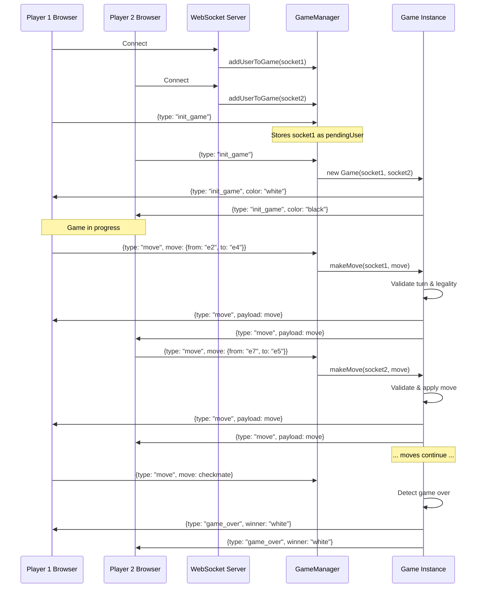

# Chess Application - Comprehensive Codebase Documentation

## Table of Contents

1. [Project Overview](#project-overview)
2. [Architecture](#architecture)
3. [Backend Deep Dive](#backend-deep-dive)
4. [Frontend Deep Dive](#frontend-deep-dive)
5. [Backend-Frontend Communication](#backend-frontend-communication)
6. [Code Enhancement Opportunities](#code-enhancement-opportunities)
7. [Scaling Strategies](#scaling-strategies)

---

## Project Overview

This is a **real-time multiplayer chess application** built with:

- **Backend**: Node.js + WebSocket Server (ws library) + chess.js
- **Frontend**: React + Vite + TailwindCSS + TypeScript + chess.js

**Core Functionality**: Two players can connect, get matched, and play chess in real-time with move validation and game state synchronization.

---

## Architecture

```mermaid
graph TB
    subgraph Frontend
        A[Landing Page] -->|Navigate| B[Game Page]
        B --> C[useWebSocket Hook]
        B --> D[useChessGame Hook]
        B --> E[ChessBoard Component]
        B --> F[GameControls Component]

        C -->|WebSocket Connection| G[WebSocket Client]
        D -->|Game State Management| H[Chess.js Instance]
        E -->|User Interaction| D
    end

    subgraph Backend
        I[WebSocket Server :8080] --> J[GameManager]
        J --> K[Pending Users Queue]
        J --> L[Active Games Array]
        L --> M[Game Instance 1]
        L --> N[Game Instance 2]
        L --> O[Game Instance N]

        M --> P[Chess.js Board]
        M --> Q[Player1 Socket]
        M --> R[Player2 Socket]
    end

    G <-->|JSON Messages| I

    style Frontend fill:#1e293b
    style Backend fill:#0f172a
```



**Directory Structure**:

```
chess/
├── backend1/
│   ├── src/
│   │   ├── index.ts          # WebSocket server entry point
│   │   ├── GameManager.ts    # Matchmaking & game orchestration
│   │   ├── game.ts           # Individual game logic
│   │   └── messages.ts       # Message type constants
│   └── package.json
└── frontend/
    ├── src/
    │   ├── screens/
    │   │   ├── Landing.tsx   # Marketing landing page
    │   │   └── game.tsx      # Game page container
    │   ├── components/
    │   │   ├── ChessBoard.tsx    # Chess board UI
    │   │   └── GameControls.tsx  # Game controls panel
    │   ├── hooks/
    │   │   ├── useWebSocket.ts   # WebSocket connection management
    │   │   └── useChessGame.ts   # Game state management
    │   ├── main.tsx
    │   ├── App.tsx
    │   └── index.css
    └── package.json
```

---

## Backend Deep Dive

### File: `backend1/src/index.ts` (14 lines)

**Purpose**: WebSocket server initialization and connection handling

**Code Block-by-Block**:

```typescript
import { WebSocket, WebSocketServer } from "ws";
import { GameManager } from "./GameManager.js";
```

- Imports WebSocket libraries and GameManager class
- Uses `.js` extension despite TypeScript due to ES Module configuration

```typescript
const wss = new WebSocketServer({ port: 8080 });
const gameManager = new GameManager();
```

- **Creates WebSocket server** on port 8080
- **Instantiates single GameManager** - singleton pattern for managing all games

```typescript
wss.on("connection", function connection(ws: WebSocket) {
  gameManager.addUserToGame(ws);

  ws.on("close", function close() {
    gameManager.removeUserFromGame(ws);
  });
});
```

- **On new connection**: Registers user with GameManager
- **On disconnect**: Cleans up user from GameManager
- **Why this code exists**: Delegates connection lifecycle to GameManager for centralized state management

**Enhancement Opportunities**:

1. Add connection authentication/validation
2. Implement connection rate limiting
3. Add health check endpoint
4. Add logging with timestamps and connection IDs

---

### File: `backend1/src/GameManager.ts` (55 lines)

**Purpose**: Matchmaking logic and message routing

**Code Block-by-Block**:

```typescript
export class GameManager {
    private games:Game[] ;
    private pendingUser: WebSocket | null;
    private users: WebSocket[];
```

- `games[]` - Array of active Game instances
- `pendingUser` - Holds first player waiting for opponent (simple queue)
- `users[]` - Tracks all connected WebSocket clients
- **Why**: Separation of concerns - tracks connections separately from games

```typescript
constructor() {
    this.games = [];
    this.pendingUser = null;
    this.users = [];
}
```

- Initializes empty state
- **No persistence** - all state is in-memory (lost on restart)

```typescript
addUserToGame(socket: WebSocket) {
    console.log("User added to GameManager");
    this.users.push(socket);
    this.addHandler(socket);
}
```

- Adds socket to users array
- Attaches message handler to socket
- **Why**: Every user gets event listeners registered

```typescript
removeUserFromGame(socket: WebSocket) {
    console.log("User removed from GameManager");
    this.users = this.users.filter(user => user !== socket);
}
```

- Filters out disconnected user
- **Missing**: Should also remove from `pendingUser` if waiting, and handle game abandonment
- **Bug**: If player in active game disconnects, game becomes broken

```typescript
private addHandler(socket: WebSocket) {
    socket.on("message", (data) => {
        const message = JSON.parse(data.toString());
```

- Listens for messages from client
- Parses JSON string to object
- **Why private**: Internal implementation detail

```typescript
if (message.type === INIT_GAME) {
  if (this.pendingUser) {
    console.log("Starting new game");
    const game = new Game(this.pendingUser, socket);
    this.games.push(game);
    this.pendingUser = null;
  } else {
    console.log("Waiting for second player");
    this.pendingUser = socket;
  }
}
```

- **Matchmaking logic**:
  - First player → stored in `pendingUser`
  - Second player → creates Game with both players
- **Simple algorithm**: FIFO matching
- **Why this works**: Guarantees 2-player games
- **Limitation**: No player preferences, ratings, or custom rooms

```typescript
if (message.type === MOVE) {
  console.log("Move message received");
  const game = this.games.find(
    (game) => game.player1 === socket || game.player2 === socket,
  );
  if (game) {
    game.makeMove(socket, message.move);
  }
}
```

- Finds which game the player belongs to
- Delegates move handling to Game instance
- **Why**: Game instance owns move validation logic

**Enhancement Opportunities**:

1. Handle player disconnection gracefully (pause game, offer reconnection)
2. Add game ID system instead of socket-based lookup
3. Implement matchmaking queue with ELO/rating
4. Add spectator support
5. Persist games to database
6. Handle multiple concurrent `INIT_GAME` requests from same user

---

### File: `backend1/src/game.ts` (77 lines)

**Purpose**: Individual chess game instance managing board state and player moves

**Code Block-by-Block**:

```typescript
export class Game {
    public player1: WebSocket;
    public player2: WebSocket;
    public board : Chess
    private startTime: number;
```

- `player1/player2` - WebSocket connections (player1 = white, player2 = black)
- `board` - chess.js instance for move validation
- `startTime` - Game start timestamp (unused currently)
- **Why public**: GameManager needs to identify games by players

```typescript
constructor(player1: WebSocket, player2: WebSocket) {
    this.player1 = player1;
    this.player2 = player2;
    this.board = new Chess();
    this.startTime = Date.now();
```

- Creates new chess board in starting position
- Records start time
- **Why chess.js**: Industry-standard library with complete rules implementation

```typescript
    this.player1.send(JSON.stringify({
        type: INIT_GAME,
        payload: {
            color: "white",
        }
    }))
    this.player2.send(JSON.stringify({
        type: INIT_GAME,
        payload: {
            color: "black",
        }
    }))
}
```

- **Immediately notifies both players** their assigned colors
- Player 1 always gets white (first move advantage)
- **Why in constructor**: Game start notification
- **Enhancement**: Could randomize colors for fairness

```typescript
makeMove(socket: WebSocket, move: {
    from: string;
    to: string;
}) {
    // Validate turn
    if (this.board.turn() === 'w' && socket !== this.player1) {
        console.log("Not player1's turn");
        return;
    }
    if (this.board.turn() === 'b' && socket !== this.player2) {
        console.log("Not player2's turn");
        return;
    }
```

- **Turn validation**: Ensures white moves when it's white's turn
- `this.board.turn()` returns 'w' or 'b'
- **Why**: Prevents players from moving out of turn
- **Silent failure**: Player not notified of rejection

```typescript
try {
  this.board.move(move);
} catch (error) {
  console.log("Invalid move", error);
  return;
}
```

- **chess.js validates move legality**: checks chess rules
- Throws error if invalid (wrong piece movement, king in check, etc.)
- **Why try-catch**: Invalid moves should not crash server
- **Missing**: Should notify player their move was rejected

```typescript
if (this.board.isGameOver()) {
  const winner = this.board.turn() === "w" ? "black" : "white";
  this.player1.send(
    JSON.stringify({
      type: GAME_OVER,
      payload: {
        winner: winner,
      },
    }),
  );
  this.player2.send(
    JSON.stringify({
      type: GAME_OVER,
      payload: {
        winner: winner,
      },
    }),
  );
  return;
}
```

- Checks for checkmate, stalemate, insufficient material, etc.
- **Winner determination**: If it's white's turn after last move, black won
- Notifies both players of game end
- **Why return**: No need to broadcast move after game ends
- **Missing**: Doesn't specify reason (checkmate vs stalemate vs draw)

```typescript
    // Notify both players of the move
    const moveMsg = JSON.stringify({
        type: MOVE,
        payload: move
    });

    this.player1.send(moveMsg);
    this.player2.send(moveMsg);
}
```

- **Broadcasts move to BOTH players** (including the one who made it)
- **Why to both**: Keeps clients in sync, confirms move acceptance
- **Optimization**: Could skip sending to sender

**Enhancement Opportunities**:

1. Add move history tracking
2. Implement undo/redo functionality
3. Add time controls (clock per player)
4. Store game to database for replay
5. Add draw offer/accept mechanism
6. Notify players of invalid moves with reasons
7. Handle resignation
8. Add game reason (checkmate/stalemate/draw/resignation)

---

### File: `backend1/src/messages.ts` (4 lines)

**Purpose**: Centralized message type constants

```typescript
export const INIT_GAME = "init_game";
export const MOVE = "move";
export const GAME_OVER = "game_over";
export const JOIN_GAME = "join_game";
```

- **Why**: Prevents typos, easier refactoring, single source of truth
- **JOIN_GAME unused**: Legacy constant not implemented
- **Enhancement**: Use TypeScript enums or const object for type safety

---

## Frontend Deep Dive

### File: `frontend/src/main.tsx` (11 lines)

**Purpose**: React application entry point

```typescript
import { StrictMode } from 'react'
import { createRoot } from 'react-dom/client'
import './index.css'
import App from './App.tsx'

createRoot(document.getElementById('root')!).render(
  <StrictMode>
    <App />
  </StrictMode>,
)
```

- **StrictMode**: Enables additional development checks
- Renders App component into `#root` element in HTML
- **Standard React pattern**: Nothing chess-specific

---

### File: `frontend/src/App.tsx` (21 lines)

**Purpose**: Routing configuration

```typescript
import { BrowserRouter, Routes, Route } from 'react-router-dom'
import { Landing } from './screens/Landing'
import { Game } from './screens/game'

function App() {
  return (
    <div>
      <BrowserRouter>
        <Routes>
          <Route path="/" element={<Landing />} />
          <Route path="/game" element={<Game />} />
        </Routes>
      </BrowserRouter>
    </div>
  )
}
```

- **2 routes**: Landing page (/) and Game page (/game)
- **BrowserRouter**: Uses HTML5 History API for clean URLs
- **Why**: Separates marketing from gameplay

**Enhancement**: Add 404 page, game history route, profile page

---

### File: `frontend/src/screens/Landing.tsx` (139 lines)

**Purpose**: Marketing landing page with call-to-action

**Key Sections**:

1. **Navigation Bar** (Lines 9-26):
   - Logo, links, "Play Now" button
   - Routes to /game on click

2. **Hero Section** (Lines 28-56):
   - Large heading, description
   - CTA button
   - Hero image (chess board)

3. **Stats Section** (Lines 58-79):
   - Displays fake statistics (10K+ Active Players, etc.)
   - **Why**: Social proof for engagement

4. **Features Section** (Lines 81-112):
   - 3 feature cards (Real-Time Play, Track Progress, Compete & Win)
   - **Why**: Highlights value propositions

5. **CTA Section** (Lines 115-130):
   - Final call-to-action before footer

6. **Footer** (Lines 132-136):
   - Copyright notice

**Design**: Dark theme with emerald green accents, modern TailwindCSS styling

**Enhancement**: Add actual player count from backend API, add testimonials, add game modes

---

### File: `frontend/src/screens/game.tsx` (53 lines)

**Purpose**: Main game page orchestrating all game components

```typescript
const WS_URL = 'ws://localhost:8080';

export function Game() {
    const { socket, isConnected, sendMessage } = useWebSocket(WS_URL);
    const { chess, playerColor, status, turn, winner, makeMove, isMyTurn } = useChessGame(socket, isConnected);
    const navigate = useNavigate();
```

- **Hardcoded WebSocket URL**: Not configurable for production
- **Custom hooks**: Separates WebSocket logic from game logic
- **Why two hooks**: Separation of concerns (connection vs game state)

```typescript
const handleStartGame = () => {
  sendMessage({ type: "init_game" });
};
```

- Simple wrapper to send init_game message
- **Why wrapper**: Abstracts message format from component

```typescript
    return (
        <div className="min-h-screen flex flex-col">
            <nav className="w-full p-6 border-b border-white/10">
                {/* Navigation */}
            </nav>

            <div className="flex-1 container mx-auto px-4 py-8 flex flex-col lg:flex-row items-start justify-center gap-8 lg:gap-12">
                <div className="order-2 lg:order-1">
                    <ChessBoard
                        chess={chess}
                        playerColor={playerColor}
                        isMyTurn={isMyTurn}
                        onMove={makeMove}
                    />
                </div>

                <div className="w-full max-w-sm order-1 lg:order-2">
                    <GameControls
                        isConnected={isConnected}
                        playerColor={playerColor}
                        status={status}
                        turn={turn}
                        isMyTurn={isMyTurn}
                        winner={winner}
                        onStartGame={handleStartGame}
                    />
                </div>
            </div>
        </div>
    );
}
```

- **Layout**: Navigation + two-column layout (board + controls)
- **Responsive**: Stacks vertically on mobile, side-by-side on desktop
- **Order swap**: Controls appear above board on mobile for better UX
- **Prop drilling**: Passes all state down to child components

**Enhancement**: Add game chat, move history panel, captured pieces display

---

### File: `frontend/src/hooks/useWebSocket.ts` (56 lines)

**Purpose**: Manages WebSocket connection lifecycle

**Code Block-by-Block**:

```typescript
export function useWebSocket(url: string) {
    const [socket, setSocket] = useState<WebSocket | null>(null);
    const [isConnected, setIsConnected] = useState(false);
    const reconnectTimeoutRef = useRef<number>(null!);
```

- **State management**: Socket object and connection status
- **reconnectTimeoutRef**: Stores timeout ID for auto-reconnect
- **Why ref not state**: Timeout ID doesn't need to trigger re-renders

```typescript
    useEffect(() => {
        const connectWebSocket = () => {
            const ws = new WebSocket(url);

            ws.onopen = () => {
                console.log('WebSocket connected');
                setIsConnected(true);
                setSocket(ws);
            };
```

- Creates WebSocket connection in useEffect
- **onopen**: Sets connection status when successful
- **Why in useEffect**: Runs on component mount, cleans up on unmount

```typescript
ws.onclose = () => {
  console.log("WebSocket disconnected");
  setIsConnected(false);
  setSocket(null);

  reconnectTimeoutRef.current = setTimeout(() => {
    console.log("Attempting to reconnect...");
    connectWebSocket();
  }, 3000);
};
```

- **Auto-reconnect**: Attempts to reconnect after 3 seconds
- **Why**: Handles network interruptions gracefully
- **Recursive**: Calls connectWebSocket again
- **Potential issue**: Infinite reconnect loop if server is down

```typescript
ws.onerror = (error) => {
  console.error("WebSocket error:", error);
};
```

- Logs errors (doesn't provide much detail due to browser limitations)

```typescript
        return () => {
            if (reconnectTimeoutRef.current) {
                clearTimeout(reconnectTimeoutRef.current);
            }
            ws.close();
        };
    }, [url]);
```

- **Cleanup**: Cancels reconnect timeout and closes socket on unmount
- **Dependency**: Re-runs if URL changes (shouldn't happen)

```typescript
    const sendMessage = (message: unknown) => {
        if (socket && isConnected) {
            socket.send(JSON.stringify(message));
        } else {
            console.error('WebSocket is not connected');
        }
    };

    return { socket, isConnected, sendMessage };
}
```

- **sendMessage**: Helper to JSON-encode and send messages
- **Safety check**: Only sends if connected
- **Returns**: Socket object, connection status, send function

**Enhancement Opportunities**:

1. Add exponential backoff for reconnection
2. Add max reconnect attempts
3. Implement heartbeat/ping-pong to detect connection issues
4. Add connection state enum (connecting/connected/disconnected/error)
5. Notify user of connection issues

---

### File: `frontend/src/hooks/useChessGame.ts` (116 lines)

**Purpose**: Manages chess game state and message handling

**Code Block-by-Block**:

```typescript
type GameStatus = "waiting" | "playing" | "finished";
type PlayerColor = "white" | "black" | null;

interface GameState {
  chess: Chess;
  playerColor: PlayerColor;
  status: GameStatus;
  turn: "w" | "b";
  winner: string | null;
}
```

- **Type definitions**: Strong typing for game state
- **Why null for color**: Player hasn't been assigned yet

```typescript
export function useChessGame(socket: WebSocket | null, isConnected: boolean) {
    const [gameState, setGameState] = useState<GameState>({
        chess: new Chess(),
        playerColor: null,
        status: 'waiting',
        turn: 'w',
        winner: null,
    });
```

- **Initial state**: Empty board, waiting for game
- **Chess instance**: Creates local chess.js instance for move validation
- **Why local validation**: Instant feedback, reduces server round-trips

```typescript
    useEffect(() => {
        if (!socket) return;

        const handleMessage = (event: MessageEvent) => {
            const message = JSON.parse(event.data);
            console.log('Game message received:', message);

            switch (message.type) {
                case 'init_game':
                    setGameState(prev => ({
                        ...prev,
                        playerColor: message.payload.color,
                        status: 'playing',
                    }));
                    break;
```

- **Message listener**: Listens for messages from server
- **init_game handler**: Sets player color and changes status to playing
- **Why spread operator**: Preserves other state fields

```typescript
                case 'move':
                    setGameState(prev => {
                        const newChess = new Chess(prev.chess.fen());
                        try {
                            newChess.move(message.payload);
                            return {
                                ...prev,
                                chess: newChess,
                                turn: newChess.turn(),
                            };
                        } catch (error) {
                            console.error('Invalid move received:', error);
                            return prev;
                        }
                    });
                    break;
```

- **move handler**: Applies opponent's move to local board
- **FEN cloning**: Creates new Chess instance from FEN string (immutability)
- **Try-catch**: Shouldn't fail since server validated, but defensive programming
- **Why update turn**: Tracks whose turn it is for UI

```typescript
                case 'game_over':
                    setGameState(prev => ({
                        ...prev,
                        status: 'finished',
                        winner: message.payload.winner,
                    }));
                    break;
            }
        };

        socket.addEventListener('message', handleMessage);

        return () => {
            socket.removeEventListener('message', handleMessage);
        };
    }, [socket]);
```

- **game_over handler**: Marks game as finished
- **Cleanup**: Removes event listener when socket changes
- **Why dependency [socket]**: Re-registers listener if socket instance changes

```typescript
const makeMove = (from: string, to: string) => {
  const move = gameState.chess.move({ from, to, promotion: "q" });

  if (move) {
    setGameState((prev) => ({
      ...prev,
      turn: prev.chess.turn(),
    }));

    if (socket && isConnected) {
      socket.send(
        JSON.stringify({
          type: "move",
          move: { from, to },
        }),
      );
      console.log("Move sent to server:", { from, to });
    }

    return true;
  }

  return false;
};
```

- **Client-side validation**: Checks move legality before sending to server
- **Optimistic update**: Updates local board immediately
- **Auto-promotes to queen**: Simplification (should offer choice)
- **Returns boolean**: Indicates success/failure for UI feedback
- **Why update turn**: Needed for UI to show correct turn

```typescript
    return {
        ...gameState,
        makeMove,
        resetGame,
        isMyTurn: gameState.playerColor !== null &&
                  ((gameState.playerColor === 'white' && gameState.turn === 'w') ||
                   (gameState.playerColor === 'black' && gameState.turn === 'b')),
    };
}
```

- **Computed property isMyTurn**: Derived from color + turn
- **Why computed**: Simplifies component logic
- **Spreads game state**: Makes all fields available to consumer

**Enhancement Opportunities**:

1. Add move history array
2. Implement undo (send to server)
3. Add pawn promotion UI
4. Add draw offer mechanism
5. Store game in localStorage for reconnection recovery
6. Add move sound effects
7. Implement game timer/clock

---

### File: `frontend/src/components/ChessBoard.tsx` (117 lines)

**Purpose**: Renders interactive chess board with pieces

**Key Logic**:

```typescript
const PIECE_SYMBOLS: { [key: string]: string } = {
  p: "♟",
  n: "♞",
  b: "♝",
  r: "♜",
  q: "♛",
  k: "♚",
};
```

- **Unicode chess pieces**: Visual representation
- **Why not images**: Simpler, faster, scales perfectly

```typescript
const [selectedSquare, setSelectedSquare] = useState<string | null>(null);
const [validMoves, setValidMoves] = useState<string[]>([]);
```

- **Selected square**: Tracks piece user clicked
- **Valid moves**: Highlights where selected piece can move

```typescript
const files = ["a", "b", "c", "d", "e", "f", "g", "h"];
const ranks = ["8", "7", "6", "5", "4", "3", "2", "1"];

const displayFiles = playerColor === "black" ? [...files].reverse() : files;
const displayRanks = playerColor === "black" ? [...ranks].reverse() : ranks;
```

- **Board orientation**: Flips board for black player
- **Why**: Standard chess convention (each player sees their pieces at bottom)

```typescript
const handleSquareClick = (square: string) => {
  if (!isMyTurn) return;

  if (selectedSquare) {
    const moved = onMove(selectedSquare, square);
    setSelectedSquare(null);
    setValidMoves([]);

    if (!moved && square !== selectedSquare) {
      selectSquare(square);
    }
  } else {
    selectSquare(square);
  }
};
```

- **Click handling logic**:
  1. If piece selected → try to move there
  2. If move fails and clicked different square → select that piece instead
  3. If no piece selected → select clicked square
- **Why**: Intuitive click-to-select, click-to-move UX

```typescript
const selectSquare = (square: string) => {
  const piece = chess.get(square as Square);

  if (
    piece &&
    ((playerColor === "white" && piece.color === "w") ||
      (playerColor === "black" && piece.color === "b"))
  ) {
    setSelectedSquare(square);

    const moves = chess.moves({ square: square as Square, verbose: true });
    setValidMoves(moves.map((m) => m.to));
  }
};
```

- **Selection validation**: Only allows selecting own pieces
- **Calculates valid moves**: Uses chess.js to get legal moves
- **Why verbose mode**: Gets detailed move objects with 'to' property

```typescript
const isLightSquare = (fileIndex: number, rankIndex: number): boolean => {
  return (fileIndex + rankIndex) % 2 === 0;
};
```

- **Checkerboard pattern**: Alternates square colors
- **Math**: Sum of indices determines color

**Visual Features**:

- **Selected highlighting**: Bright emerald overlay
- **Valid move indicators**: Dots on empty squares, rings on capture targets
- **Coordinate labels**: Ranks on left, files on bottom
- **Piece styling**: Different colors for white/black pieces with shadows

**Enhancement**:

1. Add drag-and-drop support
2. Add move animation
3. Add last move highlighting
4. Add check/checkmate visual indicators
5. Add square highlighting themes
6. Show captured pieces
7. Add board themes/skins

---

### File: `frontend/src/components/GameControls.tsx` (101 lines)

**Purpose**: Game status display and controls panel

**Key Sections**:

1. **Status Header** (Lines 22-33):
   - Shows game status badge (Waiting/In Game/Game Over)
   - Color-coded: yellow (waiting), emerald (playing), gray (finished)

2. **Turn Indicator** (Lines 37-43):
   - "Waiting for Opponent" / "Your Turn" / "Opponent's Turn" / "Game Over"

3. **Player Color Display** (Lines 45-55):
   - Shows which color you're playing as
   - Icon and text label

4. **Turn Tracker** (Lines 57-68):
   - Two boxes showing white and black
   - Highlights active player with emerald border

5. **Action Buttons** (Lines 72-96):
   - "Start Game" button when waiting (disabled if disconnected)
   - "Play Again" button when finished (reloads page)

**Design**: Card-based UI with dark background, emerald accents, responsive layout

**Enhancement**:

1. Add resign button
2. Add draw offer button
3. Add move history list
4. Add game timer/clock display
5. Add player names/avatars
6. Add statistics (captures, move count)

---

## Backend-Frontend Communication

### WebSocket Message Protocol

All messages are JSON strings over WebSocket.

**Message Types**:

#### 1. `init_game` (Client → Server)

**Trigger**: User clicks "Start Game" button

```json
{
  "type": "init_game"
}
```

**Backend Action**:

- If no pending player → stores socket as pending
- If pending player exists → creates Game, pairs players

#### 2. `init_game` (Server → Client)

**Trigger**: Game created (both players matched)

```json
{
  "type": "init_game",
  "payload": {
    "color": "white" | "black"
  }
}
```

**Frontend Action**:

- Sets `playerColor` state
- Changes status to 'playing'
- Enables board interaction

#### 3. `move` (Client → Server)

**Trigger**: Player makes a move on the board

```json
{
  "type": "move",
  "move": {
    "from": "e2",
    "to": "e4"
  }
}
```

**Backend Action**:

- Validates it's player's turn
- Validates move legality via chess.js
- Updates server board state
- Broadcasts to both players

#### 4. `move` (Server → Client)

**Trigger**: Valid move made by either player

```json
{
  "type": "move",
  "payload": {
    "from": "e2",
    "to": "e4"
  }
}
```

**Frontend Action**:

- Creates new Chess instance from current FEN
- Applies move to local board
- Updates turn state
- Re-renders board

#### 5. `game_over` (Server → Client)

**Trigger**: Game ends (checkmate, stalemate, etc.)

```json
{
  "type": "game_over",
  "payload": {
    "winner": "white" | "black"
  }
}
```

**Frontend Action**:

- Sets status to 'finished'
- Displays winner
- Shows "Play Again" button

### Communication Flow Diagram



### Data Flow

**Frontend State Updates**:

1. User interaction → React state update
2. State update → Component re-render
3. For moves: Also sends WebSocket message

**Backend State Updates**:

1. Receive WebSocket message → Parse JSON
2. Update in-memory game state
3. Broadcast to relevant players

**Synchronization Strategy**:

- **Source of truth**: Backend (server-authoritative)
- **Client prediction**: Frontend applies moves optimistically
- **Server confirmation**: Broadcasting move back confirms acceptance

---

## Code Enhancement Opportunities

### 1. Error Handling

**Current Issue**: Silent failures everywhere

**Enhancements**:

- Add error message types to protocol
- Show toast notifications for errors
- Add error boundaries in React
- Log errors to monitoring service

### 2. Reconnection Handling

**Current Issue**: Game lost if player disconnects

**Enhancements**:

- Add session tokens for reconnection
- Pause game on disconnect
- Give opponent option to wait or claim victory
- Store game state in Redis with TTL

### 3. Authentication & Authorization

**Current Issue**: No user accounts or authentication

**Enhancements**:

- Add user registration/login (JWT or session-based)
- Store user profiles in database
- Track game history per user
- Implement ELO rating system
- Add friends list and private rooms

### 4. Input Validation

**Current Issue**: Minimal validation of incoming messages

**Enhancements**:

- Validate message structure with Zod/Joi
- Sanitize all inputs
- Rate limit message frequency per socket
- Check message size to prevent DOS

###5. Move History & Replay

**Current Issue**: No move history tracking

**Enhancements**:

- Store moves array in Game class
- Add PGN (Portable Game Notation) export
- Implement move undo feature
- Show move list in UI
- Add game replay functionality
- Store finished games in database as PGN

### 6. Time Controls

**Current Issue**: No time limits (games can run forever)

**Enhancements**:

- Add chess clock (e.g., 10+0, 5+3 increment)
- Track remaining time per player
- Send time updates to clients
- Auto-forfeit on timeout
- Display timer in UI

### 7. Game Variations

**Current Issue**: Only standard chess

**Enhancements**:

- Add game modes (blitz, rapid, bullet, classical)
- Implement Chess960 (Fischer Random)
- Add puzzle mode
- Implement computer opponent (Stockfish integration)

### 8. UI/UX Improvements

**Enhancements**:

- Add sound effects (move, capture, check, game end)
- Implement drag-and-drop for pieces
- Add move animations
- Highlight last move
- Show captured pieces
- Add board and piece themes
- Implement premoves (queue next move)
- Add check/checkmate visual indicators

### 9. Social Features

**Enhancements**:

- Add in-game chat
- Implement spectator mode
- Add emotes/reactions
- Show online friends list
- Add game invitations
- Implement tournaments
- Add leaderboards

### 10. Data Persistence

**Current Issue**: All state is in-memory (lost on restart)

**Enhancements**:

- Add PostgreSQL for user data, game history
- Add Redis for active game state, matchmaking queue
- Store finished games as PGN in database
- Implement game recovery on reconnect

---

## Scaling Strategies

### Current Architecture Limitations

**Single Server Bottleneck**:

- All games run on one Node.js process
- Limited by single-core performance
- No horizontal scaling
- Memory grows with concurrent games

**Stateful WebSocket Connections**:

- Players tied to specific server instance
- Can't load balance easily
- Server restart loses all games

### Horizontal Scaling Strategy

#### 1. **Load Balancer + Sticky Sessions**

```
┌─────────┐
│ NGINX   │ (WebSocket sticky sessions)
│ Load    │
│ Balancer│
└────┬────┘
     │
     ├────────┬────────┬────────┐
     │        │        │        │
┌────▼───┐ ┌──▼────┐ ┌──▼────┐ ┌──▼────┐
│WS Srv 1│ │WS Srv2│ │WS Srv3│ │WS Srv4│
└────┬───┘ └───┬───┘ └───┬───┘ └───┬───┘
     │         │         │         │
     └─────────┴─────────┴─────────┘
                    │
               ┌────▼─────┐
               │  Redis   │ (Shared state)
               │  Cluster │
               └──────────┘
```

**Implementation**:

- Use NGINX with IP hash for sticky sessions
- 4-8 WebSocket servers behind load balancer
- Redis Pub/Sub for cross-server messaging
- Game state stored in Redis

**Advantages**:

- Linear scaling with server count
- Fault tolerance (other servers handle load)
- Relatively simple to implement

**Limitations**:

- Still requires sticky sessions
- Redis becomes bottleneck at very high scale

#### 2. **Microservices Architecture**

```
┌────────────┐
│   Frontend │
└──────┬─────┘
       │
┌──────▼──────┐        ┌───────────────┐
│   API       │────────│  Auth Service │
│   Gateway   │        └───────────────┘
└──────┬──────┘
       │
       ├─────────────────┬─────────────────┬──────────────┐
       │                 │                 │              │
┌──────▼──────┐  ┌───────▼──────┐  ┌──────▼───────┐ ┌───▼────────┐
│ Matchmaking │  │ Game Service │  │ User Service │ │Stats Service│
│  Service    │  │  (Stateless) │  │              │ │             │
└──────┬──────┘  └───────┬──────┘  └──────┬───────┘ └────────────┘
       │                 │                 │
       └─────────────────┴─────────────────┘
                         │
              ┌──────────▼──────────┐
              │   PostgreSQL        │
              │   (User/Game Data)  │
              └─────────────────────┘
              ┌─────────────────────┐
              │   Redis Cluster     │
              │ (Active Game State) │
              └─────────────────────┘
```

**Services**:

1. **Auth Service**: User registration, login, JWT issuing
2. **Matchmaking Service**: Queue management, player pairing
3. **Game Service**: Chess logic, move validation (multiple instances)
4. **User Service**: Profile, game history, ratings
5. **Stats Service**: Leaderboards, analytics

**Advantages**:

- Each service scales independently
- Technology flexibility per service
- Clear separation of concerns
- Easier to maintain and test

**Challenges**:

- More complex deployment
- Requires orchestration (Kubernetes)
- Inter-service communication overhead

#### 3. **Database Sharding**

**Strategy**: Shard by user ID

```
User ID 0-999999    → DB Shard 1
User ID 1000000-1999999 → DB Shard 2
User ID 2000000+ → DB Shard 3
```

**Game Data**: Store in shard of player1

**Advantages**:

- Distributes read/write load
- Handles millions of users

#### 4. **Redis Strategy for Active Games**

**Data Structure**:

```
game:{gameId}:fen → "rnbqkbnr/pppppppp/8/8/8/8/PPPPPPPP/RNBQKBNR w KQkq - 0 1"
game:{gameId}:player1 → userId
game:{gameId}:player2 → userId
game:{gameId}:moves → ["e2e4", "e7e5", ...]
game:{gameId}:startTime → timestamp
game:{gameId}:timeLeft:white → seconds
game:{gameId}:timeLeft:black → seconds

user:{userId}:activeGame → gameId
```

**Pub/Sub Channels**:

```
game:{gameId}:moves → Broadcast moves to all subscribers
```

**TTL**: Expire games after 24 hours inactivity

#### 5. **CDN for Static Assets**

- Serve frontend from CloudFlare/Fastly
- Reduces server load
- Global distribution for low latency

#### 6. **Monitoring & Observability**

**Tools**:

- **Prometheus**: Metrics collection
- **Grafana**: Visualization
- **ELK Stack**: Logging (Elasticsearch, Logstash, Kibana)
- **Sentry**: Error tracking

**Metrics to Track**:

- Active WebSocket connections
- Games in progress
- Moves per second
- Average game duration
- Server CPU/memory usage
- Redis queue depth
- Database query latency

### Performance Optimizations

#### Backend:

1. **Connection Pooling**: PostgreSQL connection pool (pg-pool)
2. **Caching**: Redis cache for user profiles, leaderboards
3. **Compression**: Enable WebSocket compression (permessage-deflate)
4. **Lazy Loading**: Don't load entire game history upfront
5. **Batch Operations**: Batch database writes for game history

#### Frontend:

1. **Code Splitting**: Lazy load game page
2. **Tree Shaking**: Remove unused chess.js methods
3. **Memoization**: React.memo for expensive components
4. **Virtual Scrolling**: For move history lists
5. **Service Worker**: Cache static assets
6. **WebP Images**: Use modern image formats

### Cost Optimization

**Current Stack** (MVP):

- 1 VPS (DigitalOcean $12/mo) - Backend
- Vercel Free Tier - Frontend
- Total: ~$12/month for <1000 concurrent users

**Growth Stack** (10k concurrent):

- 4 VPS instances ($48/mo)
- Redis Cloud ($20/mo)
- PostgreSQL managed ($25/mo)
- CloudFlare CDN (free)
- Total: ~$93/month

**Enterprise Stack** (100k concurrent):

- Kubernetes cluster (AWS EKS ~$300/mo)
- 10-20 app pods ($500-1000/mo)
- Redis Cluster ($200/mo)
- PostgreSQL cluster ($400/mo)
- CloudFront CDN ($100/mo)
- Load balancer ($20/mo)
- Total: ~$1520-1920/month

---

## Immediate Priorities

Based on code analysis, here are the TOP 10 immediate improvements:

### Priority 1: Critical Bug Fixes

1. **Fix player disconnection bug** in GameManager
   - Clear pendingUser if they disconnect
   - Handle mid-game disconnections (notify opponent, pause/end game)

2. **Add production WebSocket URL config**
   - Use environment variables
   - Support wss:// for HTTPS sites

### Priority 2: Core Features

3. **Add proper error handling**
   - Send error messages from server to client
   - Display errors in UI

4. **Implement basic game history**
   - Store moves array in Game class
   - Display move list in UI

5. **Add resignation functionality**
   - Add RESIGN message type
   - Show resign button during game

### Priority 3: UX Improvements

6. **Add sound effects**
   - Move sound, capture sound, check sound, game over sound

7. **Add last move highlighting**
   - Highlight source and destination squares of last move

8. **Implement drag-and-drop**
   - More intuitive than click-click for many users

### Priority 4: Infrastructure

9. **Add basic logging**
   - winston or pino for structured logging
   - Log game starts, ends, errors

10. **Environment variable setup**
    - dotenv for configuration
    - Separate dev/prod configs

---

## Security Considerations

### Current Vulnerabilities

1. **No authentication**: Anyone can connect
2. **No input validation**: Malformed messages could crash server
3. **No rate limiting**: Vulnerable to DOS attacks
4. **No encryption**: WebSocket is unencrypted (ws://)
5. **XSS risks**: If adding chat feature

### Security Enhancements

1. **Use WSS (WebSocket Secure)** with TLS certificates
2. **Implement authentication** with JWTs
3. **Validate all inputs** with schema validation (Zod)
4. **Rate limit connections** per IP (express-rate-limit)
5. **Sanitize user inputs** if adding chat/usernames
6. **Use CORS** properly on API endpoints
7. **Implement CSP** (Content Security Policy) headers
8. **Regular dependency updates** (npm audit)

---

## Testing Strategy

### Current State: No Tests

### Recommended Test Pyramid

#### Unit Tests (70%)

- `Game.makeMove()` with various scenarios
- `GameManager.addUserToGame()` logic
- Chess board square color calculation
- useChessGame hook message handling

**Tools**: Jest, @testing-library/react

#### Integration Tests (20%)

- Full game flow: connect → match → moves → game over
- WebSocket message flow
- React component interactions

**Tools**: Jest, ws (for testing WebSocket server)

#### E2E Tests (10%)

- Complete user journey: land → play → finish
- Multi-browser testing

**Tools**: Playwright or Cypress

### Sample Test Structure

```
backend1/
  src/
  tests/
    unit/
      game.test.ts
      gameManager.test.ts
    integration/
      fullGame.test.ts

frontend/
  src/
  tests/
    unit/
      useChessGame.test.tsx
      ChessBoard.test.tsx
    integration/
      gameFlow.test.tsx
    e2e/
      completeGame.spec.ts
```

---

## Deployment Guide

### Development

```bash
# Backend
cd backend1
npm install
npm run dev  # Add this script: "dev": "tsc -w & node --watch dist/index.js"

# Frontend
cd frontend
npm install
npm run dev
```

### Production (Simple)

1. **Backend on VPS**:

```bash
# On Ubuntu VPS
cd backend1
npm install
npm run build
pm2 start dist/index.js --name chess-backend
pm2 save
pm2 startup  # Auto-restart on reboot
```

2. **Frontend on Vercel**:

```bash
cd frontend
# Update WS_URL in game.tsx to production backend URL
vercel deploy --prod
```

3. **Enable WSS**:

- Get domain name
- Install SSL cert (Let's Encrypt)
- Configure reverse proxy (NGINX):

```nginx
server {
    listen 443 ssl;
    server_name api.yourchess.com;

    ssl_certificate /path/to/cert.pem;
    ssl_certificate_key /path/to/key.pem;

    location / {
        proxy_pass http://localhost:8080;
        proxy_http_version 1.1;
        proxy_set_header Upgrade $http_upgrade;
        proxy_set_header Connection "upgrade";
    }
}
```

### Production (Docker)

`backend1/Dockerfile`:

```dockerfile
FROM node:20-alpine
WORKDIR /app
COPY package*.json ./
RUN npm ci --only=production
COPY dist ./dist
CMD ["node", "dist/index.js"]
EXPOSE 8080
```

`docker-compose.yml`:

```yaml
version: "3.8"
services:
  backend:
    build: ./backend1
    ports:
      - "8080:8080"
    restart: unless-stopped

  frontend:
    build: ./frontend
    ports:
      - "3000:3000"
    depends_on:
      - backend
```

---

## Conclusion

This chess application demonstrates solid fundamentals with:

- ✅ Real-time WebSocket communication
- ✅ Clean separation of concerns (hooks, components)
- ✅ Server-authoritative game logic
- ✅ Responsive modern UI

**Strengths**:

- Simple, understandable codebase
- Good use of chess.js library
- Functional MVP with core features

**Main Gaps**:

- No persistence (games lost on restart)
- No error handling or reconnection logic
- No authentication or user accounts
- Limited scalability (single server)
- No testing

**Recommended Next Steps**:

1. Fix critical bugs (disconnection handling)
2. Add basic error handling and logging
3. Implement move history
4. Add sound effects for better UX
5. Set up environment configs
6. Write basic tests
7. Deploy to production with SSL
8. Add user authentication
9. Implement persistence (database)
10. Scale horizontally with Redis

This codebase is a great foundation that can evolve into a production-ready chess platform with the enhancements outlined above!

---

**Document Version**: 1.0  
**Last Updated**: February 1, 2026  
**Codebase Analyzed**: Chess Application (Backend + Frontend)
