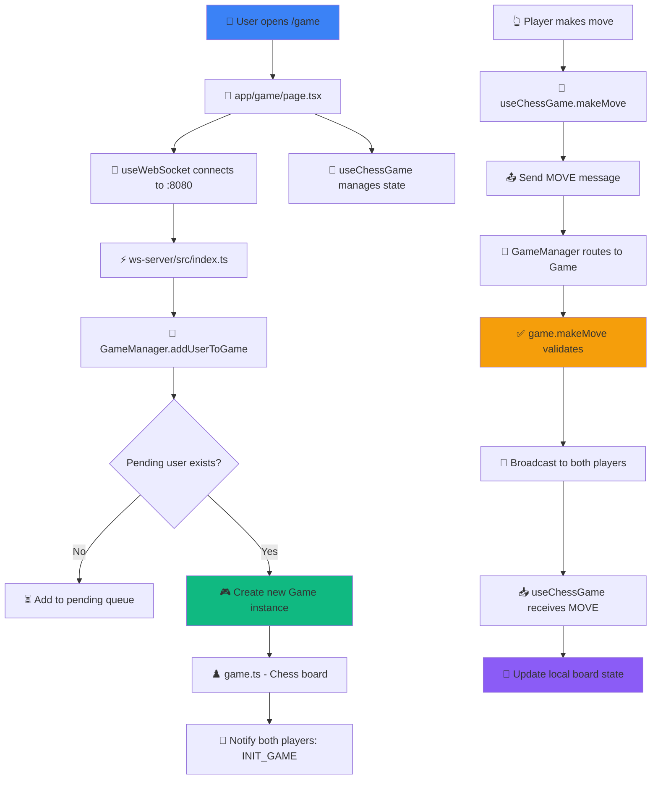

# ♟️ Chess App - Complete Architecture Documentation

> **A modern, real-time multiplayer chess platform built with Turborepo**

---

## 📚 Table of Contents

- [🎯 Overview](#-overview)
- [🏗️ Root Structure](#️-root-structure)
- [🌐 Frontend Application](#-frontend-application)
- [⚡ Backend WebSocket Server](#-backend-websocket-server)
- [📦 Shared Packages](#-shared-packages)
- [🔄 Architecture Flow](#-architecture-flow)
- [🚀 Build & Deployment](#-build--deployment)
- [📊 Project Statistics](#-project-statistics)

---

## 🎯 Overview

**Chess App** is a production-ready, real-time multiplayer chess platform featuring:

- ✨ **Modern Turborepo monorepo** architecture
- 🎮 **Real-time gameplay** with WebSocket communication
- 🎨 **Beautiful UI** with Next.js 16 and Tailwind CSS v4
- 🔒 **Type-safe** with shared TypeScript types
- 🐳 **Docker-ready** for easy deployment
- ⚡ **Fast builds** with Turbo caching

---

## 🏗️ Root Structure

```
chess-app/
├── 📄 .gitignore                   # Git ignore patterns
├── 📄 package.json                 # Root package.json for monorepo
├── 📄 pnpm-workspace.yaml          # Workspace configuration
├── 📄 README.md                    # Project documentation
├── 📄 docker-compose.yml           # Docker orchestration
├── 📄 tsconfig.json                # Root TypeScript config
├── 📄 tsconfig.base.json           # Base TypeScript config
├── 📄 turbo.json                   # Turborepo pipeline
│
├── 📁 apps/                        # Applications
│   ├── web/                        # Next.js frontend
│   └── ws-server/                  # WebSocket backend
│
└── 📁 packages/                    # Shared packages
    ├── chess-engine/               # Chess logic wrapper
    ├── types/                      # TypeScript types
    ├── ui/                         # React components
    ├── utils/                      # Utilities
    ├── eslint-config/              # ESLint configs
    ├── typescript-config/          # TS configs
    ├── api/                        # Legacy (unused)
    └── config/                     # Configurations
```

### 🔧 Configuration Files

| File | Purpose |
|------|---------|
| `turbo.json` | Turborepo build pipeline with tasks, outputs, and caching |
| `pnpm-workspace.yaml` | Defines workspaces: `apps/*` and `packages/*` |
| `package.json` | Root package with workspace scripts |
| `tsconfig.base.json` | Base TypeScript config inherited by all packages |
| `docker-compose.yml` | Orchestrates `web` and `ws-server` containers |
| `.gitignore` | Ignores node_modules, build artifacts, .env files |

---

## 🌐 Frontend Application

> **Location**: `apps/web`  
> **Framework**: Next.js 16 with App Router  
> **Port**: 3000

### 📂 Directory Structure

```
apps/web/
├── 📄 package.json                 # Dependencies (Next.js, React, Tailwind)
├── 📄 tsconfig.json                # TypeScript config
├── 📄 next.config.mjs              # Next.js configuration
├── 📄 next-env.d.ts                # Next.js type declarations
├── 📄 postcss.config.mjs           # PostCSS for Tailwind
├── 📄 tailwind.config.ts           # Tailwind configuration
├── 📄 eslint.config.mjs            # ESLint rules
├── 📄 Dockerfile                   # Production Docker image
├── 📄 README.md                    # App documentation
│
├── 📁 app/                         # Next.js App Router
│   ├── layout.tsx                  # Root layout
│   ├── page.tsx                    # Landing page (/)
│   ├── globals.css                 # Global styles
│   ├── favicon.ico                 # Site icon
│   │
│   ├── 📁 fonts/                   # Custom fonts
│   │   ├── GeistVF.woff            # Geist variable font
│   │   └── GeistMonoVF.woff        # Geist Mono font
│   │
│   ├── 📁 game/                    # Game pages
│   │   ├── page.tsx                # Quick match (/game)
│   │   └── [id]/page.tsx           # Room game (/game/:id)
│   │
│   └── 📁 spectate/                # Spectator mode
│       └── [id]/page.tsx           # Watch game (/spectate/:id)
│
├── 📁 components/                  # React components
│   ├── ChessBoard.tsx              # Main chessboard (uses @repo/ui)
│   └── GameControls.tsx            # Game controls panel
│
├── 📁 hooks/                       # Custom React hooks
│   ├── useWebSocket.ts             # WebSocket management
│   └── useChessGame.ts             # Game state management
│
├── 📁 styles/                      # Stylesheets
│   └── globals.css                 # Additional global CSS
│
├── 📁 assets/                      # Images & media
│   └── chess_board_hero.png        # Hero image
│
└── 📁 public/                      # Static assets
    ├── *.svg                       # Icons and logos
    └── turborepo-*.svg             # Turborepo branding
```

### 🎯 Key Frontend Files

| File | Purpose |
|------|---------|
| **`app/layout.tsx`** | Root layout with HTML structure, fonts, metadata |
| **`app/page.tsx`** | Landing page with hero section and call-to-action |
| **`app/game/page.tsx`** | 🎮 Quick match game page - WebSocket connection |
| **`app/game/[id]/page.tsx`** | Room-based game with custom ID |
| **`components/ChessBoard.tsx`** | Wrapper around `@repo/ui` ChessBoard component |
| **`components/GameControls.tsx`** | Status panel, start button, winner display |
| **`hooks/useWebSocket.ts`** | 🔌 WebSocket connection with auto-reconnect |
| **`hooks/useChessGame.ts`** | 🎲 Game state with message handling |
| **`styles/globals.css`** | Tailwind directives and CSS variables |

---

## ⚡ Backend WebSocket Server

> **Location**: `apps/ws-server`  
> **Framework**: Node.js + WebSocket (ws)  
> **Port**: 8080

### 📂 Directory Structure

```
apps/ws-server/
├── 📄 package.json                 # Dependencies (ws, chess.js)
├── 📄 tsconfig.json                # TypeScript config
├── 📄 Dockerfile                   # Production image
│
├── 📁 src/                         # Source code
│   ├── 📄 index.ts                 # 🚀 Main entry point
│   ├── 📄 server.ts                # Server helper
│   ├── 📄 config.ts                # Configuration
│   ├── 📄 GameManager.ts           # 🎯 Matchmaking logic
│   ├── 📄 game.ts                  # ♟️ Chess game instance
│   ├── 📄 messages.ts              # Message constants
│   │
│   ├── 📁 handlers/                # Message handlers
│   │   ├── join.ts                 # Join handler
│   │   ├── move.ts                 # Move handler
│   │   └── resign.ts               # Resign handler
│   │
│   └── 📁 services/                # Business services
│       ├── persistence.ts          # Database (planned)
│       └── redis.ts                # Redis (planned)
│
├── 📁 docs/                        # Documentation
│   └── CODEBASE_DOCUMENTATION.md   # Complete docs
│
└── 📁 dist/                        # Compiled output
```

### 🎯 Key Backend Files

| File | Purpose |
|------|---------|
| **`src/index.ts`** | 🚀 Creates WebSocket server on port 8080 |
| **`src/GameManager.ts`** | 🎮 Matchmaking queue & game orchestration |
| **`src/game.ts`** | ♟️ Individual game logic with chess board |
| **`src/messages.ts`** | Message type constants (`INIT_GAME`, `MOVE`, `GAME_OVER`) |
| **`src/config.ts`** | Environment configuration |
| **`src/handlers/*.ts`** | Modular message handlers |
| **`src/services/*.ts`** | Persistence and caching services |

---

## 📦 Shared Packages

### 1️⃣ `@chess/chess-engine` - Chess Logic

**Purpose**: Wrapper around chess.js library

```
packages/chess-engine/
├── src/
│   ├── index.ts                    # 🎯 Main export - createChess()
│   ├── Board.ts                    # Board representation
│   ├── Game.ts                     # Game wrapper
│   └── rules/                      # Custom rules
```

**Key Export**:
```typescript
import { createChess } from '@chess/chess-engine';

const chess = createChess();
chess.move({ from: 'e2', to: 'e4' });
```

---

### 2️⃣ `@repo/types` - TypeScript Types

**Purpose**: Shared type definitions for WebSocket messages

```
packages/types/src/
├── index.ts                        # Re-exports all types
├── messages.ts                     # 📨 Message types
└── events.ts                       # Event types
```

**Key Types**:
```typescript
export const INIT_GAME = "init_game";
export const MOVE = "move";
export const GAME_OVER = "game_over";

export interface ClientMessage {
  type: typeof INIT_GAME | typeof MOVE;
  move?: { from: string; to: string };
}

export interface ServerMessage {
  type: typeof INIT_GAME | typeof MOVE | typeof GAME_OVER;
  payload: any;
}

export interface MovePayload {
  from: string;  // e.g., "e2"
  to: string;    // e.g., "e4"
}
```

---

### 3️⃣ `@repo/ui` - React Components

**Purpose**: Reusable React components with Tailwind styling

```
packages/ui/src/
├── index.ts                        # Main export
├── button.tsx                      # Button component
├── card.tsx                        # Card component
├── code.tsx                        # Code block
│
├── components/
│   ├── ChessBoard/
│   │   └── ChessBoard.tsx          # 🎨 Main chessboard (8×8 grid)
│   ├── Button/
│   ├── Modal/
│   └── PlayerBadge/
│
├── themes/
│   ├── dark.ts                     # Dark theme
│   └── light.ts                    # Light theme
│
└── tokens/
    ├── colors.ts                   # Color palette
    ├── spacing.ts                  # Spacing scale
    └── typography.ts               # Typography
```

---

### 4️⃣ `@repo/utils` - Utilities

**Purpose**: Common utility functions

```
packages/utils/
├── src/
│   ├── index.ts                    # Main export
│   ├── id.ts                       # 🆔 ID generation
│   └── time.ts                     # ⏰ Time utilities
│
└── common/
    └── src/index.ts                # Common utils
```

---

### 5️⃣ `@repo/eslint-config` - ESLint Configs

**Purpose**: Reusable ESLint configurations

```
packages/eslint-config/
├── base.js                         # Base config
├── next.js                         # Next.js specific
├── nest.js                         # NestJS specific
├── library.js                      # Library packages
├── react-internal.js               # React libraries
└── prettier-base.js                # Prettier integration
```

**Usage**:
```javascript
// In apps/web/eslint.config.mjs
import config from '@repo/eslint-config/next';
export default config;
```

---

### 6️⃣ `@repo/typescript-config` - TS Configs

**Purpose**: Reusable TypeScript configurations

```
packages/typescript-config/
├── base.json                       # Base config
├── nextjs.json                     # Next.js App Router
├── nestjs.json                     # NestJS
└── react-library.json              # React libraries
```

**Usage**:
```json
// In apps/web/tsconfig.json
{
  "extends": "@repo/typescript-config/nextjs.json"
}
```

---

### 7️⃣ `@repo/api` - Legacy Package

> ⚠️ **Status**: Unused - Can be safely removed

**Purpose**: NestJS REST API boilerplate (not used in current architecture)

---

## 🔄 Architecture Flow

### 🎮 Game Flow Diagram



### 🔄 Communication Protocol

#### Client → Server

**1. Init Game**
```json
{
  "type": "init_game"
}
```

**2. Move**
```json
{
  "type": "move",
  "move": {
    "from": "e2",
    "to": "e4"
  }
}
```

#### Server → Client

**1. Init Game**
```json
{
  "type": "init_game",
  "payload": {
    "color": "white"
  }
}
```

**2. Move**
```json
{
  "type": "move",
  "payload": {
    "from": "e7",
    "to": "e5"
  }
}
```

**3. Game Over**
```json
{
  "type": "game_over",
  "payload": {
    "winner": "white"
  }
}
```

---

## 🚀 Build & Deployment

### 💻 Development

```bash
# 1. Install dependencies
pnpm install

# 2. Start WebSocket server (Terminal 1)
cd apps/ws-server && pnpm run dev

# 3. Start Next.js frontend (Terminal 2)
cd apps/web && pnpm run dev

# 4. Open browser
# Frontend: http://localhost:3000
# WebSocket: ws://localhost:8080
```

### 🏗️ Production Build

```bash
# Build all apps with Turbo
pnpm run build

# Or build individually
cd apps/web && pnpm run build
cd apps/ws-server && pnpm run build
```

### 🐳 Docker Deployment

```bash
# Build and start containers
docker-compose up --build

# Services:
# - web: http://localhost:3000
# - ws-server: ws://localhost:8080

# Stop containers
docker-compose down
```

> **Note**: Docker Compose v1.x has compatibility issues. Use v2+ or dev servers.

### 🌍 Environment Variables

**Frontend** (`apps/web/.env.local`):
```env
NEXT_PUBLIC_WS_URL=wss://your-websocket-server.com
```

**Backend** (`apps/ws-server/.env`):
```env
PORT=8080
```

---

## 📊 Project Statistics

### 📈 Codebase Size

| Category | Count |
|----------|------:|
| **Applications** | 2 |
| **Shared Packages** | 8 |
| **TypeScript Files** | ~50 |
| **Configuration Files** | ~20 |
| **Total Lines of Code** | ~5,000+ |

### 📦 Tech Stack

**Frontend**
- Next.js `16.0.10` - React framework with App Router
- React `19.x` - UI library
- Tailwind CSS `4.x` - Utility-first styling
- chess.js `1.0.0-beta.8` - Chess engine

**Backend**
- ws `^8.x` - WebSocket server
- chess.js `1.0.0-beta.8` - Move validation
- TypeScript `^5.x` - Type safety

**Build Tools**
- Turborepo `^2.x` - Monorepo orchestration
- pnpm `^9.x` - Fast package manager
- Docker - Containerization

### 🎯 Package Dependencies

```mermaid
graph LR
    Web[apps/web] --> Types[@repo/types]
    Web --> UI[@repo/ui]
    Web --> Utils[@repo/utils]
    Web --> Engine[@chess/chess-engine]
    
    WS[apps/ws-server] --> Types
    WS --> Engine
    
    UI --> Types
    Engine --> Types
    
    style Web fill:#3b82f6
    style WS fill:#10b981
    style Engine fill:#f59e0b
    style Types fill:#8b5cf6
```

---

## 📝 Quick Reference

### 🔥 Common Commands

```bash
# Install dependencies
pnpm install

# Development
pnpm run dev              # All apps
cd apps/web && pnpm run dev
cd apps/ws-server && pnpm run dev

# Build
pnpm run build            # All apps
pnpm run build --filter=web
pnpm run build --filter=ws-server

# Lint
pnpm run lint             # All apps

# Clean
pnpm run clean            # Remove build artifacts
```

### 📚 Important Files

| File | Location | Purpose |
|------|----------|---------|
| Game Page | `apps/web/app/game/page.tsx` | Main game UI |
| WebSocket Hook | `apps/web/hooks/useWebSocket.ts` | Connection management |
| Game State Hook | `apps/web/hooks/useChessGame.ts` | Game logic |
| Game Manager | `apps/ws-server/src/GameManager.ts` | Matchmaking |
| Game Instance | `apps/ws-server/src/game.ts` | Chess logic |
| Shared Types | `packages/types/src/messages.ts` | Type definitions |
| Chessboard | `packages/ui/src/components/ChessBoard/ChessBoard.tsx` | UI component |

---

<div align="center">

**Last Updated**: February 4, 2026  
**Version**: 2.0  
**Built with** ♟️ **and** ⚡

[🏠 Home](/) • [📖 Docs](/apps/ws-server/docs/) • [🐛 Issues](https://github.com/your-repo/issues)

</div>